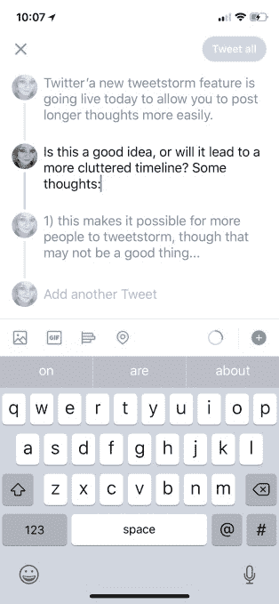

# Twitter 正式推出“线程”，这是一项可以轻松发布推文的新功能

> 原文：<https://web.archive.org/web/https://techcrunch.com/2017/12/12/twitter-officially-launches-threads-a-new-feature-for-easily-writing-tweetstorms/>

Twitter 今天[宣布](https://web.archive.org/web/20230307100631/https://blog.twitter.com/official/en_us/topics/product/2017/nicethreads.html)推出一项新功能，允许人们更容易地发布推文风暴——也就是说，那些连接的推文系列已经成为一种流行的解决方法，可以超越 Twitter 的字符数限制，以分享更长的想法。该公司[上个月](https://web.archive.org/web/20230307100631/https://techcrunch.com/2017/11/16/twitter-confirms-its-testing-a-tweetstorm-feature/)证实，它正在测试其 iOS 和 Android 应用程序的这一功能，现在称之为“线程”。

tweetsstorm 格式在 Twitter 上已经使用了很长时间，最初是由一小部分早期采用者使用的，包括 a16z 的联合创始人马克·安德森，他经常使用 tweet 发表相当于[的博客帖子](https://web.archive.org/web/20230307100631/https://medium.com/tweet-stormed)。

这些年来，对 tweetstorms 的需求变得越来越迫切，因为用户不断碰到 Twitter 的 140 个字符的限制——在今天的发布会之前，Twitter 最近将这个限制增加了一倍。

用户采用 tweetstorm 的原因有很多——通过 Twitter 讲述个人的、悬疑的或有趣的故事，联系突发新闻的事实，对政治或其他问题进行咆哮，甚至只是为了让较长的帖子更具可读性和更容易跟踪。

Twitter 指出，现在每天都有成千上万的帖子发布。

尽管 Twitter 的新字符限制为 280 个，但推特风暴仍在使用。在这一点上，该功能基本上已经成为 Twitter 的一个惯例——该公司在开发新功能时一直从其用户群中获取灵感。例如,@reply、hashtag 和 RT 都是基于用户行为模式作为官方产品推出的。现在同样的事情也发生在线程上。

线程特性本身很容易使用。现在在编辑器屏幕上有了一个新的加号(“+”)按钮，你可以在这里输入你的一系列推文。

每行代表一条 tweet，通常字符限制为 280。你也可以像直接在 Twitter 上一样，向主题中的任何一条单独的推文添加相同数量的媒体，如 gif、图像、视频等。当你发完一条微博后，你只需点击下面的空白处继续你的话题。

在撰写你的 tweetstorm 时，你可以随时回去编辑推文，因为它们仍然是草稿格式。当你准备好发布时，点击顶部的“Tweet all”按钮，将信息流发送到 Twitter。(Twitter 会稍微调整一下发布推文的速度，这样它们就不会同时出现。)

此外，另一个方便的功能允许你在帖子发布后通过添加新的推文来返回和更新帖子。为此，你可以在点击“添加另一条推文”按钮后写出新推文。这让你可以永远更新一个线程——例如，Twitter 首席执行官杰克·多西[已经用他自己的线程](https://web.archive.org/web/20230307100631/https://twitter.com/jack/status/923976996220166144)做了这件事。

Twitter 告诉我们，目前一个线程中有 25 个条目的限制，但这个数字可能会根据更广泛的用户群如何采用该功能而有所变化。

该公司还回应了用户的担忧，即通过让人们更容易访问 tweetstorms，Twitter 的时间线将变得混乱，因为较长的帖子会降低用户快速浏览帖子的能力，就像你现在可以做到的那样。它说，来自某人的两三条推文的线程会出现在你的时间线中，由一条线连接以区分它，但当有四条或更多推文时，该线程会被截断。

在这种情况下，您将看到一个选项“显示该线程”如果您单击或点击此消息，整个线程将会扩展。这允许用户分享他们更长的 tweetstorms，但在这个过程中不会占用你的时间线。

Twitter 表示，threads 将于今天开始向 iOS、Android 和网络上的所有人推出，并在几周内覆盖所有用户。