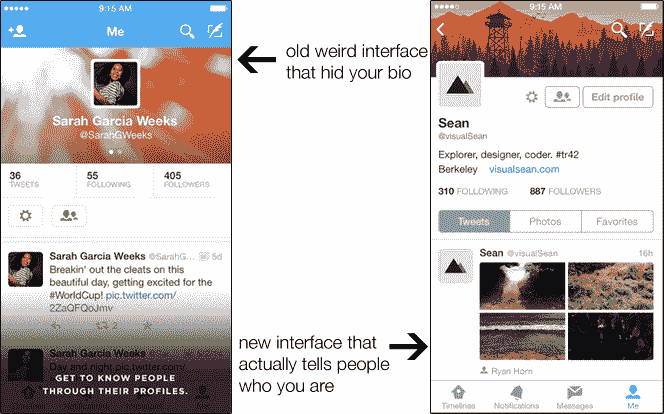

# Twitter 对 iPhone 上的用户界面进行了彻底检查，不再隐藏你的个人信息

> 原文：<https://web.archive.org/web/https://techcrunch.com/2014/09/18/twitter-overhauls-its-ui-on-iphone-stops-hiding-your-bio/>

# Twitter 彻底改变了 iPhone 的用户界面，不再隐藏你的简历

如果你曾经认为 Twitter 在手机上显示个人资料的界面有点不稳定，不要担心。你并不孤单。甚至推特也同意这一观点。

Twitter 刚刚为 iOS 用户推出了一个新的个人资料界面，他们在过去的几个月里一直在悄悄地测试这个界面。

最大的变化？他们不再莫名其妙地在刷卡后隐藏每个人的生物线。因为，说真的…他们到底为什么要这么做？当你点击某人的个人资料时，为什么你*不想*看到他的简历？

您的个人资料现在将显示您的背景图片、头像照片和个人简历。下面是三个按钮:一个显示你的推文；一个仅显示您共享的照片；一个展示所有你喜欢的东西的盒子。

除了个人资料的调整，主要的变化都是关于接受苹果在 iOS 8 中开辟的新东西。你现在可以转发/收藏/关注/等等。例如，通过推送通知来回复你屏幕上弹出的任何推文。

唉，bios 还是不靠谱，藏在安卓最新版的 Twitter 里。