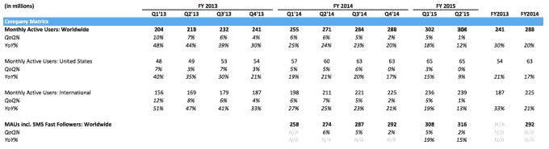

# Twitter 公布 Q2 收入和利润好于预期，用户增长乏力，股价上涨 4%

> 原文：<https://web.archive.org/web/https://techcrunch.com/2015/07/28/twitter-pops-4-after-reporting-better-than-expected-q2-revenue-and-profit-along-with-anemic-user-growth/>

# Twitter 公布了好于预期的 Q2 收入和利润以及疲软的用户增长，股价上涨 4%

***更新:** Twitter 股价在盘后交易中跌至持平，随后温和反弹，涨幅收窄。投资者似乎仍在试图找出如何给这个季度打分。*

该公司今天报告称，Twitter 第二季度的收入为 5.02 亿美元，调整后每股收益为 0.07 美元。投资者[预计](https://web.archive.org/web/20221006195859/http://finance.yahoo.com/q/ae?s=TWTR+Analyst+Estimates) Twitter 在 4.8128 亿美元收入的基础上，调整后每股利润仅为 0.04 美元。

这家社交公司报告称，其月活跃用户数量已攀升至 3.16 亿。在前一季度，Twitter 拥有 3.02 亿月度活跃用户，高于第四季度的 2.88 亿。 ***更新 2:** 你卑微的仆人在这里混了些数字。该公司本季度的月活跃人数更少，为 3.04 亿，不包括基于短信的“快速关注者”如您所见，我最初报告了一个包含短信的数字，与过去没有短信号码的季度相比。这使得增长看起来比实际情况更强劲。下面是图表，我道歉:*

在此期间，Twitter 报告称，其活跃在手机上的用户比例为 80%。在之前的一个季度，这个数字也是 80%。

该公司在一份声明中称，它“对观众的增长不满意。”

移动是 Twitter 收入的关键驱动力，Twitter 在当前的新闻稿中指出，其 88%的广告收入来自移动来源。按美元计算，这相当于大约 3.98 亿美元。

继其财务表现之后，Twitter 的股价在盘后交易中上涨了约 5%。该公司在正常工作时间表现强劲，全天上涨约 5%。美国股市普遍上涨，尽管涨幅较小。

Twitter 以 36 亿美元的现金和等价物结束了本季度。

展望未来，Twitter 预计本季度收入在 5.45 亿美元至 5.6 亿美元之间，同期调整后的 EBITDA 在 1.10 亿美元至 1.15 亿美元之间。目前，投资者预计第三季度收入为 5.5578 亿美元。

对 Twitter 来说，本季度几乎像是一次重演。Twitter 的财务状况很好，顶线和底线都不错。但与此同时，用户增长缓慢也是一个拖累，而且这种拖累已经持续了一段时间。Twitter 的股价已经脱离盘后高点。