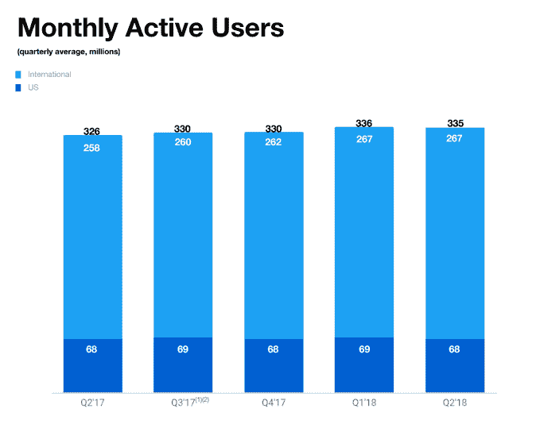

# Twitter 帖子创下 1 亿美元利润记录，但失去 100 万用户

> 原文：<https://web.archive.org/web/https://techcrunch.com/2018/07/27/twitter-posts-record-100m-profit-but-loses-1m-users/>

社交媒体末日本周即将来临。在脸书的股票因糟糕的收益报告创下 1230 亿美元的记录后几天，推特的股票在公司 T2 宣布用户数量下降后下跌了近 20%。

微博服务记录显示，Q2 的月用户减少了 100 万，整体用户减少了 3.35 亿，美国减少了 6800 万..国际用户数量保持稳定，美国用户数量较上一季度的 6900 万有所下降。

[彭博报道](https://web.archive.org/web/20230309005505/https://www.bloomberg.com/news/articles/2018-07-27/twitter-projects-users-to-decline-profit-short-of-estimates?cmpid=socialflow-twitter-business&utm_campaign=socialflow-organic&utm_source=twitter&utm_medium=social&utm_content=business)收益公布后，Twitter 的股价在早盘下跌了 17%。

Twitter 未能在美国发展，市场似乎被吓坏了..事实上，一年前，它在国内拥有 6800 万用户，尽管在此期间，它的国际影响力仅增长了 3.5%，但有人怀疑 Twitter 是否能增加受众。该公司自己表示，预计其每月活跃用户数将下降“中个位数百万”

Twitter 已经加大了寻找和暂停虚假账户的力度，[据说在过去的一年里增加了一倍](https://web.archive.org/web/20230309005505/https://techcrunch.com/2018/07/06/twitter-bots-numbers-disinformation-washington-post/)，但[它也表示预计这不会影响本季度的用户数量](https://web.archive.org/web/20230309005505/https://techcrunch.com/2018/07/09/twitters-cfo-clarifies-that-its-second-quarter-user-metrics-wont-be-affected-by-fake-account-purge/)。

“当我们暂停账户时，许多被删除的账户已经被从 MAU 或 DAU 中排除，要么是因为这些账户在暂停时已经不活动超过一个月，要么是因为它们在注册时被发现，从未被包括在 MAU 或 DAU 中，”Twitter 在其新闻稿中进一步解释道。

不过，该公司确实表示，它与短信运营商的合作以及资源的重新分配，是它预测更多用户数量下降的原因。

虽然 Twitter 可以(几乎可以说)它的每日用户数量在本季度增长了 11%，略高于 Q1 的 10%，但该公司实际上并没有披露这个数字。

股价下跌将让高管们感到沮丧，因为对其有利的是，Twitter 创下了季度利润纪录。GAAP 净收入为 1 亿美元，收入同比增长 24%，达到 7.11 亿美元。调整后的 EBITDA 为 2.65 亿美元，Twitter 预计下一季度将降至 2.15 亿至 2.35 亿美元。

这一利润高于分析师预测的 7000 万美元，但在脸书本周的大崩盘后，投资者希望看到增长潜力……这意味着更多的用户。不幸的是，这是 Twitter 的致命弱点。

[gallery ids="1681441，1681442"]