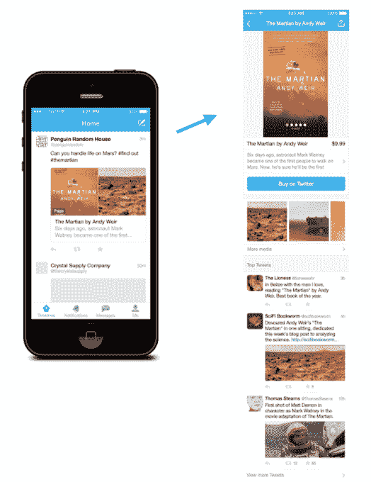

# Twitter 通过产品页面和收藏变得更有购物价值 

> 原文：<https://web.archive.org/web/https://techcrunch.com/2015/06/19/twitter-product-pages-and-collections/>

# Twitter 通过产品页面和收藏变得更有购物价值

Twitter 刚刚[宣布了](https://web.archive.org/web/20221207050823/https://blog.twitter.com/2015/testing-new-ways-to-make-it-easier-to-discover-products-and-places)新功能，称“让发现产品和地点变得更容易。”

该公司一直在进军电子商务，去年秋天[推出了一个购买按钮](https://web.archive.org/web/20221207050823/https://beta.techcrunch.com/2014/09/08/twitter-commerce-buy-now/)。然而，一条单独的推文可能不是销售产品的最佳方式，尤其是如果你不太了解它，所以 Twitter 表示，它开始围绕一些产品创建页面，以提供更多信息和内容。

这些页面将包括多条推文，但它们也将有基本的产品信息——是的，还有实际购买的能力。这是安迪·威尔畅销书*火星人*的样本页面图像。

Twitter 还允许包括 TechCrunch 在内的有限的“策展人”团体围绕不同的主题创建自己的收藏。例如，我们在推特上发布了一组“ [5 款智能厨房小工具](https://web.archive.org/web/20221207050823/https://twitter.com/TechCrunch/status/611926602205806592)”它看起来像一条普通的推文，有多个图片，但当你打开它时，你会看到多个，每个都在谈论一个不同的小工具。这些推文，反过来，链接到产品页面。

就我个人而言，我对厨房或小工具知之甚少(声明一下，我没有参与我们集合的工作)，所以其他选择包括流行歌星黛米·洛瓦托推荐的[产品集合或](https://web.archive.org/web/20221207050823/https://twitter.com/ddlovato/timelines/606854604039397376)[与《权力的游戏》相关的](https://web.archive.org/web/20221207050823/https://twitter.com/GameofThrones/timelines/608393602343944192)产品集合。

[Twitter 的博客文章](https://web.archive.org/web/20221207050823/https://blog.twitter.com/2015/testing-new-ways-to-make-it-easier-to-discover-products-and-places)称这是一次测试，并补充道:

> 这只是开始。在接下来的几个月里，我们将测试更多的新体验，希望能为您提供关于您想探索的地方和事物的最个性化和最相关的信息。