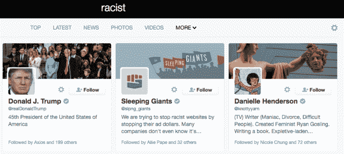

# Twitter 在搜索“混蛋”、“小手”和更多 时推荐特朗普

> 原文：<https://web.archive.org/web/https://techcrunch.com/2017/01/25/twitter-recommends-trump-in-searches-for-asshole-tiny-hands-and-more/>

# 推特推荐特朗普搜索“混蛋”、“小手”等等

嗯。搜索“混蛋”一词的 Twitter 用户将收到一封关于美国第 45 任总统唐纳德·特朗普先生的个人资料的推荐信。

为什么会这样？我们在 Twitter 上寻求评论，如果有回音，我们会及时更新。[**26 年 1 月 1 日更新:**虽然 Twitter 没有回复我们，但他们似乎已经将特朗普从“混蛋”和这篇报道中提到的其他关键词的搜索结果中删除了。]我们最大的猜测是，特朗普的提及充满了人们称他为混蛋，因此这使得 Twitter 的搜索算法相信这个词与他的账户相关联。

这个奇怪的搜索结果引起了格雷格·詹纳的注意，他是历史学家，也是喜剧历史节目《T4》和《恐怖历史》的顾问。

以下是手机上发生的事情:

这是桌面上的视图:

正如你所看到的，Twitter 推荐的其他人都是自称的混蛋。他们的推特简介里都有“混蛋”这个词。特朗普总统的推特简历里没有“混蛋”这个词。

哦，看，当你搜索“种族主义者”这个词时也会发生这种情况:

甚至还有“小手”！

但特朗普并不是唯一一个个人资料中负面含义词汇排名第一的政治家:

如果这确实是人们在提到总统的推特上所说的话的产物，那么看看推特会对此做些什么将会很有趣。特朗普可能是由于算法失误而出现在这些结果中，Twitter 显然已经选择手动从结果中删除他的个人资料。毕竟，特朗普是社交媒体平台的忠实粉丝。看起来 Twitter 并没有选择袖手旁观搜索算法，并允许总统的账户出现在用户经常与他联系在一起的搜索结果中。