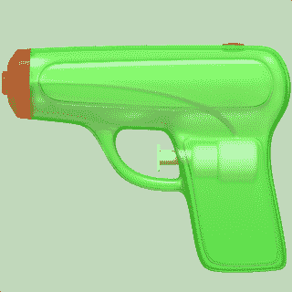
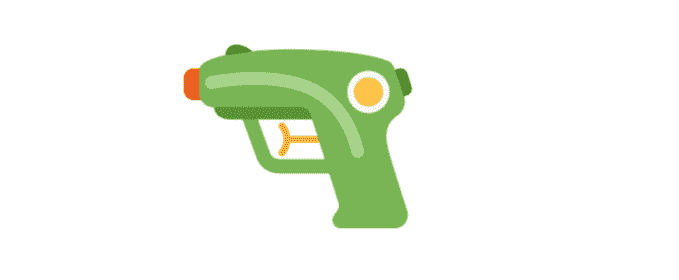
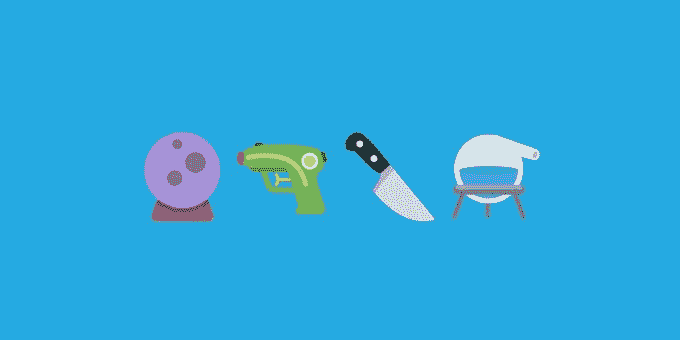

# Twitter 用水枪取代了它的枪支表情符号

> 原文：<https://web.archive.org/web/https://techcrunch.com/2018/04/11/twitter-replaces-its-gun-emoji-with-a-water-gun/>

Twitter 现在已经跟随苹果的脚步，将其手枪表情符号改为无害的亮绿色水枪。通过这样做，这家一直在努力处理其平台上发生的虐待、仇恨言论和骚扰的公司，已经消除了在线虐待者绑架受害者的一种手段。

这一变化是 Twitter 表情符号更新 Twemoji 2.6 中推出的几个[之一，它影响了网络、移动网络和 Tweetdeck 上的 Twitter 用户。](https://web.archive.org/web/20230310080529/https://blog.emojipedia.org/twemoji-2-6-emoji-changelog/)

*下图:苹果的水枪*

*下图:推特的水枪*

当苹果在 2016 年在 iOS 10 中推出自己的水枪表情符号[时，将武器表情符号替换为儿童玩具的决定](https://web.archive.org/web/20230310080529/https://www.apple.com/newsroom/2016/08/apple-adds-more-gender-diverse-emoji-in-ios-10.html)[被视为一项政治声明](https://web.archive.org/web/20230310080529/https://techcrunch.com/2016/08/01/apple-drops-a-new-ios-10-beta-with-a-hundred-new-emoji/)。该公司还[反对添加步枪表情符号，](https://web.archive.org/web/20230310080529/https://www.buzzfeed.com/charliewarzel/thanks-to-apples-influence-youre-not-getting-a-rifle-emoji?utm_term=.oqPBMEmAdN#.djpDLo6yn5)最终导致 Unicode 决定在同年将其从新表情符号候选名单中删除。

通过这些举措，苹果实际上是在告诉人们，枪在人们在移动设备上发送信息时常用的图像语言中没有一席之地。

这些变化很重要，因为表情符号具有影响文化的能力，以及作为一种全球理解的交流形式的功能。这就是为什么人们如此关注那些超越化妆品的表情符号更新——例如，提供更好的人类肤色表示，显示不同类型的家庭分组或关系，或者提供各种职业 —如警察或科学家——男女版本。

在“水枪”事件中，苹果设定了一个特定的标准，业内其他公司也纷纷效仿。

[三星后来也把枪换成了水枪](https://web.archive.org/web/20230310080529/https://androidandme.com/2018/02/news/samsung-experience-9-0-update-brings-better-looking-emoji/)， [WhatsApp](https://web.archive.org/web/20230310080529/https://www.express.co.uk/life-style/science-technology/720907/whatsapp-update-new-emojis-user-complaints-ios-android) 也是如此。与此同时，谷歌没有效仿苹果，称其相信跨平台通信。包括微软在内的许多其他人也没有使用他们逼真的枪支表情符号。

“手枪表情符号不同外观的主要问题是，当一个平台将它显示为无害的玩具，而另一个平台将相同的表情符号显示为武器时，可能会产生混淆。这在 2016 年是一个特别的问题，当时苹果改变了手枪表情符号，与当时的所有其他供应商都不合拍，[Emojipedia 的创始人兼 Unicode 表情符号小组委员会副主席 Jeremy Burge 指出。“现在我们看到多家厂商都在类似的时间框架内改变了水枪的形象，三星和 Twitter 今年都改变了他们的设计，”他说。](https://web.archive.org/web/20230310080529/https://www.linkedin.com/in/jeremyburge/)

然而，在 Twitter 上，更新后的枪支表情符号在很大程度上传达了该公司在虐待和暴力问题上的立场(或目标)。与水枪相反，当推文中伴有暴力威胁时，枪可能更加可怕。

这一变化也发生在 Twitter 试图更好地管理其平台上发生的不良行为的时候——有些人可能会说不成功。最近，它决定[公布其关于滥用的规则](https://web.archive.org/web/20230310080529/https://techcrunch.com/2018/04/06/twitter-will-publicize-rules-around-abuse-to-test-if-behavior-changes/),看看人们是否会选择遵守这些规则。它还更新了其[的指导方针和政策](https://web.archive.org/web/20230310080529/https://techcrunch.com/2017/12/18/twitter-today-starts-enforcing-new-rules-around-violence-and-hate/)，关于它[将如何处理](https://web.archive.org/web/20230310080529/https://techcrunch.com/2017/11/14/twitter-details-how-it-reviews-and-enforces-rules-around-hate-speech-violence-and-harassment/)在线滥用者，结果喜忧参半。

此外，与苹果表情符号更新相比，这一变化感觉上更像是一个政治信息，因为它的时机——在帕克兰、青年领导的#NeverAgain 运动、YouTube 枪击事件以及人们越来越关注全国步枪协会对政治家的贡献之后。

Twitter 在发给 TechCrunch 的一封电子邮件中证实了这一变化，称这一决定是为了与其他变化保持“一致”。

不过 [Emojipedia 显示，并不是所有公司都更新了](https://web.archive.org/web/20230310080529/https://emojipedia.org/pistol/)到水枪。谷歌、微软、脸书、Messenger、LG、HTC、EmojiOne、emojidex 和 Mozilla 仍然提供逼真的手枪，而不是绿色玩具。

但是苹果和三星可能在事情的发展方向上更有分量。

“我知道一些用户反对他们认为的表情键盘上的审查，但我肯定能明白为什么今天的公司可能想确保他们不会展示一种武器，而 iPhone 和三星 Galaxy 用户现在有一把玩具枪，”Burge 说。“这与 2016 年苹果与其他供应商步调不一的问题非常相反。”

枪是 Twemoji 2.6 中最值得注意的变化，但 Emojipedia 指出，其他表情也已经更新，包括菜刀(现在看起来更像蔬菜切片器，而不是刺伤的武器)、水晶球、Alembic(盛水的玻璃器皿)和放大镜，对外套、眼睛和带角的表情脸进行了更多的细微调整。

*图片鸣谢:Emojipedia 苹果水枪:苹果*