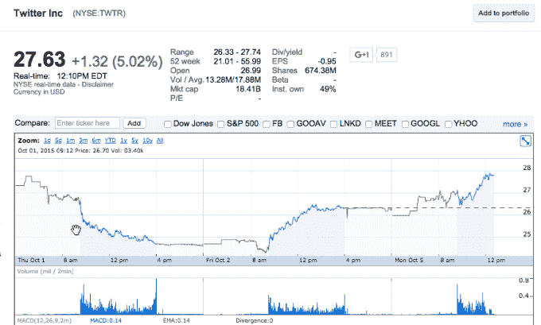

# 在@Jack 回归的消息传出后，Twitter 的股价上涨了 5.7%

> 原文：<https://web.archive.org/web/https://techcrunch.com/2015/10/05/twitter-shares-pop-5-7-on-news-of-jacks-return/>

# 在@Jack 回归的消息传出后，Twitter 的股价上涨了 5.7%

在杰克·多西将再次担任首席执行官的消息传出后，Twitter 的股票今天上涨了约 5 %,这证明了市场是愚蠢的。多尔西将保留他在 Square 的职位，这使他成为一名罕见的双重高管。

这是图表:

这意味着两件事。首先，市场显然至少对一段时间以来在技术世界里是实用真理的消息感到适度惊讶。而且，投资者对多尔西的回报感到满意。

他之前退出的[故事现在成了谣言*和*的素材，但那显然是现在上游桥下的水。](https://web.archive.org/web/20221209210607/http://fortune.com/2015/09/30/jack-dorsey-twitter-ceo-fired/)

根据 Google Finance 的数据，Twitter 现在价值 177.9 亿美元，这意味着市值飙升约 10 亿美元，这取决于该公司股价的最新波动。10 亿美元对经历了剧烈股价波动的 Twitter 来说是一个有意义的增长。

现在是工作时间。多尔西必须证明他能够扩大 Twitter 的用户群。新任命的首席运营官·亚当·贝恩擅长打造这家社交公司的核心业务。迄今为止，其他高管未能以可观的速度增长 Twitter 的用户群。你只能回到同一口井那么多次；由此可见，多尔西的任务是明确的。

目前，投资者很高兴。我们将在收益期间看看情况如何。