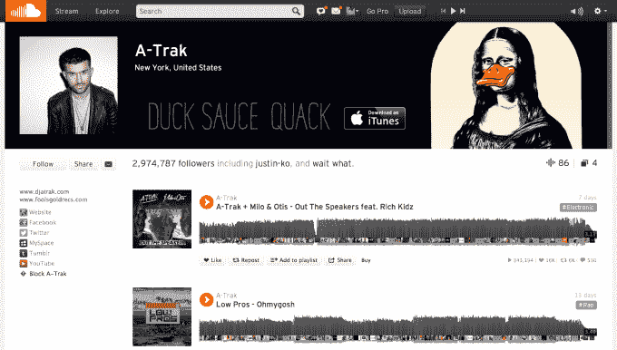
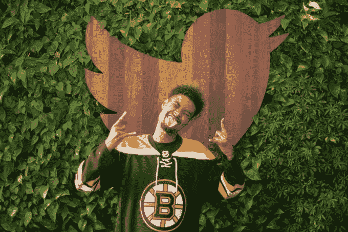
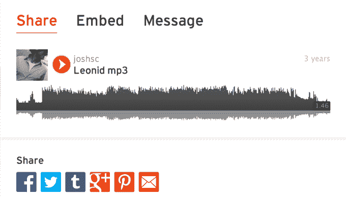

# Twitter 应该打开它的储蓄金去收购 SoundCloud 吗？

> 原文：<https://web.archive.org/web/https://techcrunch.com/2014/05/19/twitter-soundcloud/>

SoundCloud 可能是音乐的 YouTube，但这并不意味着 Twitter 应该扮演谷歌的角色并收购它。比起投资一家不一定会改善其核心服务的音乐初创公司，有更好的方式来花掉 IPO 获得的 20 亿美元。【更新:现在[明镜在线](https://web.archive.org/web/20230102160812/http://www.spiegel.de/netzwelt/web/twitter-will-soundcloud-aus-berlin-nicht-uebernehmen-a-970381.html)，一家来自音云母国的德国新闻机构，称推特不会收购音云。据 SPIEGEL 报道，Twitter 确实考虑过收购这家初创公司，但知情人士告诉它，Twitter 决定不进行这笔交易。]

MoPub。这是一笔[明智的收购](https://web.archive.org/web/20230102160812/https://techcrunch.com/2013/09/09/twitter-said-to-acquire-mopub/)，价格约为 3.5 亿美元。Twitter 非常了解人们在想什么，但展示营销信息的空间有限。将目标数据注入 MoPub，这样它就可以在其他地方销售更好的广告，这两者都得到了加强。

另一方面，SoundCloud 就没那么有意义了。Re/code 的 Peter Kafka 报道称，熟悉两家公司的消息来源称 Twitter 正在考虑收购事宜。

这项服务允许任何人上传音频，其他人可以播放或下载。人们互相追随(是的，像 Twitter 一样)，这在希望主持混音带的新晋 DJ 和试图制造轰动的大牌艺术家中很受欢迎。SoundCloud 通过销售解除托管和下载限制的专业账户(T2)和羽翼未丰的原生广告(T4)赚钱，比如图片幻灯片和关注对象的建议。

成立于 2007 年的 SoundCloud 已经崛起，填补了 Myspace 留下的空白，成为音乐人寻求推广自己的高度功能性主页。去年 7 月，它拥有 4000 万注册用户，每月为包括未注册用户在内的 2 亿用户提供服务。到 2013 年 10 月，这个数字是 2 . 5 亿，所以可以肯定现在已经接近 3 亿了。这一快速增长显示了 SoundCloud 的巨大潜力。

据报道，SoundCloud 从 1 月份开始的最新一轮[6000 万美元融资](https://web.archive.org/web/20230102160812/https://techcrunch.com/2014/01/25/soundcloud-raises-60-million-at-700-million-valuation/)对[的估值为 7 亿美元](https://web.archive.org/web/20230102160812/http://blogs.wsj.com/digits/2014/01/24/music-sharing-service-soundcloud-raises-new-funds-at-700-million-valuation/)。Twitter 可能不得不支付一笔可观的溢价，甚至是数倍于此的价格来收购这家初创公司。Twitter 在首次公开募股中筹集了约 21 亿美元，总体上仍在亏损，其中包括 2014 年在 Q1 的 1.32 亿美元。如果 Twitter 想借钱，它还有 10 亿美元的信用额度。总而言之，收购 SoundCloud 可能会烧掉 Twitter 的一大笔现金，或者至少会让其目前 189 亿美元的股票市值大幅缩水。这真的是其战争基金或股权的最佳用途吗？

## Twitter 可以拥有这个时代的 Myspace 音乐

卡夫卡认为，Twitter 渴望扩大自己服务之外的受众。收购 SoundCloud 可以做到这一点。与此同时，Twitter 可以为 SoundCloud 带来广告基础设施。卡夫卡引用了 alignment，因为 Twitter 上分享链接最多的音乐服务是 SoundCloud，可能来自艺术家在 Twitter 上发布的流和主页。

从更高的层面来看，收购的理由可能是，这将有助于 Twitter 成为下一代媒体公司。它已经有了图片和视频。SoundCloud 也可以让它控制音乐。SoundCloud 是许多音乐家与他们的粉丝建立深厚联系的方式，Twitter 可以通过拥有这种联系而繁荣发展。创作工具的不断民主化需要一种在线分享原创声音的服务。

Twitter 可以为 SoundCloud 上的音乐人建立更好的推广工具。通过这种方式，当艺术家在推特上发布他们页面的链接时，它既可以在推特上获得高质量的内容，也可以为 SoundCloud 带来流量，从而实现盈利。Twitter 已经允许通过其卡在线播放 SoundCloud 音乐，但交互性有限，如果他们是一家公司，可以得到改善。

理想的情况是 Twitter 为 SoundCloud 提供力量和跑道，使其成为一个类似 YouTube 的发布平台。艺术家将受到激励，推动那里的流量，因为他们将获得广告收入的一部分。问题是，音乐通常可以在很多地方获得，比如流媒体和下载服务，而不仅仅是 SoundCloud。如果两家公司真的能够成功地让 SoundCloud 的内容在 Twitter 上分享，就像艺术家直接向粉丝分发音乐一样，这笔交易可能是一个好的举措。但这需要敏捷的执行。

尽管如此，这些协同效应加起来可能抵不上 Twitter 的价格。

## Twitter 需要在多样化之前集中精力

今天，我与几位音乐技术高管进行了交谈，没有人能给出一个令人信服的理由，说明为什么这对 Twitter 来说是一笔明智的收购。

它已经试图通过 We Are hunt-powered 的#Music 独立应用程序让音乐成为其服务中更大的一部分。然而，这个应用崩溃了，因为用户有很多其他的方法来发现音乐。Twitter [几个月前关闭了应用](https://web.archive.org/web/20230102160812/https://techcrunch.com/2014/03/21/i-wont-miss-the-hashtag/?utm_campaign=fb&ncid=fb)，专注于其主应用中关于音乐的对话。因此，虽然摇滚对人们的生活可能很重要，但他们可能不会在 Twitter 上寻找。

试图通过插入更多的 SoundCloud 来巩固 audio 在 Twitter 上的地位可能也好不到哪里去。SoundCloud 不是用户生成的内容驱动的服务。很大程度上是专业人士和半专业人士上传音乐为其提供动力。虽然 Twitter 和 Vine 可能被“有影响力的人”统治，但普通人仍然可以发推特或拍摄视频。大多数人都没有可以上传到 SoundCloud 的东西。

相反，他们是听众，许多人在网上冲浪或外出时会在后台播放歌曲。他们不会那么容易通过 Twitter 最了解的视觉广告赚钱，人们鄙视音频广告。此外，SoundCloud 上的相当一部分内容没有得到适当的许可。打击这种行为，使其对广告更加友好，可能会损害 SoundCloud 的街头信誉。

如果 Twitter 希望分享更多音乐内容，它可以在不收购 SoundCloud 的情况下为音乐人打造更好的推广工具。如果它想成为一家媒体公司，音乐似乎不是最合适的。它并不像照片或短视频剪辑那样天生就可以吃，人们似乎不愿意像购买游戏或网飞等流媒体视频服务那样为它付费。Twitter 已经与艺术家建立了牢固的关系，它可能会继承与 SoundCloud 唱片公司更麻烦的关系。

虽然 SoundCloud 在几年前确实很特别，仍然有你在其他地方听不到的混音和混音带，但 Spotify 等干净、标准化的合法流媒体音乐服务的兴起，降低了它在大牌艺术家方面的价值主张。想要轻松获得流行歌曲的主流听众可以在其他地方找到它们，这些服务是为收听而建立的，而不是发现或粉丝艺术家联系。或者在 YouTube 上，它的熟悉度、搜索引擎优化和基于浏览器的状态往往使它成为听一首歌的最快方式。SoundCloud 不会是唯一拥有大众吸引力的内容提供商。这使得建立一个媒体帝国变得困难。

收购 Instagram 本可以给 Twitter 带来用户生成的、可随时获取的、具有广泛影响力的独家内容，但这条船很久以前就驶向了脸书。

我知道为什么 SoundCloud 想要这笔交易。它可以通过 Twitter 的网络让其音乐获得巨大的影响力，并从 Twitter 的业务团队那里获得盈利帮助。如果没有自己的广告业务，SoundCloud 可能会发现很难通过首次公开募股来吸引投资者。一位消息人士告诉我，主要的唱片公司在授权方面严重挤压 SoundCloud，一些唱片公司有意伤害或扼杀该公司。这使得现在实现退出变得更加有利可图，尽管 SoundCloud 的增长意味着它可能会变得更有价值，只要它能生存下来。

如果 Twitter 是一家更大的公司，所有的事情都井然有序，那么这次收购可能是一个更好的举措。当谷歌收购 YouTube 时，它已经有了搜索广告和 AdSense 业务，并且正在解决 Gmail 和地图的问题。YouTube 才成立一年，筹集的资金还不到 1200 万美元。Twitter 仍在试图稳定其核心产品，尽管它在广告方面取得了巨大的早期进展，但这项业务仍需要时间来加速发展并使公司盈利。SoundCloud 已经成立 7 年了，已经筹集了 1.23 亿美元。这可能是一笔不错的收购，但不是现在的 Twitter。

看到脸书在 WhatsApp 上砸下 190 亿美元，Twitter 很难做出省钱的决定。如果 Twitter 不收购 SoundCloud，也许脸书或谷歌会利用它们的规模优势，把它抢走。

然而，Twitter 需要保持专注。专注于使其服务更持续地吸引没有固定受众的新用户，使其订阅源易于管理，以便退伍军人变得越来越投入，并改善其广告定位和衡量，以向广告商证明投资回报，以便他们购买大量活动。SoundCloud 没有做到这些。Twitter 最好把钱存起来，雇佣和收购那些能让其核心服务飞得更高的公司，而不是仅仅在鸟群中增加一只鸟。

*【图片来源:Len Peters/Flickr via[NHPR](https://web.archive.org/web/20230102160812/http://nhpr.org/post/soft-spot-bluebirds)*