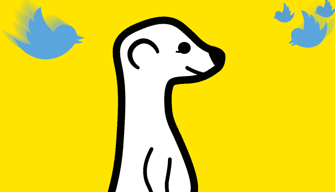
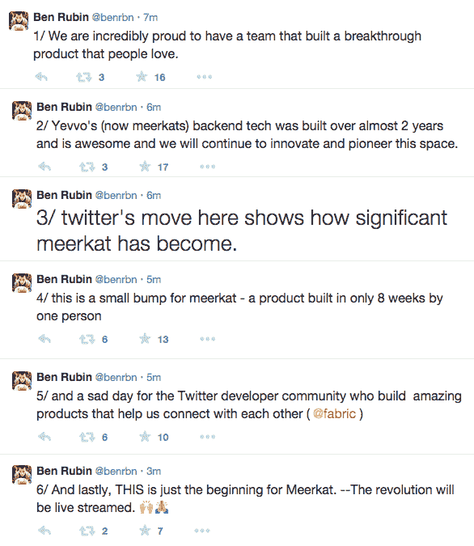

# 推特开始通过限制社交图访问来打破猫鼬特征|技术危机

> 原文：<https://web.archive.org/web/https://techcrunch.com/2015/03/13/twitter-starts-breaking-meerkat-features-by-limiting-social-graph-access/>

# 推特开始通过限制社交图访问来打破猫鼬特征

谈论时机:推特证实他们已经购买了猫鼬的竞争对手潜望镜 T2，但是几个小时后推特采取了行动，取消了猫鼬的一些功能。

[猫鼬](https://web.archive.org/web/20230404151851/http://meerkatapp.co/)是一个快速崛起、以推特为中心的视频直播平台，自几周前推出以来，似乎已经获得了相当多的粉丝。livestream 的观众可以向您发推，并让这些推出现在您的屏幕上，从而实现快速、即时的交互和讨论。

猫鼬的成功和吸引力很大程度上在于它与推特的紧密结合——许多人已经注意到，如果推特决定自己进入直播视频，这可能是一个前进的问题。当然，他们刚刚做了。

现在推特已经开始切断猫鼬对推特社交图的访问。

那是什么意思？到目前为止，新的猫鼬用户可以用他们的推特账户登录该服务，砰——你会自动跟踪你已经在推特上跟踪的猫鼬上的任何人，他们也会跟着你。这让猫鼬看起来像是推特非常非常自然的延伸。

[Buzzfeed 首先发现了这一变化](https://web.archive.org/web/20230404151851/http://www.buzzfeed.com/mathonan/twitter-chokes-off-meerkats-access-to-its-social-graph#.wgK1r9plX)，当时创建新账户时，追随者数量似乎有点下降。

我们已经联系了推特，他确认了这一变化。**以下是推特发言人对此事的看法:**

*“我们正在限制他们访问推特的社交图，这符合我们的内部政策。他们的用户仍然可以在推特上发布视频，并使用他们的推特证书登录。”*

是毁灭性的改变吗？也许不是——Meerkat 已经有了相当大的发展势头。但这肯定不是 Meerkat 团队会感到兴奋的事情…尤其是现在 Twitter 内部竞争对手的威胁迫在眉睫。

**更新:** Meerkat 联合创始人[本·鲁宾](https://web.archive.org/web/20230404151851/https://twitter.com/benrbn)回应称，此举“对 Twitter 开发者社区来说是悲伤的一天”，但“对 Meerkat 来说是一个小小的打击”:

