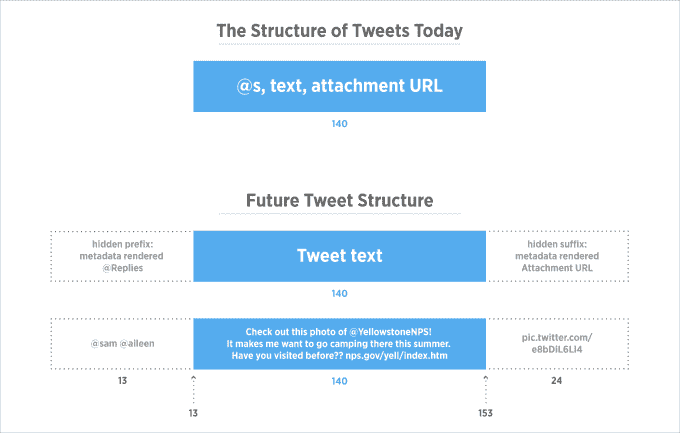
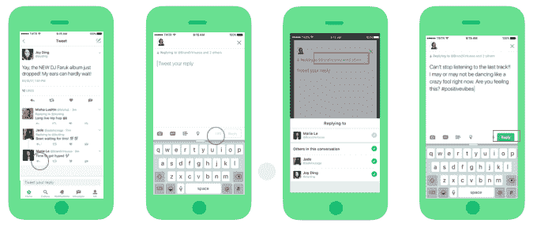

# Twitter 停止在网络和手机上对 140 个字符的@回复进行计数 

> 原文：<https://web.archive.org/web/https://techcrunch.com/2017/03/30/twitter-stops-counting-replies-towards-its-140-characters/>

大约一年前，Twitter [宣布](https://web.archive.org/web/20230120202033/https://techcrunch.com/2016/05/24/twitter-moves-away-from-140-characters-ditches-confusing-and-restrictive-rules/)将开始远离所有推文只能包含 140 个字符的要求，不再计算一些内容，如媒体附件或@回复的字符数。然而，直到去年秋天，[才开始用@ replies 测试这一变化。](https://web.archive.org/web/20230120202033/https://techcrunch.com/2016/10/26/sinking-the-twitter-canoe/)今天，推特[称回复的这一变化](https://web.archive.org/web/20230120202033/https://blog.twitter.com/2017/now-on-twitter-140-characters-for-your-replies)正在向网络、iOS 和 Android 上的所有用户推广。

回顾一下，Twitter 最初被设计成一种公共文本信息服务。短信被限制在 160 个字符以内，所以 Twitter 把字符限制在了 140 个，以为推文前面的用户名留出空间。

然而，Twitter 回复中的@用户名最终被计入了 140 个字符，其他媒体附件也是如此，包括照片、gif、视频和投票。这给用户的真实想法留下了宝贵的空间。

这也导致了非正式的约定，如“ [tweetstorms](https://web.archive.org/web/20230120202033/https://www.lifewire.com/tweetstorm-explained-3288889) ”用于分享更长的想法，以及“ [Twitter 独木舟](https://web.archive.org/web/20230120202033/http://nymag.com/daily/intelligencer/2013/12/2013-twitter-glossary-doge-hatereads-tabs-mansplain-meaning.html)”——大型的多人对话最终破裂，因为太多人加入，没有字符留给实际的帖子回复。

过去几个月，Twitter 一直试图通过改变用户界面和取消各种技术限制来纠正 140 个字符的限制问题。它[已经阻止了](https://web.archive.org/web/20230120202033/https://techcrunch.com/2016/05/24/twitter-moves-away-from-140-characters-ditches-confusing-and-restrictive-rules/)gif、图片、视频和引用推文计入 140 个字符。(链接仍然有效)。

随着今天对回复的改变，Twitter 在网络和手机上的界面现在会将你回复的内容显示在推文上方，而不是推文内，这为你的想法腾出了更多的字符。

您可以点击此“回复”栏来查看谁在对话中，并根据需要更改回复列表。点击该字段后，通过取消选中屏幕上出现的小弹出窗口中的复选框来完成此操作。

这一变化还旨在使阅读较长的对话更容易，因为这个“回复”字段要小得多，而且不在推文中。这样，你就可以专注于阅读实际的帖子，而不必先记下用户名。

然而，这里有一些需要注意的地方。例如，在 tweet Compose 屏幕上，这个“回复”字段相当小。如果你很匆忙，这可能会被忽略——让你以为你在写一条新的推文，而实际上你正在参与一场对话。

这很重要，因为回复是第二类推文。不是每个人都能看到您的回复出现在他们的时间线中，即使他们关注您。相反，如果他们同时关注你和收件人 T2，他们只会看到回复。

回复也隐藏在用户 Twitter 个人资料页面的二级标签中，“推文和回复”(Twitter 本月早些时候更新了用户在手机上的个人资料，在单独的标签页显示回复，就像在网上一样。)

由于回复的可见性较低，用户开始在回复中添加句号(“.”)在任何回复之前，他们希望所有的关注者都能看到，他们引用了别人的推文。这也成了某种 Twitter 惯例。

此外，因为你回复的那些人的用户名不再出现在推文中， [Twitter 建议](https://web.archive.org/web/20230120202033/https://blog.twitter.com/express-even-more-in-140-characters)你转发你的回复，或者使用 Twitter 的引用推文功能来引用它。也就是说，如果你开始一个回复，你就真的不能再往里面插点了。

该公司希望消除点号的使用，但它的功能似乎不会完全崩溃。毕竟，如果你选择用一个圆点加一个@提示音来开始一条新的推文，他们仍然会看到，关注你的每个人也会看到。

正如 Twitter 在 5 月份与他们沟通的那样，第三方开发者应该为这一变化做好准备。然而，我们需要等到它公开推出，看看哪些开发者会为这种转变更新他们的应用程序。(Tweetbot 的应用程序还没有准备好，我们已经和开发者保罗·阿达德确认过了，他说他会在它上线后进行测试，并在未来发布更新。)

回复的改变标志着 Twitter 时代的结束。该公司帮助推广这种格式，并使其成为主流。如今，使用“@”符号来称呼某人已经得到了一系列服务的支持，包括脸书、Instagram、Tumblr、LinkedIn、Slack，甚至还有 [Outlook](https://web.archive.org/web/20230120202033/https://support.office.com/en-us/article/Use-mentions-to-get-someone-s-attention-90701709-5dc1-41c7-aa48-b01d4a46e8c7) 等等。

虽然 Twitter 做出这些改变是试图简化其用户服务的一种方式，但它实际上只是用一套规则替换了另一套规则。还有[，那会超级令人困惑](https://web.archive.org/web/20230120202033/https://medium.com/@sarahperez/twitter-so-easy-its-hard-e9ffc03e8bbb)。TechCrunch 编辑马修·潘扎里诺[甚至鼓励 Twitter 不要走这条路](https://web.archive.org/web/20230120202033/https://techcrunch.com/2016/10/28/complaining-about-twitter-on-twitter/)。

一些人认为，Twitter 应该完全取消字符限制——也许只是删减一个 URL 下较长的帖子。但这将使阅读长对话中的推文变得更加困难，因为所有的点击。

Twitter 表示，在新模式测试期间，更多的人参与了这项服务。更新后的格式将会出现在最新版本的 iOS 和 Android 移动应用程序中，并在网上发布。有些人现在就能看到，有些人过一会儿就能看到。