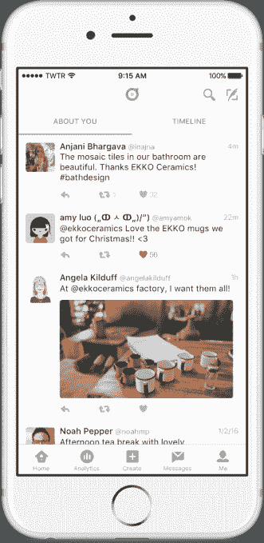
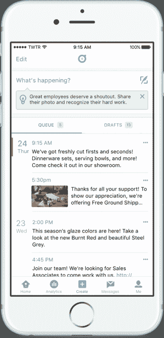

# Twitter 推出 Dashboard ，瞄准小型企业

> 原文：<https://web.archive.org/web/https://techcrunch.com/2016/06/28/twitter-targets-smaller-businesses-with-launch-of-dashboard/>

继推出针对影响者的应用程序[Twitter Engage](https://web.archive.org/web/20230406193512/https://techcrunch.com/2016/06/21/twitter-launches-a-standalone-analytics-and-engagement-app-for-power-users/)之后，Twitter 今天发布了另一款独立应用程序: [Twitter Dashboard](https://web.archive.org/web/20230406193512/https://dashboard.twitter.com/i/landing) 。这项新服务在网上和手机上都有，针对的是那些希望使用 Twitter 与客户联系的企业。该应用程序提供了一套工具，包括定制的推文提要、安排帖子的工具、获取推文内容的提示、分析等。

与 Twitter Engage 类似，Dashboard 的想法实际上是为特定的 Twitter 用户群体(这次是中小型企业)提供更加个性化的定制目的地和应用程序。虽然大公司可能会继续使用他们来自 Twitter 合作伙伴的[复杂工具](https://web.archive.org/web/20230406193512/https://partners.twitter.com/)，Dashboard 的想法是为更广泛的受众提供一套更基本的商业友好工具。

Dashboard 的一个关键功能是能够监控 Twitter 上关于企业的帖子，而不仅仅是人们直接向企业的@username 发推文。Dashboard 用户可以设置一个定制的 feed 来监视标签和关键词，比如你的企业名称或产品名称。通过这种方式，企业可以在一个 feed 中查看和回复谈论他们或提出问题的客户，以及那些实际上提到该企业 Twitter 手柄的客户。

此外，从仪表板网站的[，企业可以建立一个预定的推文队列，以便在最佳时间到达他们的受众。与此同时，新的 iOS 应用程序还可以让你在旅途中安排、编辑和重新安排这些推文。](https://web.archive.org/web/20230406193512/https://dashboard.twitter.com/i/landing)

Dashboard 还通过提供推文建议来帮助企业确定要说什么以及哪种帖子有效。例如， [Twitter 博客帖子](https://web.archive.org/web/20230406193512/https://blog.twitter.com/2016/introducing-twitter-dashboard-0)详细介绍了这一消息，Twitter 可能会建议一名室内设计师转发他们客户的一些赞美，或者一家餐厅可能会在 Twitter 上发布关于他们团队成员的一些特别的事情——比如厨师和他或她最近获得的一些认可。

除了访问 Twitter [分析](https://web.archive.org/web/20230406193512/https://analytics.twitter.com/)——Dashboard 推出之前就已经存在的功能——企业可以开始通过衡量这些推文的影响来了解它们是如何工作的。这在 web 上和新的客户端应用程序中都可用。分析可以让企业看到他们账户的一系列信息，包括热门推文和提及次数、热门媒体帖子、热门关注者等等。

虽然 Dashboard 应用程序的重点是使这些新工具易于使用，但它也可以作为 Twitter 客户端，允许企业发布推文，检查和回复直接消息，查看他们的个人资料，回复，转发等等。