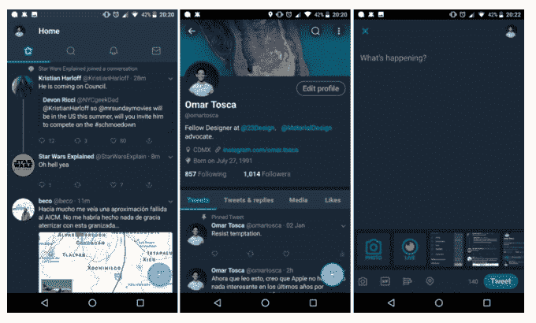

# Twitter 测试圆形按钮和缩略图...因为这就是问题所在？

> 原文：<https://web.archive.org/web/https://techcrunch.com/2017/05/30/twitter-tests-rounded-buttons-and-thumbnails-because-thats-the-problem/>

Twitter 正在测试其在 iOS 和 Android 上的移动应用程序的新界面，其中包括圆形的个人资料图像、按钮和其他功能。目前还不清楚“圆形”会带来什么优势，因为这种风格在应用程序制造商和设计师中的采用更倾向于随着时间的推移而潮起潮落，而不是一种被证明比经典和熟悉的方形/矩形风格具有显著优势的格式。

引入圆形图标的一个理由可能是，它可以更容易地将应用程序的用户与内容区分开来——例如，发布到服务上的照片或相册。(你可以在 Quora 上看到这个[的例子，一名脸书设计师展示了如何在 Instagram 的活动订阅中区分人们和他们喜欢的照片。)](https://web.archive.org/web/20230304193814/https://www.quora.com/Why-are-many-UI-designers-using-round-profile-pictures-in-their-designs-recently)

然而，对于 Twitter 这样一个不断调整其用户界面甚至其核心功能集功能的服务来说——比如[算 140 个字符中的什么](https://web.archive.org/web/20230304193814/https://techcrunch.com/2017/03/30/twitter-stops-counting-replies-towards-its-140-characters/)或者[回复是如何工作的](https://web.archive.org/web/20230304193814/https://techcrunch.com/2016/10/28/complaining-about-twitter-on-twitter/)——摆弄圆形缩略图和按钮似乎有点浪费时间。

毕竟，Twitter 多年来的产品问题源于试图推出一项最终吸引更懂技术的个人的服务，并试图让它也适用于日常的主流用户。

Twitter 的最早采用者和高级用户已经陶醉于其更迟钝的功能，比如该应用程序曾经纯粹的倒序提要，它对字符数的内置限制迫使简洁，以及它的“秘密俱乐部”性质，用户可以在 Twitter 的平台上黑客自己的交流方式——无论是通过写“RT”来踢转推，放一个句号(“.”)以使它们更容易被看到，或者给推文编号以分享更长的想法，例如“推文风暴”。

到目前为止，人们可能会认为 Twitter 应该知道，由于其个人资料图标的外观，或者 tweet 按钮是圆形还是矩形，其应用程序最终不会或多或少地可用。

如果它通过正面解决垃圾邮件和骚扰来尊重它的用户群，它将是有用的。如果它提供了一种既能观看又能参与在线对话的简单方式，而这种在线对话是你无法在脸书等其他社交平台上进行的，那么它就会被采纳。如果它成为你在其他地方得不到的内容的唯一来源，它[可以吸引更多的用户。(Twitter 希望这将是其](https://web.archive.org/web/20230304193814/https://techcrunch.com/2017/04/26/twitters-first-quarter-was-a-surprise-much-needed-hit/)[的直播](https://web.archive.org/web/20230304193814/https://techcrunch.com/2017/05/01/twitter-announces-new-live-shows-from-the-wnba-buzzfeed-live-nation-and-more/)视频，但事实上，是[川普的推文在最近几天推动了其用户数量的上升](https://web.archive.org/web/20230304193814/http://money.cnn.com/2017/04/26/technology/twitter-earnings/)。)

但是尽管如此，Twitter 喜欢测试东西，所以我想把所有全面的东西都带来吧？

Android Police [上周](https://web.archive.org/web/20230304193814/http://www.androidpolice.com/2017/05/22/twitter-testing-new-rounded-interface-alpha-android-app/)首次发现了 Twitter 的新外观，当时它在 Android alpha 应用程序中可用。我们还从 iOS beta 测试人员那里听说他们也有了新的外观。

*图片来源:上图，[安卓警察](https://web.archive.org/web/20230304193814/http://www.androidpolice.com/2017/05/22/twitter-testing-new-rounded-interface-alpha-android-app/)*

具体来说，用户资料和推文旁边的缩略图都是圆形的，其他按钮也是圆形的，如撰写屏幕中的“编辑资料”按钮和“推文”按钮。搜索框和按钮也有一个圆形的主题。

其他的改变也可能正在进行中，比如使用新的字体。

这些变化是否会被更多的公众所接受还有待观察。

Twitter 拒绝对该测试发表官方评论，但我们从熟悉该实验的人那里了解到，该测试现在可以在 iOS 和 Android 上运行，旨在确定更新是否会使 Twitter 更容易使用。

¯_(ツ)_/¯