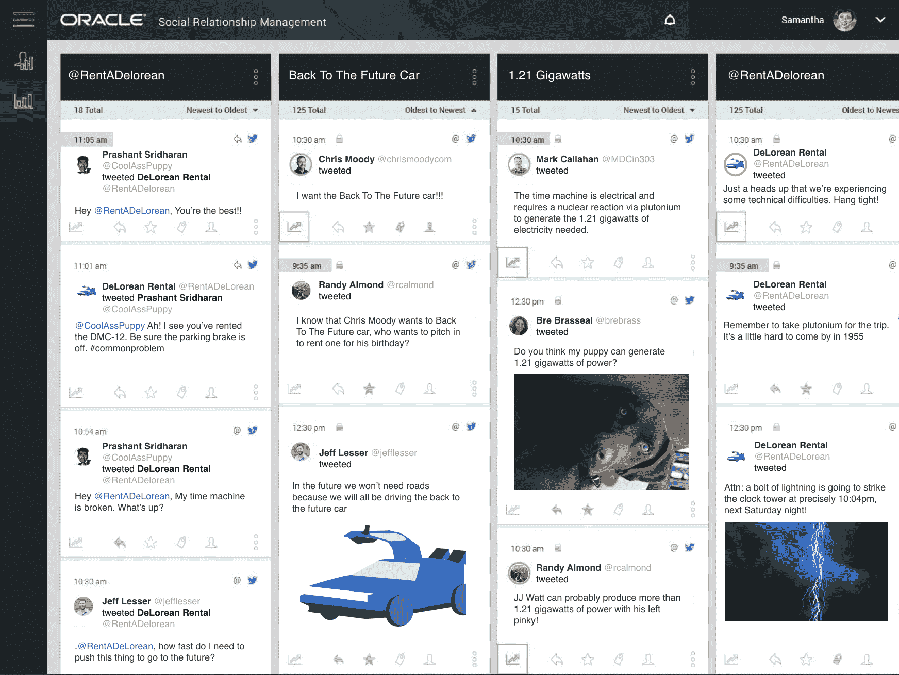
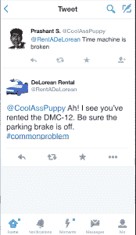

# Twitter 允许品牌将用户的 Twitter 账号与他们的客户账户联系起来，以实现客户关怀

> 原文：<https://web.archive.org/web/https://techcrunch.com/2015/10/21/twitter-to-let-brands-link-up-users-twitter-handles-with-their-customer-accounts-for-customer-care/>

# Twitter 允许品牌将用户的 Twitter 账号与他们的客户账户联系起来，以实现客户关怀

昨天我们写了 Twitter 有兴趣将其平台建设成为企业和品牌管理客户服务的平台，今天 Twitter [公布了这一努力的一些早期功能。在其飞行开发者大会上，该公司展示了如何与 Fabric 和 Gnip 合作，帮助企业通过 Twitter 运营客户服务。早期用户包括连锁酒店希尔顿。](https://web.archive.org/web/20230306013412/https://dev.twitter.com/solutions/customer-service)

今天公布了几项功能。首先，企业可以使用 Fabric developer 平台将客户的电话号码或 Twitter 凭证与该企业的客户账户联系起来。您可以在 CRM 后端完成这项工作，但是当客户服务代表通过企业客户端在 Twitter 上看到用户时，它会自动将两者联系起来。Twitter 正在展示它如何与该公司的早期合作伙伴之一甲骨文合作开展客户关怀工作。

然后，这将贯穿到公司如何能够通过 Twitter 跟踪用户与他们品牌的互动，这种推文可以更好地表明客户是否有持续的问题，或者可能有任何其他历史记录。

今天，另一个正在开启的领域是 Twitter 所谓的“单条推文解决方案”——本质上是因为用户的 Twitter 账户将与他们的客户账户相链接，客户服务代表将能够看到客户的购买历史，并在 Twitter 上提供更直接和具体的建议来回答问题。

Twitter——凭借其快节奏的实时新闻流和向任何其他账户发送推文的能力(除了那些试图阻止你的账户)——几乎主宰了社交媒体上的客户服务。该公司表示，约 80%的请求来自其平台。

负责 Twitter Gnip 部门的 Chris Moody 在一次采访中告诉 TechCrunch，通过 Twitter 运营客户服务的企业有几个好处。一个是促进客户服务的基本能力，使其有可能比 1-800 号码等旧的传统服务更容易、更有效地工作。

穆迪声称，与其他传统渠道相比，在 Twitter 上运行这些服务的成本只有六分之一。另一个事实是，对于 Twitter 来说，这是作为客户接近这些企业的一种方式，他们可能会选择转向 Twitter 做其他事情，比如他们的营销活动。

