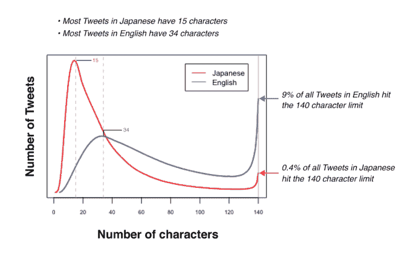
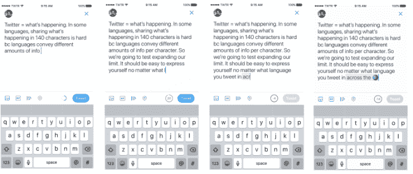
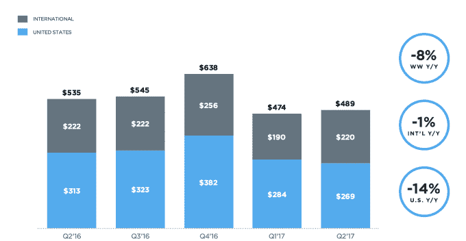

# Twitter 尝试将推文从 140 个字符扩展到 280 个字符 

> 原文：<https://web.archive.org/web/https://techcrunch.com/2017/09/26/twitter-trials-an-expansion-beyond-140-characters/>

该公司今天宣布，Twitter 首次扩展到超过 140 个字符的限制。这家社交网络表示，它现在将在包括英语在内的选定语言中尝试 280 个字符的更长限制，以允许人们分享他们扩展的想法，而不会耗尽推特的空间。

该功能最初将暂时提供给一小部分用户，因为扩展被认为是一个测试，而不是一个大的公共展示。

该公司表示，之所以决定增加字符数，是因为它意识到，与日语、韩语和中文等其他语言相比，字符数限制对英语、西班牙语、葡萄牙语或法语等一些语言的推文影响更大。

[gallery ids="1547330，1547400"]

正如公司[通过博客](https://web.archive.org/web/20221006135645/https://blog.twitter.com/official/en_us/topics/product/2017/Giving-you-more-characters-to-express-yourself.html)解释的那样，与前者相比，后者可以在一个角色中传达两倍的信息量。Twitter 随后研究了这意味着什么，根据不同地区的推文长度，发现只有 0.4%的日语推文有 140 个字符，但更大比例(9%)的英语推文有 140 个字符。

它还发现，大多数日语推文平均是 15 个字符，而大多数英语推文是 34 个字符。

正因为如此，新的 280 个字符的限制将只适用于那些受到“填鸭式”影响的语言，Twitter 称这是除日语、中文和韩语之外的所有语言。

这一变化是社交网络的一个显著举措，其用户多年来一直在讨论扩大字符数的好处。

虽然有些人认为这样做会让 Twitter [感到更少的限制](https://web.archive.org/web/20221006135645/http://readwrite.com/2011/02/16/why_twitter_must_expand_beyond_140_characters/)，更有可能鼓励更长的对话，但其他人认为 Twitter 对简洁的关注[是其最大的与众不同之处](https://web.archive.org/web/20221006135645/https://thenextweb.com/twitter/2011/02/21/why-twitter-should-never-expand-beyond-140-characters/#.tnw_in6lnGAU)，事实上，这也是其服务的本质。

就 Twitter 而言，它一直拒绝这个想法。

例如，就在去年， [Twitter 首席执行官杰克·多西回应](https://web.archive.org/web/20221006135645/https://beta.techcrunch.com/2016/03/18/jack-dorsey-140-characters/)关于 Twitter [正在测试推文 10，000 字符限制](https://web.archive.org/web/20221006135645/https://www.recode.net/2016/1/5/11588480/twitter-considering-10000-character-limit-for-tweets)的报道，称 140 个字符的限制是“一个美丽的约束”，Twitter“永远不会失去这种感觉”

然而，最近几个月，该公司开始远离 140 个字符的限制——这是因为该服务现在经常被用来分享不仅仅是文本的帖子。由于 Twitter 能够托管照片、gif、投票、视频和引用的推文，它需要一种方法来允许用户在同一条推文中发布媒体和他们的想法。

2016 年春天， [Twitter 停止将](https://web.archive.org/web/20221006135645/https://beta.techcrunch.com/2016/05/24/twitter-moves-away-from-140-characters-ditches-confusing-and-restrictive-rules/)这种媒体计入字符数，然后今年 3 月更有争议的[改变了@replies 在其服务上的工作方式](https://web.archive.org/web/20221006135645/https://beta.techcrunch.com/2017/03/30/twitter-stops-counting-replies-towards-its-140-characters/)。同样，这一改变的目标是为用户自己的想法和评论释放更多的空间——这一次，通过将@reply 从推文的文本字段中移出，改为一段元数据。

## 新的 Twitter 撰写界面不再显示字符数

除了这一变化，Twitter 还更新了用户界面，所以它不再倒数字符，直到你接近结束。相反，当你接近极限时，一个圆圈将会填满，直到只剩下 20 个字符(对于日语、汉语和韩语用户来说是 10 个)，你才会知道自己还剩多少个字符。

至于为什么 Twitter 终于开始尝试更长的文本限制，答案在 Twitter 的声明中有所陈述。

该公司表示:“在所有市场中，当人们不必将自己的想法塞进 140 个字符，实际上还有多余的时候，我们会看到更多人发推特。”

(Twitter 发言人向我们澄清说，这种理解并不是已经公开测试了 280 个字符的结果，而是对不同语言用户如何发布推文的观察。也就是说，在有更多空间发微博的市场，人们会发更多的微博。)

## Twitter 产品的变化没有影响长期增长

这里的大背景是，Twitter 希望通过降低其服务的易用性——比如对推文的任意字符限制——让更多人使用 Twitter。“更多的人”是这个社交网络现在需要的，考虑到[它的用户增长](https://web.archive.org/web/20221006135645/https://beta.techcrunch.com/2017/07/27/twitters-user-growth-went-nowhere-and-the-stock-is-diving/)和收入下降[它的广告业务](https://web.archive.org/web/20221006135645/https://beta.techcrunch.com/2017/02/09/twitters-streamlining-efforts-still-arent-fixing-its-core-business-problems/)。(为了澄清，witter [在 2 月份曾表示](https://web.archive.org/web/20221006135645/https://beta.techcrunch.com/2017/02/09/twitter-says-product-changes-are-driving-growth-not-just-the-presidents-usage/)其每日活跃用户增长和每月用户都有所上升，将其归因于产品变化，但在更多的[近期公告中](https://web.archive.org/web/20221006135645/https://beta.techcrunch.com/2017/07/27/twitters-user-growth-went-nowhere-and-the-stock-is-diving/)，用户增长仍然持平。)

但最终，可能并不是技术限制或消除这些限制减缓了 Twitter 的增长。事实是，尽管其努力打击虐待行为，但许多人仍然将社交网络视为攻击、钓鱼和其他虐待行为的过于公开的论坛。(川普继续使用推特广泛攻击反对者，以及[发出战争威胁](https://web.archive.org/web/20221006135645/https://beta.techcrunch.com/2017/09/25/twitter-says-it-hasnt-deleted-trumps-provocative-north-korea-tweet-because-of-newsworthiness/)，这些对川普毫无帮助。)

除此之外，Twitter 一直在努力以其他方式监管其平台——比如处理机器人问题，或者确保新纳粹的广告不会出现。

多年来，它还忽略了用户的一项顶级产品需求:编辑推文的能力。(但当被问及这一天是否会到来时，我们被告知“永远不要说永远不会”。)

Twitter 表示，新的 280 个字符最初将提供给 iOS、Android 和桌面网络上的一小部分随机但有代表性的 Twitter 用户。测试预计不会持续很长时间——只有几周 Twitter 计划就更广泛的推广做出决定。