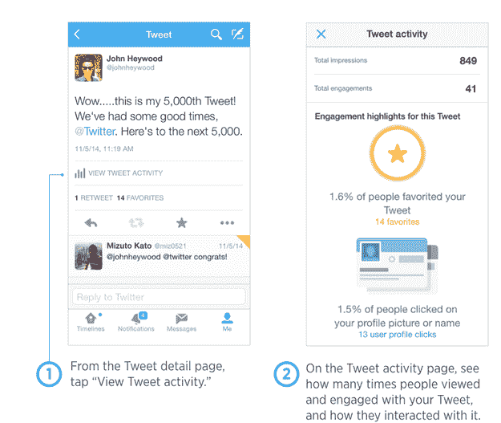

# Twitter 用户现在可以在 iOS 应用 TechCrunch 中跟踪推文浏览量和参与人数

> 原文：<https://web.archive.org/web/https://techcrunch.com/2014/12/22/twitter-users-can-now-track-tweet-impressions-engagement-numbers-right-in-the-ios-app/>

Twitter 再次扩大了对其分析数据的访问，今天推出了在手机上查看你的“推特活动”的功能。在 Twitter 最新版本的 iOS 应用程序中，一项新功能允许用户在任何推文的详细页面上点击“查看分析细节”选项，以查看与该帖子相关的数据，包括总浏览量、参与度等。

这一变化是 Twitter 让其分析数据更广泛地为其用户群所用的又一个例子，此前[在今年早些时候向公众](https://web.archive.org/web/20221224162503/https://techcrunch.com/2014/08/27/how-many-people-see-your-tweets-twitter-opens-its-nifty-analytics-dashboard-to-everyone/)开放了其分析仪表板。

新增的 iOS 功能最初是由 [The Next Web](https://web.archive.org/web/20221224162503/http://thenextweb.com/insider/2014/12/22/twitter-just-launched-a-mobile-analytics-app-for-ios/) 发现的，它捕捉到了来自 Twitter 前端工程师 Ian Chan 的一条[关于它的推文](https://web.archive.org/web/20221224162503/https://twitter.com/chanian/status/547104694015774720)。然而，该公司并没有费心通过其公司博客或主要 Twitter 账户正式宣布这一功能(至少在发布时没有)。

Twitter Analytics dashboard 是一个方便的资源，可以告诉你你在 Twitter 社交网络上的每一次更新表现如何。当这项服务在 7 月份首次推出时，它最初的目标是 Twitter 的广告商和出版商——也就是说，那些更有可能定期跟踪印象、回复和点击等信息的人，以便分析他们自己的社交媒体策略。

该公司已经向广告商提供了他们付费推广的推文数据，但在分析仪表板出现之前，同样的数据还不能用于“有机”推文。

接下来的一个月，Ian Chan 在 Twitter 上宣布[analytics dashboard 对任何想要访问的人开放](https://web.archive.org/web/20221224162503/https://techcrunch.com/2014/08/27/how-many-people-see-your-tweets-twitter-opens-its-nifty-analytics-dashboard-to-everyone/)。这意味着像你我这样的普通用户可以登录，看看我们的哪些推文引起了 Twitter 观众的共鸣。

在网络上，仪表板显示有机印象和参与度，详细表现的图表，推文预览和每篇帖子的详细参与度指标，以及导出数据和永久链接以供进一步分析的能力。

在移动设备上，通过 iOS 应用程序，互动数据以更简化的格式提供。你会看到某条推文的总浏览量和参与度，以及其他相关统计数据，例如，有多少人点击了你推文中的链接，有多少人点击了你的推文，有多少人收藏了你的推文，或者有多少人点击了你的个人资料图片或姓名。

虽然详细描述您的总印象和参与度的指标显示在每条推文中，但显示的亮点会因推文而异。也就是说，Twitter 会有选择地向您显示与该特定推文相关的指标(例如，点击，如果您在推文中包含了链接)，以及那些值得分享的指标。

你看不到其他账户转发的这些指标，这是可以理解的。

新功能本身目前只适用于 iOS。Chan 在随后的一条推文中表示，Android 支持正在进行中，但该公司目前没有发布日期。