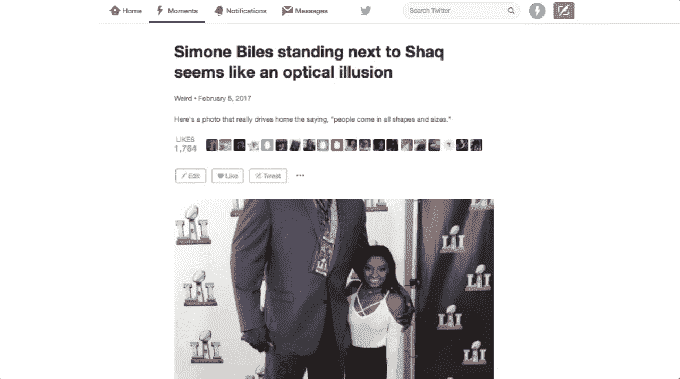

# Twitter 时刻有自己的分析技术 

> 原文：<https://web.archive.org/web/https://techcrunch.com/2017/03/07/twitters-moments-get-their-own-analytics/>

公司[今天宣布【Twitter Moments，Twitter 自己对以一系列相互关联的推文形式讲述的简短内容的看法，今天得到了自己的分析。这将允许 Moments 的创建者通过提供打开、喜欢、分享等细节来跟踪他们的内容在 Twitter 上的表现。这个想法是，这些数据将有助于在未来创造更好的表现时刻。](https://web.archive.org/web/20221005181329/https://twitter.com/TwitterMoments/status/839143612436860928)

回顾一下，Twitter 时刻功能最初是由[在 2015 年](https://web.archive.org/web/20221005181329/https://beta.techcrunch.com/2015/10/06/project-glacier/)推出的，作为对 Snapchat 故事的某种回应。像故事一样，瞬间被设计成简单快捷的内容。但是，他们不是用图片，而是用一系列推文来讲述一个故事。

该功能最初只对品牌和有影响力的人开放，这可能会减缓他们在 Twitter 用户群中的采用。创作工具[直到 2016 年 11 月](https://web.archive.org/web/20221005181329/https://beta.techcrunch.com/2016/11/30/twitter-now-lets-mobile-users-make-their-own-moments/)才对普通用户开放。

Moments 的存在也没有像该公司可能希望的那样，刺激更多人注册这项服务。他们也没有取代“推特风暴”作为分享更长想法的手段——手动编号和连接的推特在今天的推特上仍然非常受欢迎。

Twitter 最终决定降级其应用程序中的时刻。今年早些时候，[该公司在手机上推出了一个“探索”栏目](https://web.archive.org/web/20221005181329/https://beta.techcrunch.com/2017/01/26/twitter-launches-explore-a-new-home-for-moments-trends-search-and-live-video/)，接管了曾经举办的现场活动。虽然时刻仍然是这一部分的一部分，但它们不再是唯一的吸引力，甚至不是主要的吸引力。热门搜索、视频和直播现在在这里占据了重要位置。

但几个品牌正在继续发布自己的时刻。例如，在撰写本文时，你可以在 Explore 屏幕上找到来自路透社、Hype Machine、GQ、SB Nation、美国职业足球大联盟、Net-A-Porter 和其他网站的内容，以及内部制作的内容。

Twitter 拒绝分享 Moments 的采用、牵引力或增长指标。

要访问新的分析，您可以单击向下箭头或三点“更多”菜单。

据我们了解，该工具将主要由出版商合作伙伴和品牌广告商使用，并将跟踪打开次数(某个时刻被查看的次数)；唯一打开(由唯一用户查看)；比如，分享(来自 tweet 按钮)，以及完成率(到达终点的百分比)。