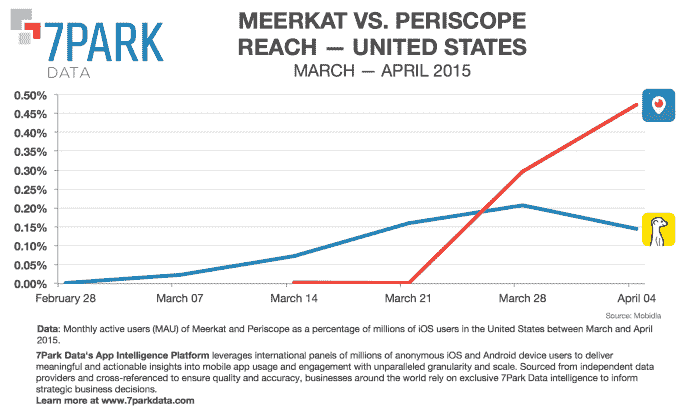
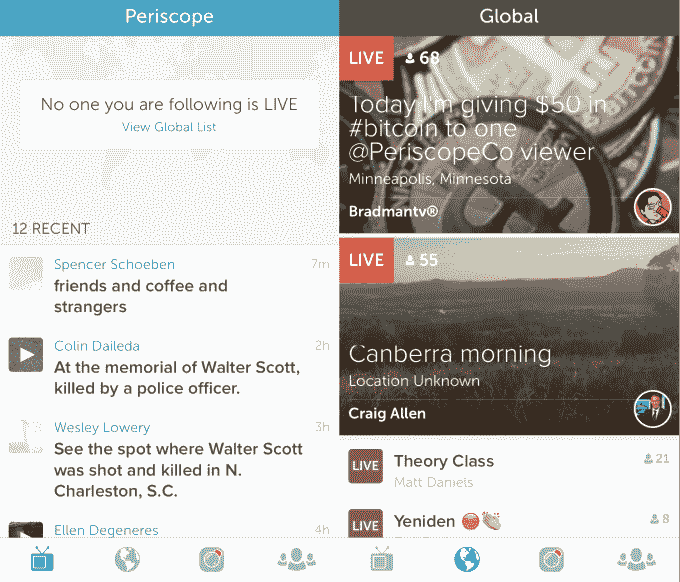

# Twitter 正在赢得直播之战 

> 原文：<https://web.archive.org/web/https://techcrunch.com/2015/04/16/twitters-periscope-widens-lead-over-rival-meerkat/>

在收购直播应用 Periscope 之后，Twitter 一直在积极努力确保其服务击败独立竞争对手 Meerkat，后者起步稍早。最近几周，Twitter 已经对[做出了改变，切断了 Meerkat 对 Twitter 社交图](https://web.archive.org/web/20230131033604/https://techcrunch.com/2015/03/13/twitter-starts-breaking-meerkat-features-by-limiting-social-graph-access/)的访问，甚至开始[推动名人和出版商停止使用 Meerkat](https://web.archive.org/web/20230131033604/https://techcrunch.com/2015/04/12/this-stream-aint-big-enough-for-the-both-of-us/#.o0tzqc:3uwi) 。根据现在发布的新数据，这些努力似乎为 Twitter 带来了回报，该数据显示 Periscope 在 iOS 月活跃用户方面领先 Meerkat 近 0.5 个百分点。

这两家竞争对手的服务都提供允许用户从智能手机直接向 Twitter 直播的应用程序，它们一直在争夺消费者的注意力，同时迅速推出各自应用程序的改进。例如，上个月， [Meerkat 推出了新的发现功能和推荐](https://web.archive.org/web/20230131033604/https://techcrunch.com/2015/03/27/hunting-meerkats/#.o0tzqc:b64W)，而 Periscope 最近的更新[使查找朋友的广播更加容易](https://web.archive.org/web/20230131033604/https://techcrunch.com/2015/04/08/friendiscope/)。

就在今天，Meerkat 通过第一个使用 Android 应用程序的[再次超越了 Twitter，尽管在这一点上仍然只有邀请才能访问。](https://web.archive.org/web/20230131033604/http://9to5google.com/2015/04/15/meerkat-android-app/)

然而，Twitter 仍然拥有优势，因为它控制着这个平台，而且作为一家规模更大的上市公司，它已经拥有资源来吸引名人、媒体公司和其他可能帮助其平台取得成功的人。此外，如果有必要，如果客户和其他品牌选择与 Meerkat 合作，它甚至可以通过切断他们对 Amplify 等广告产品的访问来迫使他们使用 Periscope。

当然，从工程、营销和招聘的角度来看，Twitter 也有更多的资源可以投入 Periscope。

现在看来，Twitter 的激进策略已经奏效。在 3 月 22 日这一周，Periscope 的月活跃用户数量超过了 Meerkat。根据来自 [7Park](https://web.archive.org/web/20230131033604/http://7parkdata.com/) 的数据，当时 Meerkat 在 iOS 上的占有率为 0.2%，Periscope 的占有率为 0.3%。在这种情况下，“触及”被定义为该应用在 2015 年 3 月至 4 月期间在美国数百万 iOS 用户中所占的百分比。

接下来的一周，两个应用之间的差距扩大了，Meerkat 的触及率下滑至 0.1%，Periscope 攀升至 0.5%。

然而，值得指出的是，从整体来看，这些数字仍然很低。与其他社交应用相比，这两种服务争夺的受众非常少。相比之下，Twitter 在美国 iOS 用户中的覆盖率约为 19%，而其 Vine 视频应用的覆盖率为 5.4%。Snapchat 以 29.8%的覆盖率高居榜首。

话虽如此，对于一款新应用来说，在几周内增长甚至半个百分点都是一个强劲的启动，而且 Periscope 很可能在未来几个月继续增长，特别是在 Twitter 全力支持下。

对于移动社交应用，许多人认为这不一定是一个赢家通吃的市场。但 Twitter 的潜望镜却不是这样。[视频有望成为 Twitter 未来](https://web.archive.org/web/20230131033604/https://techcrunch.com/2015/03/14/bird-vs-mammal/)的主要部分，其自己的直播平台也有可能成为新广告收入的一个有利可图的来源。此外，该服务为用户提供了一种与 Twitter 互动的新方式——这可能有助于该网络增加其活跃用户数量、使用其应用程序的时间以及登录用户数量。

后一项可能会解决该公司的长期痛点。Twitter 历史上很难让新访客转化为注册用户，因为许多人更被动地使用该服务，只阅读新闻媒体或公众人物如政治家、名人、体育明星和其他有影响力的人的推文。[事实上，就在昨天，Twitter 推出了一个新的主页](https://web.archive.org/web/20230131033604/https://blog.twitter.com/2015/twittercom-gets-a-refresh)，旨在迎合那些还没有 Twitter 账户或者还没有登录的人。更新后的登录页面允许这些已注销的用户按类别查看热门推文——让他们在建立帐户之前有机会与服务互动。

Twitter 方面的希望是，这些访问者喜欢他们在新网站上看到的东西，足以实际加入这项服务。新页面也给了 Twitter 一个更好地追踪非注册用户的途径。当然，很容易想象一个专注于流行直播视频流的栏目将来也会出现在这个页面上。

对于 Meerkat 来说，与 Twitter 对抗可能会以失败告终——但该应用早期的受欢迎程度及其团队的技术水平可能会使其成为其他希望参与直播趋势的主要参与者的收购目标，比如脸书。显而易见的是，在 Meerkat 与 Twitter 的战斗中，它仍有一场大战要打。