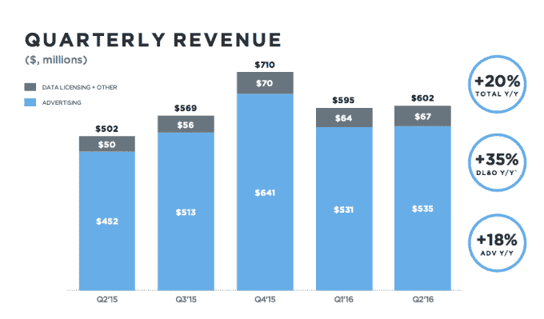

# Twitter 的销售团队在即将到来的大裁员中受到冲击 

> 原文：<https://web.archive.org/web/https://techcrunch.com/2016/10/24/twitters-sales-team-may-take-a-hit-in-big-upcoming-layoffs/>

好了，现在我们知道为什么 Twitter 决定在开市前发布收益报告了([那时西海岸将会很方便地在很大程度上睡着](https://web.archive.org/web/20221220122850/https://techcrunch.com/2016/10/24/twitter-decides-to-release-earnings-while-most-of-us-are-sleeping-because-reasons/))。

据彭博报道，该公司可能会裁员 8%，约 300 人，裁员[最早可能在本周](https://web.archive.org/web/20221220122850/https://www.bloomberg.com/news/articles/2016-10-25/twitter-said-to-plan-hundreds-more-job-cuts-as-soon-as-this-week)宣布。像往常一样，这些情况是非常动态的，所以上述所有情况都可能与预期不同，但我们在过去几周已经听到了很多类似的裁员传言。

特别是，我们从消息来源听到的一件事是，销售团队是裁员的目标。收入增长放缓可能是罪魁祸首，尤其是像脸书和 Snapchat 这样的替代平台继续以更快的速度增长。

(除此之外，这些裁员的传言与[首席执行官杰克·多西发出的一份奇怪的备忘录基本上是在说这家公司有多棒](https://web.archive.org/web/20221220122850/https://www.bloomberg.com/news/articles/2016-10-10/twitter-s-dorsey-rallies-staff-around-independent-strategy-in-internal-memo)。所以，你可以随意解读。)

不管是哪种情况，随着一家更大的公司突然出现并收购它的希望越来越渺茫，该公司似乎正在努力瘦身。Twitter 的一名代表拒绝置评。

自从多尔西去年这个时候接管以来，Twitter 一直处于绝对的过山车状态。多尔西上任伊始就裁掉了公司 8%的股份，在他担任首席执行官期间，Twitter 的价值缩水了近一半。这是用户增长缓慢甚至没有增长、收入增长放缓以及不断被平台上的钓鱼问题困扰的结果。(后者[实际上吓跑了迪士尼和 Salesforce 作为潜在的追求者](https://web.archive.org/web/20221220122850/http://fortune.com/2016/10/18/twitter-disney-salesforce/)。)

有报道称，Salesforce、迪士尼和其他公司都在考虑收购该公司，这带来了希望。这让 Twitter 的市值增加了数十亿美元，但很快就被剥离[，因为很明显没有一家公司对此感兴趣](https://web.archive.org/web/20221220122850/https://techcrunch.com/2016/10/06/twitter-shares-drop-20-as-takeover-rumors-fade-away)。没有一个明显的追求者，Twitter 将需要找到一种方式，让华尔街更具前瞻性和希望。从裁员开始以提高业务效率有时是事情的发展方向。

但是最终还是要改进产品。除了巨魔之外，多尔西实际上并没有对这项服务做出任何重大的改变，只是在 feed 中加入了更多的算法。试图让它不那么混乱，比如取消对各种媒体的字符限制，并试图修复@replies(和“独木舟”)，仍然没有帮助使这项服务更有粘性，吸引新用户。(还有[和](https://web.archive.org/web/20221220122850/https://techcrunch.com/2015/10/06/project-glacier/)时刻，但这个故事似乎还没有结束。)

Twitter 将于太平洋时间周四凌晨 4:00 公布第三季度财报。如果你想知道更多的细节(或者，也许，那一天他们会正式宣布)，设置你的闹钟，拿一杯咖啡。我们也会继续收看。