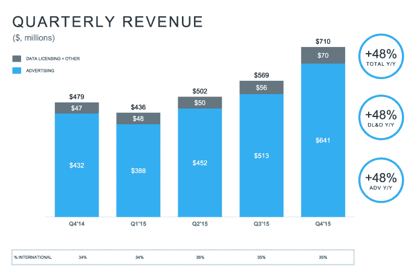
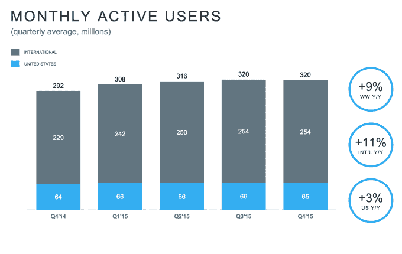
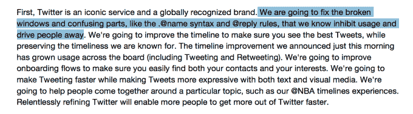

# Twitter 的用户增长停滞不前，因为它达到了 7.1 亿美元的收入预期 

> 原文：<https://web.archive.org/web/https://techcrunch.com/2016/02/10/twitters-user-growth-goes-nowhere-as-it-meets-revenue-expectations-of-710m/>

Twitter 今天报告了其第四季度的收益——该公司历史上最重要的季度之一——基本上持平。

与分析师预期的小幅增长相比，Twitter 的月度活跃用户增长在季度基础上持平。上个季度，该公司拥有 3.2 亿月活跃用户，本季度也是如此。该公司表示，不包括短信快速追随者的 MAUs 实际上比上季度下降了。该公司报告称，第四季度的月活跃用户为 3.05 亿，而上一季度为 3.07 亿，不包括短信快速追随者。

“我们看到第四季度的月活跃使用量有所下降，但我们已经看到 1 月份的月活跃使用量反弹到第三季度的水平，”该公司在财报中表示。“我们相信，通过严格的执行，这种增长趋势将会持续下去。”

该公司报告每股收益 16 美分，收入 7.1 亿美元。分析师原本预计 7.1 亿美元的收入将达到每股 12 美分。在盘后交易中，该股跌幅高达 13%，再创新低至 13.75 美元左右。随着收益电话会议的进行，该股略有下降，目前在延长交易时段下跌了约 3%。

该公司表示，预计第一季度收入在 5.95 亿美元至 6.10 亿美元之间，而预期为 6.29 亿美元。尽管用户增长停滞，但收入同比增长 48%。

*观看这段视频，了解是什么导致了 Twitter 的增长问题*

在财报电话会议上，多尔西列出了该公司希望在 2015 年关注的五件事:“完善我们的核心服务，让它更直观，投资直播视频，为创作者和有影响力的人提供最好的工具，投资让 Twitter 更安全，更好地支持开发者。”

这对 Twitter 来说是一个重大事件。过去一年，该股下跌了近 70%。Twitter 因未能以有意义的方式扩大其登录用户群而屡遭惩罚。投资者正在寻求 Twitter 的长期增长，尽管它的赚钱引擎继续突突前进，但它需要表明，如果它要继续作为一家大型上市公司运营，它可以扩大可以赚钱的总人数。

在今天的交易中，股价上涨了约 4%，至每股 15 美元左右。股价从一度超过 53 美元的高点下跌，抹去了该公司数百亿美元的市值。

[graphiq id = " aozdeffnn 2 z " title = " Twitter Inc .(TWTR)股价-1 年" width = " 600 " height = " 490 " URL = " https://w . graphiq . com/w/aozdeffnn 2 z " link = " http://listings . findcompany . com/l/445483/Twitter-Inc-in-San-Francisco-CA " link _ text = " "]

当首席执行官迪克·科斯特罗下台，联合创始人杰克·多西回来管理公司时，至少还有一些乐观情绪。产品负责人再次掌权。但即使在他的领导下，Twitter 的增量更新——时刻，将收藏夹改为喜欢按钮，以及可能取消推文的字符限制——也没有对服务产生有意义的影响。多尔西在 Q2 财报电话会议上总结了该公司的问题:“我们在 Q2 的业绩显示，货币化进展良好，但我们对受众的增长不满意。”

Twitter 在 10 月份推出了 Moments，所以它有一些时间来施展它的魔法，如果它打算这么做的话。尽管视觉上很刺激，但 Moments 似乎没有抓住 Twitter 希望吸引的主流崇拜。Twitter 近十年来的看法一直存在——它很难使用，最适合新闻迷和名人，脸书是一个分享的好地方。

随着股票下跌，士气也会下降。像 Twitter 这样的公司，员工的大部分薪酬往往被锁定在股票上，随着股价的起伏波动。随着多尔西治下发生的崩盘，拥有股票的 Twitter 员工已经看到股票价值的巨大部分被抹去。

毫无疑问，今天早些时候，该公司推出了一个新的时间线，而不是典型的时间顺序时间线。它被设计成当你不在时的一种升级，帮助用户了解与他们兴趣相关的最重要的推文。这一声明——以及 BuzzFeed 披露的之前的故事——引起了一点混乱，人们对 Twitter 改变其核心服务进行了反击。

幸运的是，它已经开始出现一些可能有所帮助的变化。算法时间线的推出可能会让人们订阅的每条推文变得更有趣。这可能会鼓励他们实际消化 Twitter 显示的广告，提高他们的业绩和 Twitter 可以收取的价格。该公司还刚刚宣布了位于时间轴顶部的 First View 视频广告。这些当然更会打断体验，但由于它们如此生动，应该会获得很高的收视率。

Twitter 方面表示，在讨论其第四季度收益的致股东信中，它致力于减少这项服务的混乱。有趣的是，它挑出@个回复和。@名称规则。

所有这一切似乎都是为了让这项服务对新老用户更加平易近人，更加方便——并帮助它继续发展。看来该公司的问题还在继续。Twitter 需要找到一种方法来重新点燃其用户增长，现在用户增长已经完全停滞。