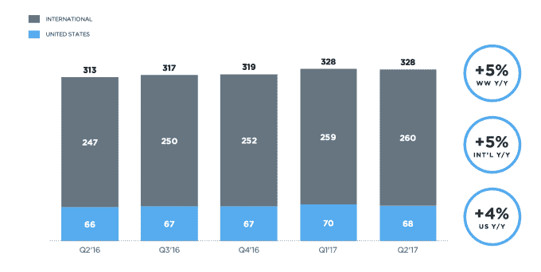
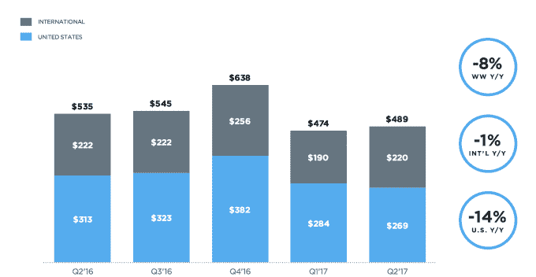
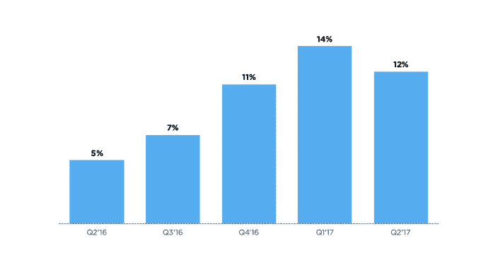
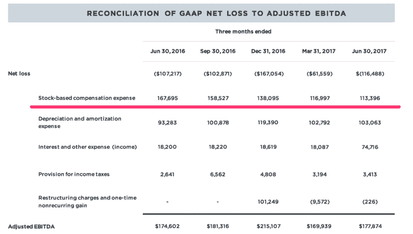

# Twitter 用户增长停滞，股价暴跌 

> 原文：<https://web.archive.org/web/https://techcrunch.com/2017/07/27/twitters-user-growth-went-nowhere-and-the-stock-is-diving/>

过去几个季度，Twitter 给自己带来的一个小小的好消息是，至少它的月活跃用户数在逐季增长。

虽然 MAUs 可能不是这些天应该关注的正确数字，但不管是好是坏，这是 Twitter 目前被评判的核心指标之一——这在 Twitter 今天报告其收益时并未实现，因为其用户与上一季度相比持平(与去年同期相比增长了约 5%)。也许更重要的是，该公司在美国的 MAUs 略有下降，尽管国际用户弥补了这一损失。

因此，很像 Twitter 的风格，在报告出来后，该股下跌了 8%以上。这是资金图表:

Twitter 的其他业务看起来或多或少都不错，但华尔街似乎仍然依赖 Twitter 来维持哪怕是很小的用户增长。由于广告业务持续下滑，其收入仍在下降，降至 5.74 亿美元。其数据许可仍在增长，但还不够快(或不够大)来抵消这一下降。Twitter 表示，其每股收益为 12 美分，而分析师预计其收入为 5.366 亿美元，每股收益为 5 美分。

以下是美国这一数字下降对 Twitter 不利的一个原因:就货币化而言，这可能是它最有效率的市场(对许多其他公司来说也是如此)。它的美国用户只占其用户总数的一小部分，但他们构成了其广告收入的大部分。这与网飞在试图发展时不得不应对的问题是一样的，尽管它可能已经达到了一个饱和点——每个潜在想使用 Twitter 的人都已经在 Twitter 上了。(下面是广告收入。)

从更大的范围来看，Twitter 试图将自己标榜为一个不可或缺的直播服务，可以发展成为一个长期独立的公司。Snap 上市以来的糟糕表现可能改变了市场对脸书和谷歌以外的广告产品的看法，但 Twitter 可能看到了利用其(嗯，大型)利基市场销售高价视频广告产品的机会。

在这种程度上，该公司吹嘘自己拥有 5500 万独立视频观众。它还试图展示其每日用户数正在增长，尽管这是一张没有实际每日活跃用户数的奇怪神秘图表(但嘿，这是技术——我们不需要 Y 轴):

今年到目前为止，这种宣传可能是有效的。尽管*高层发生了更多的*变动——尽管最近的一次[是增加了新的视频直播业务负责人](https://web.archive.org/web/20230213113614/https://techcrunch.com/2017/05/22/twitter-brings-on-a-new-lead-for-its-live-video-business/)——该公司的股票仍然上涨了 20%左右。在 Anthony Noto 接任首席运营官后，Twitter 本月早些时候宣布[任命了一位新的首席财务官](https://web.archive.org/web/20230213113614/https://techcrunch.com/2017/07/11/twitters-new-cfo-is-getting-15-million-in-stock/)。但如果它要继续销售自己，它显然还需要做更多的工作来提高用户增长。

但是，嘿:至少基于股票的薪酬支出数字仍在下降:

