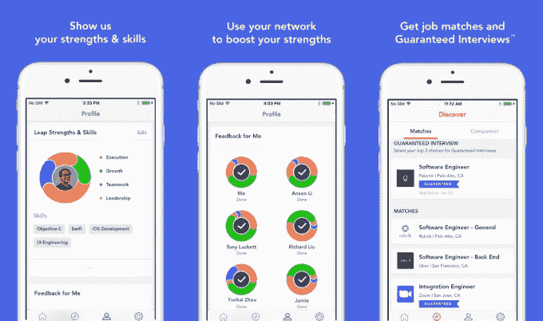

# 两名前谷歌员工正在使用人工智能来保证科技求职者的面试

> 原文：<https://web.archive.org/web/https://techcrunch.com/2017/08/26/two-ex-googlers-are-using-leap-ai-guaranteed-job-interviews-tech-companies/>

两名前谷歌员工向科技行业的员工保证，由于人工智能，他们可以获得与梦想雇主的面试机会。

过去一年左右，人工智能被用来解决一系列广泛的问题，随着他们的初创公司 [Leap.ai](https://web.archive.org/web/20221226040708/https://leap.ai/) ，前谷歌工程师和[周云凯](https://web.archive.org/web/20221226040708/https://www.linkedin.com/in/yunkaizhou/)相信它可以用来解决科技领域的招聘难题。

目前的情况是，LinkedIn 是定义在线招聘的 800 磅大猩猩。但它远非完美。大多数人力资源和招聘团队都在无尽的电子简历堆中穿梭。LinkedIn 去年以超过 260 亿美元的价格出售给了微软，由于 LinkedIn 内部的猎头选择通常是定量的，而不是定性的，因此服务工作通常是一个耗时的人工过程。

Leap.ai 创始人刘(CEO)和周(CTO)都来自中国，但都是硅谷的长期居民。他们认为，有一种更有效的方式来映射个人的技能和经验，同时将它们与潜在雇主的要求和文化相匹配。

“我的部门大概雇佣了 500 人，”刘在一次采访中告诉 TechCrunch，他在谷歌工作了八年，后来成为 Project Fi 的工程主管。“我们知道招聘很难。”

“你学习能力、合作能力或主动性都是很强的特征，但你很难从面试中感受到这些特征。好奇心和动力，在面试过程中，你不能做太多来衡量，”他补充道。

Leap.ai 成立于 18 个月前，目前有 10 名员工，它绘制了一系列数据，包括就业历史、资格和技能、个人兴趣、职业动机等明显的领域，以汇集候选人职业抱负的更完整画面。这个过程的一部分包括描绘出他们的“梦想”雇主和理想角色。

从那里，该系统将求职者与包括 Dropbox、优步等公司在内的寻求招聘的客户进行匹配。通过要求候选人说出他们渴望为之工作的两家公司，Leap.ai 相信它可以保证至少面试一家，特别是当他们是初创公司而不是谷歌这样的大公司时。

刘解释说，这是因为，公司真正看重的是那些能适应公司文化、除了经济利益之外还有动力加入公司的候选人。

“LinkedIn 完美地解决了第一个问题，即你做了什么，但每个人有多好，他们如何融入组织，这要困难得多，也有价值得多，”他说。

Leap.ai 服务还根据求职者和招聘者收集的数据，就候选人最适合在哪里工作提供个性化建议。

迄今为止，结果似乎令人印象深刻。该公司只有在成功促成招聘时才赚钱，刘说，该公司有望在 8 月份实现盈利。迄今为止，70%的匹配者(至少)通过了目标公司的第一轮面试。

它目前专注于纽约、博尔德、奥斯汀、西雅图和硅谷的候选人，但它希望在美国和海外拓展这一范围。这部分是由其 50 多个客户的需求推动的。刘说，Leap.ai 已经引起了印度和中国公司的极大兴趣，这些公司正在寻找渴望回国从事科技项目的海外侨民。

这家初创公司已经建立了专门的功能来帮助这些亚洲公司在美国招聘员工，并计划从中国开始调查当地的招聘选项。

它已经在中国开放网络方面取得了进展。Leap.ai 的创始人除了拥有中国工程师的身份，还从中国顶级科技风投公司之一的真格基金(Zhen Fund)获得了资金，作为其迄今为止筹集的 240 万美元种子资金的一部分。

“我们正在中国积极寻找机会，(但)我们希望确保在进入中国之前，我们已经在美国站稳脚跟，”刘说。“我们从第一天起就为美国、中国和印度设定了目标。”

该公司的目标不仅仅是帮助招聘，Leap.ai 希望复制刘和周在谷歌时的那种导师关系。也就是说，帮助年轻员工规划他们的职业目标，并从一个阶段到另一个阶段实现他们的抱负——无论是在当前公司的新职位上，还是跳槽到其他地方。

就产品而言，这意味着人们会把它作为一种长期的职业伙伴。这家初创公司的应用程序已经远远超出了求职范围，专注于职业和个人发展，他们计划在这方面增加更多深度。

“我们在谷歌一直是积极的导师，”在这家搜索巨头工作了近十年的周解释道。“我们希望鼓励长期的职业成功。”

作为衡量其成功的一个标准，该公司自己雇佣了超过一半的 it 员工。现在，它希望让其他人，包括雇主和雇员，都能从中获益。