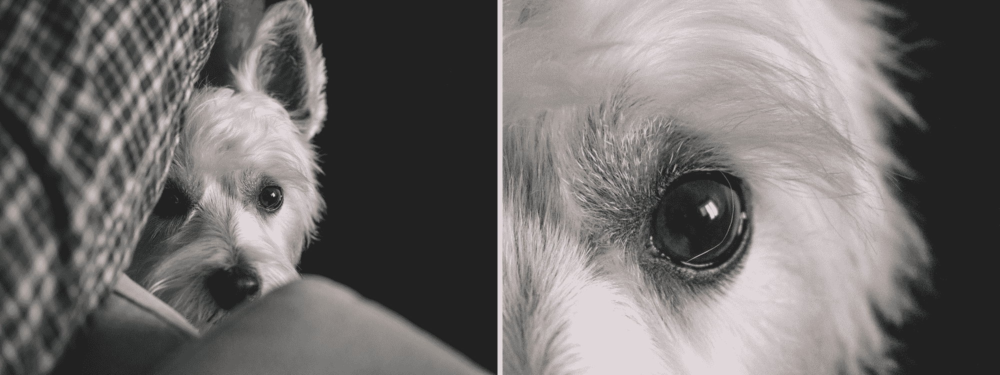
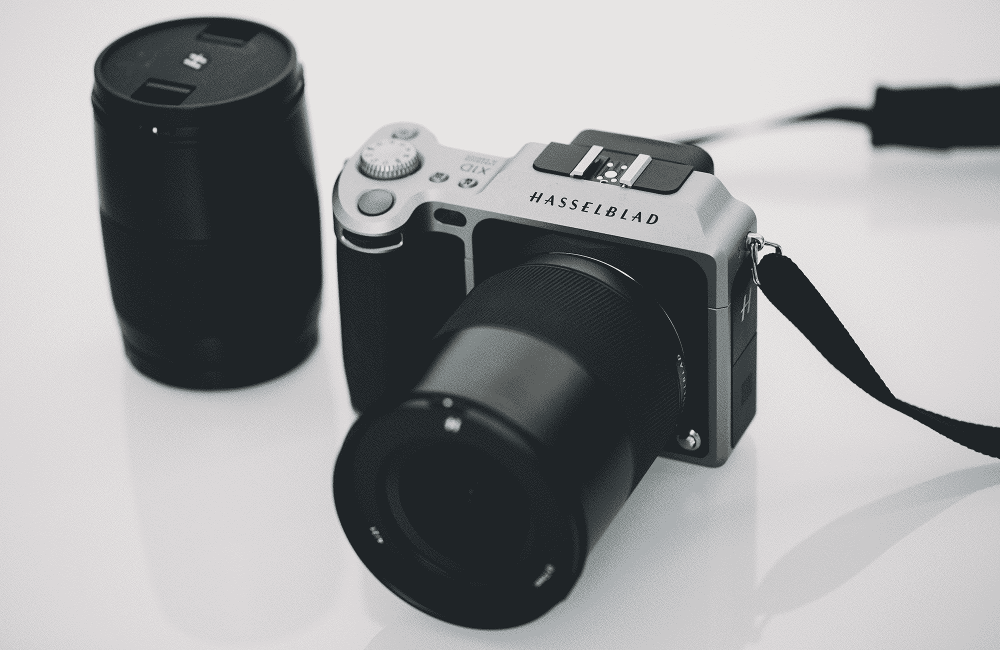

# 使用价值 16，000 美元的哈苏套件两周 

> 原文：<https://web.archive.org/web/https://techcrunch.com/2018/09/29/two-weeks-with-a-16000-hasselblad-kit/>

对于像我这样的业余摄影爱好者来说，哈苏一直是高端专业人士的奢侈品品牌。

为了填补随意摄影和有意摄影之间的空白，他们发布了 X1D——一种紧凑的无反光镜中画幅。去年夏天，当斯蒂芬·艾蒂安[检阅](https://web.archive.org/web/20230213024200/https://techcrunch.com/2017/05/11/hasselbads-x1d-puts-other-medium-format-cameras-on-notice/)新发布的相机时，我要求拍张照片。

在将 raw 文件导入 Lightroom 并翻阅了十几个预设后，我开玩笑说，我会在接下来的一年里吃拉面包，这样我就可以买这个相机了。令人印象深刻。

###### *XCD 3.5/30mm 镜头*

上个月，哈苏将 X1D body 毫米(他们最新的超广角镜头)发给我们进行为期两周的评估，同时将 X1D 机身和 XCD 3.2/90 毫米人像镜头进行比较。我想看看我能用这个工具包做些什么，并做了如下计划:

*   用一张不讨人喜欢的 Tinder 个人资料照片对着每个人向右滑动，并主动提出帮他们重拍
*   去一个风景优美的地方旅游

我的时间表没有为这两者提供太多的时间，所以周末去小屋旅行就足够了。

[gallery type = " slide show " link = " none " columns = " 1 " size = " full " ids = " 1722181，1722182，1722183，1722184，1722185，1722186，1722187，1722188，1722201"]

### 作为日常相机

周末的北部相当安静，平淡无奇，但这是测试相机套件的完美场景，因为 X1D 速度很慢

开机大约需要 8 秒钟，每次快门点击后需要额外的 2-3 秒钟处理时间——此外还有缓慢的自动对焦、缓慢的快门释放和较短的电池寿命(我在一天内用完了一块电池，大约拍摄了 90 张照片)。与其重复 Stefan 的评论，我建议在这里 阅读它的 [以获得完整的规范。](https://web.archive.org/web/20230213024200/https://techcrunch.com/2017/05/11/hasselbads-x1d-puts-other-medium-format-cameras-on-notice/)

来自佳能 5D Mark IV，我习惯于即时性和相当高的命中率。与哈苏的第一天充满了不断错过的时刻，错过的机会。作为一台日常相机，它感觉不切实际，直到我转向一种更谨慎的方法——回到高中单反时代，当时一卷胶卷只能容纳有限的 24 张曝光。

当我暂停拍照时，我开始欣赏这款相机的细节:安静的快门、紧凑但坚固的机身和直观的界面，包括触摸屏液晶显示屏/取景器。

[gallery type = " slide show " link = " none " columns = " 1 " size = " full " ids = " 1722796，1722784，1722775"]

无论是机身还是镜头，瑞典设计的铝制结构看起来还是感觉都不便宜。对于无反光镜相机来说，它很重，但握起来感觉非常好。

### XCD 4/21 毫米镜头

[gallery type = " slide show " link = " none " columns = " 1 " size = " full " ids = " 1722190，1722191，1722489，1722490"]

没有过度夸张视角的戏剧性风景和城市景观——这就是 XCD 4/21mm 优于其他超广角镜头的地方。

105°的视角和17 毫米的视野相当于一个全框 DSLR，我原本以为会有更多的失真和晕影，但图像在导入 Lightroom 时会自动纠正并变平。Creative Cloud 的最新部署将 Hasselblad(相机和镜头)配置文件集成到 Lightroom 中，因此无需下载和导入配置文件。

油腻的纽约房地产经纪人真的应该考虑用这个镜头拍摄他们狭小的 250 平方英尺。制成一室公寓感觉宏伟，而不看滑稽的鱼眼。

### XCD 3.2/90 毫米镜头

【时间】下图所示的画廊只是用镜子里的梳妆灯做了些练习。它也被拍摄曝光不足，看看有多少细节，我可以拉在员额。 [这里有尺寸缩小、未经编辑的版本](https://web.archive.org/web/20230213024200/https://techcrunch.com/wp-content/uploads/2018/09/hasselblad_x1d_sample_008.jpg) ，所以你不必等待每个 110mb 的文件加载。

[gallery type= "幻灯片显示" link = " none " columns = " 1 " size = " full " ids = " 1722193，1722194，1722195，1722196"]

我想，如果我有时间，而且感觉自己是个慈善家，我可以用这个镜头在 Tinder 上修复很多爱情故事。

### 闪耀的地方

评论中的图片通常都是未经编辑的，但我认为对原始图片的真正考验在于后期制作。这就是 X1D 处理时间慢和电池消耗快的好处。这款相机采用的是巨型的 50 MP 44 x 33mm CMOS 传感器，每个原始文件的大小约为 110mb(相比之下，我的 Mark IV 的原始文件大小为 20-30mb)，也就是说，有大量信息被打包到了 8272 x 6200 个像素中。

[调整为 2000 x 1500 像素](https://web.archive.org/web/20230213024200/https://techcrunch.com/wp-content/uploads/2018/09/hasselblad_x1d_sample_012.jpg)和[裁剪为 2000 x 1500 像素](https://web.archive.org/web/20230213024200/https://techcrunch.com/wp-content/uploads/2018/09/hasselblad_x1d_sample_013.jpg) :

虽然其他相机制造商倾向于某些颜色和肤色，但哈苏的代表 Dan Wang 告诉我，“我们相信看到非常自然甚至影响非常小的调色板。我们在这里不是来决定应该是什么颜色的。我们在这里给你尽可能多的数据，提供尽可能多的原始细节和原始颜色信息，让你可以在你的范围内解释它。”

作为一个喜欢花无数时间调整颜色、移动像素和美化事物的人，我很欣赏这一点。它允许更少的固定，更多的创造自由。

### 这个相机是给谁的？

我的朋友[彼得](https://web.archive.org/web/20230213024200/http://www.peterbuckingham.com/)，一位时尚摄影师(他为《时尚芭莎》、《时尚》等杂志做过编辑特写)，是我认识的唯一一个用哈苏摄影的人，所以我觉得应该问问他的意见。“这是给那些有钱花不完的自命不凡的有钱混蛋的，”他调侃道。我不同意。X1D 是哈苏摆脱重型三脚架、走出工作室的坚实一步。

虽然在这个价位，人们可能会认为这款相机无所不能，但它针对的是一个狭窄的人群:愿意为了质量和紧凑性而忽略速度的摄影师。

随着苹果(Apple)和三星(Samsung)等智能手机公司在过去几年里加快了它们的相机游戏，摄影界感觉被无关紧要、被丢弃的图像淹没了(自我放纵的自拍，“看看我午餐吃了什么”，OOTD…)。

我与哈苏的两个星期提醒我，摄影是一种有条不紊的艺术形式，而不是一种喷洒和祈祷的爱好。

已审核的套件运行费用为 15，940 美元，税前: