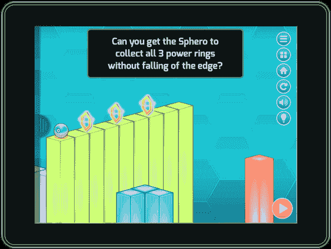

# Tynker 是一家教孩子编程的初创公司，现在与机器人、无人机等合作

> 原文：<https://web.archive.org/web/https://techcrunch.com/2015/05/15/tynker-a-startup-that-teaches-kids-to-code-now-works-with-robots-drones-and-more/>

# Tynker 是一家教孩子编程的初创公司，现在与机器人、无人机等合作

初创公司 Tynker 通过让孩子们构建自己的游戏来教授他们编程的基础知识，现在该公司正在扩展其平台，允许孩子们控制联网设备，包括无人机、机器人和其他“智能家居”产品，如照明系统。该公司将于本周末在圣马特奥的湾区制造商大会上介绍这些功能，额外的支持现在也扩展到 Tynker iPad 和 Android 平板电脑应用程序。

迄今为止，[初创公司一直专注于](https://web.archive.org/web/20221208225800/https://beta.techcrunch.com/2013/08/06/with-tynkers-new-service-kids-can-learn-to-code-at-home/)，通过提供大量教程和工具，让孩子们更容易理解编程的核心概念，他们可以通过可视化的拖放界面与有趣的角色进行互动，从而构建游戏。

在过去的三年中，超过 2300 万名儿童开始使用 Tynker 编程，其课程目前正在美国、加拿大、英国、澳大利亚和新西兰的 20，000 多所学校使用。每月大约有 100 万到 200 万用户登录 Tynker，该公司还在以每月 50 万新注册用户的速度扩大用户群。

苹果零售店也预装了该公司的 iPad 应用程序供孩子们玩耍，其 Android 应用程序也将出现在即将到来的[谷歌家庭设计发布会](https://web.archive.org/web/20221208225800/https://beta.techcrunch.com/2015/04/14/google-plays-new-program-designed-for-families-will-highlight-pre-approved-kid-safe-apps/#.clfcz4:Iba1)上。据首席执行官 Krishna Vedati 称，该公司今年的现金流将为正。

有了对“物联网”设备的额外支持，Tynker 的用户现在可以做的不仅仅是编写软件环境——他们可以通过构建驾驶无人机、控制玩具和指挥机器人的应用程序来控制现实世界的物体。在发布会上，Tynker 将与许多流行的联网设备合作，包括 Parrot 无人机、Sphero 机器人和飞利浦 Hue/Lux 照明系统。但该公司表示，未来计划进行更多的整合。

为了与这些设备一起工作，Tynker 正在引入新的代码块，这将允许孩子们通过视觉界面来创建控制目标的应用程序。为了更容易上手，Tynker 还提供了一些预编码模板，如“Flappy Drone”，允许孩子们对无人机进行编程，使其上下飞行，以避免和躲避真正的障碍——如流行的手机游戏“Flappy Bird”，以及其他模板，如 Robo Race(机器人赛车游戏)、特技飞行员(用于让无人机表演特技)和其他与连接的照明系统配合工作的模板。

Vedati 表示，在未来，Tynker 将扩展到支持更多的无人机和遥控玩具，并将与苹果 HomeKit、Parrot Flower Power 集成，并提供与乐高、Arduino 和树莓 Pi 的简单接口。

新的代码块库和训练拼图现在可以在 [Google Play](https://web.archive.org/web/20221208225800/https://play.google.com/store/apps/details?id=com.tynker.TynkerPremium) 和 [iTunes](https://web.archive.org/web/20221208225800/https://itunes.apple.com/us/app/tynker-learn-programming-visual/id805869467?ls=1&mt=8) 上的 Tynker 应用程序中获得。