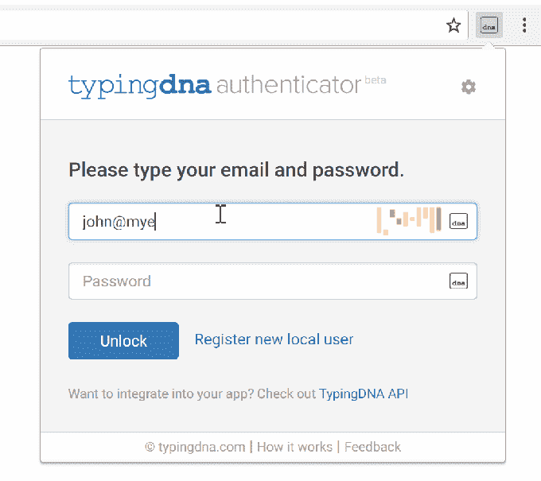

# TypingDNA 推出 Chrome 扩展，根据输入内容验证您的身份

> 原文：<https://web.archive.org/web/https://techcrunch.com/2018/03/14/typingdna-authenticator-chrome/>

# TypingDNA 推出 Chrome 扩展，根据键入内容验证您的身份

DNA 有了一种新的方法，可以根据你的打字方式来验证你的身份。

这家初创公司是目前在 [Techstars NYC](https://web.archive.org/web/20230315095316/https://www.techstars.com/programs/nyc-program/) 的课程的一部分，它将此作为双重认证的替代方案——即，向一个单独的设备(通常是你的手机)发送唯一代码的安全功能，以确保别人不会用你的密码登录。

两个因素的问题？劳尔波帕简单地说:“这是一个糟糕的用户体验…没有人想使用不同的设备。”(我知道 TechCrunch 的作者自己也有两个问题，比如当他们试图在飞机上登录时，却无法连接手机。)

因此，DNA 分型允许用户验证他们的身份，而不必拿出他们的手机。相反，他们只是在一个窗口中输入他们的名字和密码，然后 TypingDNA 将分析他们的输入，并确认这确实是他们。

这家初创公司的商业模式围绕着与合作伙伴合作来整合技术，但它也推出了免费的 Chrome 扩展功能，作为对包括亚马逊网络服务、比特币基地和 Gmail 在内的广泛服务的双重认证的替代。

波帕说，打字 DNA 测量你打字的两个关键方面:你按下一个键需要多长时间，以及你按下这个键需要多长时间。显然这些模式是独一无二的；波帕向我展示了这个系统可以区分我和他的打字，你可以在 DNA 打字网站上亲自测试一下。

他还表示，该公司可以调整系统的严格程度，将误报率降至 0.1%。在 Chrome authenticator 的情况下，波帕说，“我们将错误接受率降至最低”——因此，如果你在一个不寻常的位置打字，或者如果有其他原因，你的打字速度比平时慢或快，你可能会被拒绝。但是在这种情况下，验证者会要求你再试一次。

同样，你可以在很多网站上使用 Chrome 扩展。大多数双因素选项允许使用二维码来确认设备，二维码是典型的 DNA 可以抓取的。双因素代码然后被发送到 TypingDNA 扩展(代码存储在你的本地计算机上，而不是公司的服务器上)，一旦你用上述类型验证了你的身份，它们就会显示出来。

您可以访问 TypingDNA 以[了解更多信息并下载扩展](https://web.archive.org/web/20230315095316/https://www.typingdna.com/authenticator)。