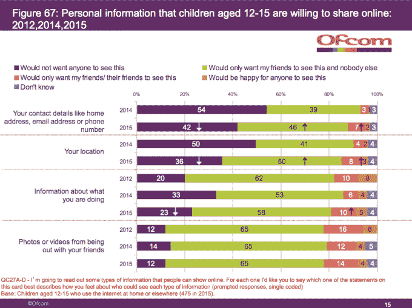

# Ofcom TechCrunch 发现英国儿童越来越容易轻信网络

> 原文：<https://web.archive.org/web/https://techcrunch.com/2015/11/20/u-k-kids-increasingly-credulous-online-finds-ofcom/>

虽然近年来英国政府高调支持为国家的年轻人提供数字技能，包括在英国国家课程中要求开始向小学年龄的儿童教授编码的 T2，T4 通信行业监管机构 Ofcom 的新研究表明，在我们信息超载的时代，同样迫切需要教育孩子成为更好的批判性思考者。

目前，英国越来越多的年轻人太容易轻信他们在网上消费的媒体，英国通信办公室发现，英国孩子有时缺乏判断他们正在观看的数字内容是否真实或公正的能力。

其最新的[媒体使用和态度报告](https://web.archive.org/web/20230110200326/http://stakeholders.ofcom.org.uk/market-data-research/other/research-publications/childrens/children-parents-nov-15/)在 2015 年调查了英国儿童和父母的观点，记录了儿童对在线信息的信任度上升，近十分之一的 8 至 15 岁儿童显然认为他们在社交媒体网站和应用程序上遇到的信息“都是真实的”——这一比例是去年报告的两倍。

从某种意义上说，这并不奇怪，因为在这个时代，社论内容与营销和广告的界限越来越模糊。更不用说像脸书这样的大型广告驱动的社交媒体平台企业系统地盗用用户生成的内容，将其用作可信的背景，以便向用户推送广告。

但是，更重要的是，教育孩子们对他们被灌输的数字信息要更加挑剔。这并不是政府优先考虑的事情。相反，它继续将注意力集中在数字业务的需求上，比如资助教授技术雇主寻求的技能的免费在线课程，比如社交媒体营销培训。媒介素养？没有那么多。

令人难以置信的是，Ofcom 的研究发现，五分之一的网络青少年(12 至 15 岁)相信由谷歌或必应等搜索引擎返回的信息*一定是真实的*。然而，只有三分之一的人能够在这些搜索结果中识别付费广告。

Ofcom 还发现，越来越多的英国孩子转向 YouTube——广告巨头谷歌的另一个平台——寻找关于世界上正在发生的事情的“真实而准确”的信息。近十分之一(8%)的在线儿童认为 YouTube 是他们获取这类信息的首选，而 2014 年这一比例仅为 3%。

然而，在观看 YouTube 的 12 至 15 岁青少年中，只有一半知道广告是该网站的主要资金来源，不到一半的人知道视频博主可以通过代言产品或服务获得报酬。

的确，我们生活在一个营销和误导的黄金时代。

该研究还表明，该国的年轻人普遍越来越适应在网上分享个人信息的概念——同样，鉴于社交媒体平台如何培养他们这样做，这也不足为奇，这些平台依赖用户生成的内容来推动他们的业务。

Ofcom 发现，与去年的调查相比，更少的青少年不希望任何人看到他们的内容细节；位置；关于他们正在做什么的信息；和他们的朋友分享照片和视频。

【T2

尽管如此，研究还发现，越来越多的青少年表示，他们希望这种类型的个人信息共享只与他们的朋友分享——这表明他们对隐私的立场更加微妙，例如，孩子们可能更喜欢通过消息应用程序实现的更有限的信息共享，而不是他们的父母可能也在场的更广泛的社交共享平台。

完整的 Ofcom 媒体使用和态度报告可以在[这里](https://web.archive.org/web/20230110200326/http://stakeholders.ofcom.org.uk/binaries/research/media-literacy/children-parents-nov-15/childrens_parents_nov2015.pdf)找到。