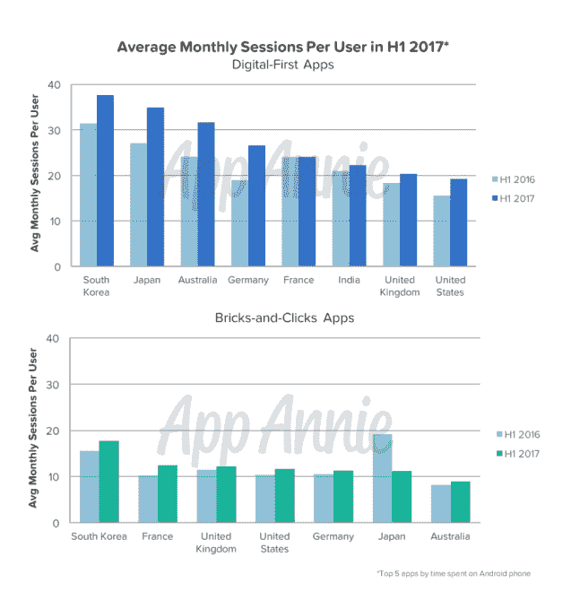
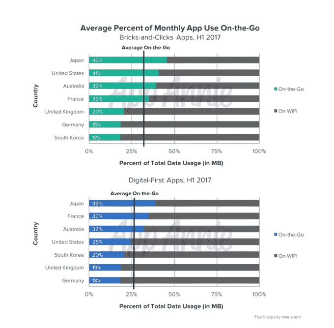

# 美国消费者每年花 10 个小时在购物应用上 

> 原文：<https://web.archive.org/web/https://techcrunch.com/2017/10/11/u-s-consumers-are-spending-10-hours-per-year-in-shopping-apps/>

根据 App Annie 今天早上发布的一份新报告，移动购物正在兴起，美国消费者现在每月花近 50 分钟在购物应用上，每年 10 小时。报告还发现，与传统实体零售商的购物应用相比，亚马逊(Amazon)、Etsy、Wish 等公司的数字优先购物应用在总会话数和月使用量方面也增长得更快。

在美国，2017 年上半年，前五大数字优先购物应用的总会话数同比增长超过 60%，而传统零售商的数字应用仅增长 50%。

就美国每月平均会话数而言，数字优先应用增长了近 25%，而实体零售商的数字优先应用增长了 15%。

这似乎是亚马逊击败沃尔玛的一个领域。App Annie 表示，亚马逊等数字优先应用程序每月也有 19 次会话，相比之下，塔吉特(Target)和沃尔玛(Walmart)等实体零售商今年上半年每月只有 12 次会话。

2017 年 H1 期间，在美国花费时间排名前五的数字优先应用程序是亚马逊、亚马逊购物(亚马逊有一个旧应用程序已从 app store 中删除，但仍在此图表中排名)、Wish、Etsy 和 Zulily。亚马逊购物在英国和德国也是最受欢迎的应用，在日本排名第二。

2017 年 H1 期间，亚马逊、Wish、Etsy、全球速卖通和亚马逊 Prime Now 也是美国月度活跃用户最多的应用。

与此同时，在 2017 年 H1 期间，传统零售商在美国花费时间排名前五的应用程序是沃尔玛、Cartwheel(塔吉特的应用程序，目前正在与塔吉特的主应用程序合并)、美国柯尔百货公司、家得宝和克罗格。

按月度活跃人数计算，美国的名单包括沃尔玛、沃尔格林、卡特彼勒、美国柯尔百货公司和塔吉特。

报告指出，特别是沃尔格林的用户增长迅猛，在 H1 同比增长 65%。

此外，人们倾向于在旅途中使用实体零售商的应用程序——可能是在浏览过道或试图在商店中定位商品时。与此同时，数字优先应用程序更经常在 Wi-Fi 上使用，这表明当他们启动应用程序时，购物者可能在工作或在家。

这些发现将在这个假日购物季发挥作用，App Annie 预测，在黑色星期五和网络星期一，用户将在美国五大数字优先的安卓应用上花费超过 1200 万小时，比去年多 40%。

该公司还预测，纯应用程序交易和独家交易以及具有新的店内功能的实体商店的独家交易将会增加，如 [Target 的视觉搜索](https://web.archive.org/web/20221025222409/https://beta.techcrunch.com/2017/09/25/target-is-adding-pinterests-visual-search-tool-to-its-app-and-website/)或沃尔玛的扫描即走。