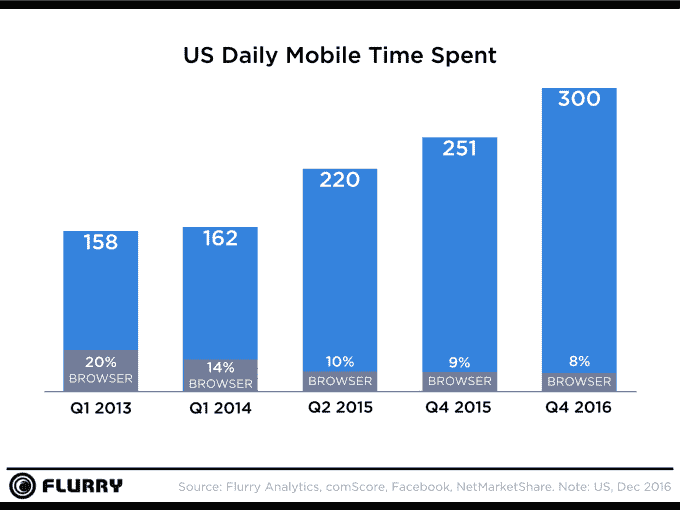
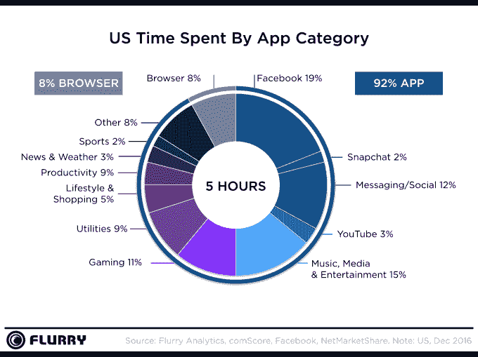

# 美国消费者现在每天在移动设备上花费 5 个小时

> 原文：<https://web.archive.org/web/https://techcrunch.com/2017/03/03/u-s-consumers-now-spend-5-hours-per-day-on-mobile-devices/>

美国用户在移动应用上花费的时间持续增长；根据分析公司 Flurry 本周发布的新数据,我们每天花在移动设备上的时间长达 5 个小时。这是继 1 月的[新闻报道称花在移动应用上的时间比去年同期增长了 69%。](https://web.archive.org/web/20230407062633/https://techcrunch.com/2017/01/12/the-mobile-app-gold-rush-may-be-over/)

与 2015 年第四季度相比，每天 5 个小时增长了 20%，这似乎是以移动浏览器的使用为代价的，而移动浏览器的使用在过去几年中大幅下降。

移动浏览器份额目前为 8%，低于 2015 年第四季度的 9%、2014 年 Q1 的 14%和 2013 年 Q1 的 20%。

向应用程序的转变也可以归因于许多其他因素——应用程序商店的选择增加，更好和更可用的 Wi-Fi 和移动宽带，以及消息应用程序的兴起，应用程序取代了短信和电话等典型的电话功能，以及其他一些因素。

但正如 Flurry 过去指出的那样，应用程序已经变得比看电视更受欢迎——这表明用户对应用程序的兴趣不仅仅是实用性。

2015 年秋天，该公司发现[美国用户花在使用应用程序](https://web.archive.org/web/20230407062633/https://techcrunch.com/2015/09/10/u-s-consumers-now-spend-more-time-in-apps-than-watching-tv/)上的时间比在客厅看大屏幕电视的时间还多。这里的迹象表明，应用程序正在占用我们更多的“休息时间”，否则我们就会被动地观看电视节目。此外，由于网飞、亚马逊视频、Hulu 等流媒体服务的出现，我们在许多情况下都将应用程序作为我们“看电视”的手段。

事实上，如今媒体和娱乐应用占据了我们花在应用上时间的 15%。

Flurry 还表示，美国用户将超过一半的时间(51%)花在社交媒体、消息以及媒体和娱乐应用上，包括 Snapchat 等应用，Snapchat 现在占用户日常应用时间的 2%。

然而，Snapchat 要挑战社交网络巨头脸书还有一段路要走，由于其相关属性 WhatsApp 和 Instagram，该公司占据了 19%的份额。然而，Flurry 发现，Snapchat 正在逼近拥有 3%份额的 YouTube。

与此同时，报告称，其余的“消息/社交”类别占应用程序花费时间的 12%。

所有这些参与都是以另一个热门应用类别——游戏——为代价的。

游戏仍然是开发者和应用平台的赚钱工具，尽管它们的使用率正在下降。例如，苹果公司表示，2017 年元旦是有史以来最大的应用商店日，购买额达 2.4 亿美元。

Flurry 指出，但是这一类别已经连续第二年下降，现在占应用时间的 11%。

随着用户使用应用程序时间的增加，广告领域也受到了影响。应用程序现在可以吸引电视广告资金——多亏了诸如 DirecTV Now、Sling TV、YouTube TV 和其他新服务，它们甚至正在追赶电视用户。Flurry 表示，它相信这些条目将会对未来几天的时间产生影响，并将“从电视中吸取更多的时间”