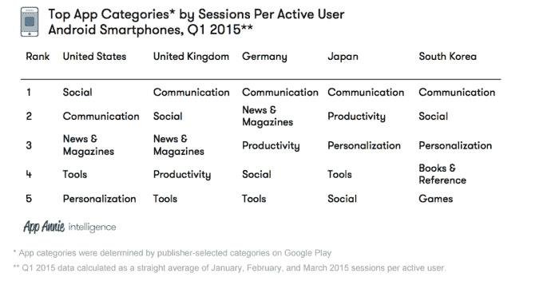
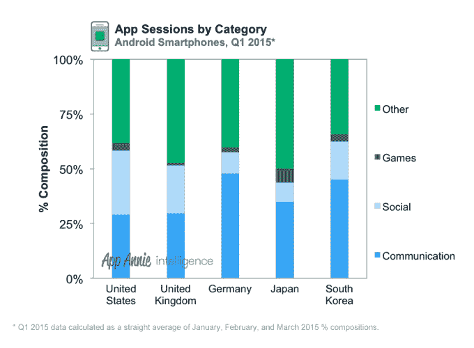
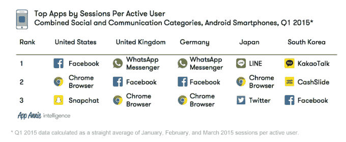
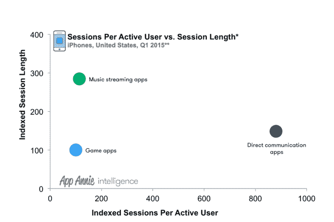

# 美国移动用户花在脸书和 Instagram 上的时间最多，其他地方的消息应用程序占据主导地位 

> 原文：<https://web.archive.org/web/https://techcrunch.com/2015/05/13/u-s-mobile-users-spend-the-most-time-in-facebook-and-instagram-elsewhere-messaging-apps-dominate/>

根据智能手机会话和在应用上花费的时间，消息应用正在成为全球大多数主要市场中使用最频繁的应用类型。然而，根据 App Annie 的新数据，美国是这一趋势的例外。在这方面，脸书仍在智能手机会话方面占据主导地位，而脸书和 Instagram 在应用程序上花费的时间都领先。

收集的数据基于今年第一季度的 Android 会话，因此不一定是移动应用生态系统或应用使用的全貌——但它来自业内最大的移动数据数据集之一。事实上，App Annie 的数据集最近在上周收购移动测量公司 Mobidia 后有所增长。该公司现在能够详细记录来自 60 个国家数百万用户的应用使用数据。

结合 Mobidia 和 App Annie 的数据，该公司[发布了其有史以来第一份调查移动应用使用水平趋势的报告，特别关注了美国、英国、德国、日本和韩国等国家。](https://web.archive.org/web/20221209210730/http://blog.appannie.com/app-usage-report-q1-2015/)

毫不奇怪，鉴于智能手机主要是通信设备，该报告发现，在每个关键市场，通信和社交类别的应用程序至少占 Android 智能手机会话的 40%。App Annie 表示，这种趋势类似于用户在应用上花费的时间。

在美国，由于脸书在这方面的突出地位，社交网站仍然是活跃用户会话数最高的类别。但在英国、德国、日本和韩国，通讯排在第一位，这是指他们对即时通讯应用的偏好。

在其中许多国家，通信和社交类别主导着应用程序会话。例如，在韩国，这两个类别占智能手机应用程序会话的 60%左右。美国和德国紧随其后。(见下图。)

这意味着用户在手机上启动这类应用的频率高于其他任何类别的应用，包括手机游戏。

与此同时，花在应用上的时间也受社交和交流类别的支配。同样是在美国和德国，这两个国家在安卓智能手机应用上花费的时间约占 60%。在南韩和日本，花在应用上的时间略低，但仍占 Q1 期间花在应用上的总时间的 45%。

然而，在这些国家，哪些应用程序最受欢迎存在一些差异，这说明了地区差异和沟通偏好。例如，在美国，用户似乎更倾向于通过社交网络进行一对多的交流，而其他国家似乎更喜欢一对一的交流。

为了说明这一点:脸书在美国看到了最多的智能手机会话，而脸书和 Instagram 看到了花在应用程序上的时间最多。在其他国家，消息应用在这两个领域都更受欢迎，包括 WhatsApp、LINE 和 KakaoTalk 等应用。

然而，Chrome 浏览器应用程序的使用量也很大——它是 Android 上每活跃用户会话数第二高的应用程序，也是英国、德国和日本的前三名。

在这些排名中值得注意的是，它如何表明消费者从桌面转向移动时，他们在哪里度过时间的转变。在计算机上，浏览器是访问更广阔的网络和接触内容的主要手段。但在手机上，用户的大部分时间和网络消费都花在了社交应用上。这就是为什么最近的举措[像脸书宣布](https://web.archive.org/web/20221209210730/https://beta.techcrunch.com/2015/05/12/facebook-instant-articles/)它将提供完整的新闻文章，并在新闻提要中开放是有意义的——对于许多消费者来说，脸书*就是他们手机上的*网络。

尽管 App Annie 的大部分初始数据都参考了 Android 用户群，但该公司也指出了 iOS 上的类似发现。在苹果的平台上，即时通讯应用占据了南韩(KakaoTalk)、日本(LINE)和德国(WhatsApp)用户的首位。在美国的 iPhones 上，直接通讯应用(信息和通话)也是使用最多的。

此外，美国 iPhone 用户平均每月活跃人数排名前五的个人通信应用的平均每月会话数是领先的游戏应用和领先的音乐流媒体应用的 7 倍多。

完整的报告还深入探讨了今年以来的其他趋势，包括手机游戏和数据使用，这是南韩领先的领域。