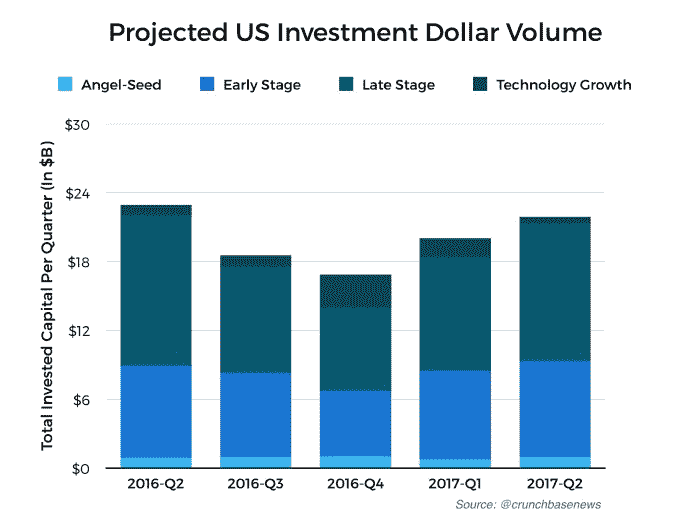
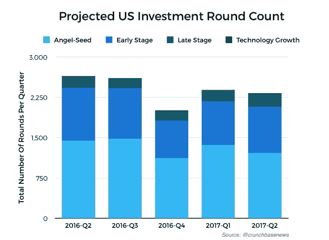
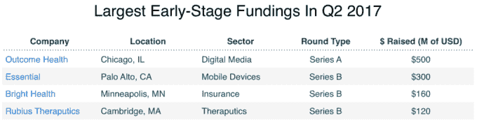
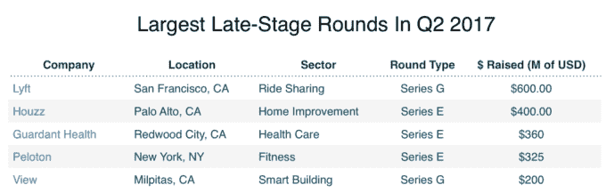
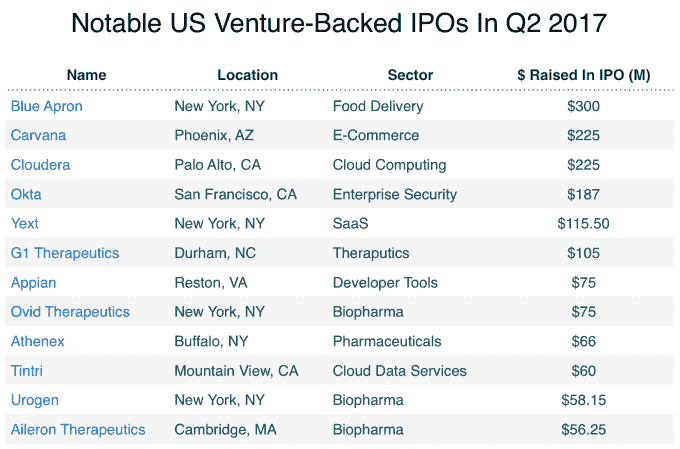
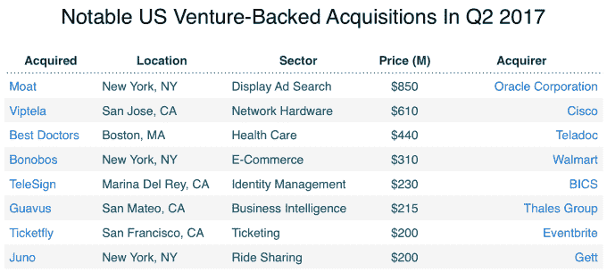

# 2017 年美国风险投资在 Q2 增长

> 原文：<https://web.archive.org/web/https://techcrunch.com/2017/07/12/u-s-venture-investment-ticks-up-in-q2-2017/>

乔安娜·格拉斯纳撰稿人

More posts by this contributor

2017 年第二季度，美国初创公司的风险投资连续增长，这得益于大型后期融资以及科技和医疗保健领域的几轮超大型早期融资。

总体而言，Crunchbase 预计，美国初创公司在从种子到技术增长的所有阶段都筹集了 227 亿美元。这高于 Q1 的 206 亿美元，这通常是一个略显缓慢的季度，与去年同期水平大致持平。

(要了解全球风险投资市场的 Q2，[点击这里](https://web.archive.org/web/20230326222106/https://techcrunch.com/2017/07/11/inside-the-q2-2017-global-venture-capital-ecosystem/)。)

强劲的季度融资数据正值公开市场的牛市时期，Q2 的主要指数达到新高。随着风投结束新一轮融资，现有投资组合公司利用市场条件完成了一些大型收购要约和 IPO。

到目前为止，这些最近上市的公司中有几家未能达到其私募市场的估值。然而，这似乎并没有抑制后期交易和独角兽融资。

下图显示了预计总投资，按阶段进行了颜色编码:

## 舍入计数

回合计数可以让我们了解投资者是在少数公司之间进行整合，还是在更多创业公司之间分散赌注。对于 Q2，我们预计有 2，329 家初创公司获得了投资。总体而言，预计的回合数与 Q1 大致持平，比去年同期有所下降。

每个阶段的趋势都有所不同。后期融资数量同比上升，而种子融资和早期融资数量下降。预计种子轮数比去年同期下降了 16%。这很重要，因为种子资金占所有融资的一半以上。此外，种子阶段交易的减少可能表明未来投资放缓的可能性更大，因为风投依赖于种子支持公司的强大渠道进行首轮和后期融资。

在下面的图表中，我们来看一下本季度的舍入计数:

## 早期融资

Crunchbase 预计，在 Q2 的首轮和 B 轮融资中，投资者投入了 83 亿美元，高于 Q1 的 77 亿美元。Q2 的结果受到了几轮大型医疗保健轮次的提振，数字医疗内容提供商 [Outcome Health](https://web.archive.org/web/20230326222106/https://www.crunchbase.com/organization/outcomehealth#/entity) 完成了最大一笔投资，即[5 亿美元的首轮融资](https://web.archive.org/web/20230326222106/https://www.crunchbase.com/organization/outcomehealth/funding-rounds)50 亿美元的估值。(然而，Outcome 并不是典型的早期交易。该公司成立于 2006 年。)

在五轮最大的早期融资中，只有一轮，手机和家庭设备开发商 [Essential](https://web.archive.org/web/20230326222106/https://www.crunchbase.com/organization/essential-2#/entity) ，与医疗保健无关。

在下图中，我们看到了本季度最大的 A 轮和 B 轮融资:

## 后期融资

在 Q2，后期和技术增长融资保持在较高水平。总体而言，Crunchbase 项目在 Q2 的后期和增长融资总额为 126 亿美元，高于 Q1 的 116 亿美元，略低于去年同期的 140 亿美元。

熟悉的名字在最大资金接受者名单中名列前茅，包括[优步](https://web.archive.org/web/20230326222106/https://www.crunchbase.com/organization/uber#/entity)竞争对手 [Lyft](https://web.archive.org/web/20230326222106/https://www.crunchbase.com/organization/lyft#/entity) ，筹集了 6 亿美元，家居装饰网站 [Houzz](https://web.archive.org/web/20230326222106/https://www.crunchbase.com/organization/houzz#/entity) ，以 4 亿美元收盘。在下图中，我们看到了五笔最大的后期融资:

## 多孔氧化物隔离

至少有 12 家美国风险投资公司在 Q2 上市，结果喜忧参半。一些科技公司的首日表现稳健，首日股价上涨，后市表现也不错。这个群体包括身份管理提供商 [Okta](https://web.archive.org/web/20230326222106/http://about.crunchbase.com/news/morning-report-oktas-ipo-puts-point-board-enterprise-startups/) ，商业位置数据提供商 [Yext](https://web.archive.org/web/20230326222106/http://about.crunchbase.com/news/morning-report-yexts-ipo-proves-open-ipo-window-remains/?utm_content=buffer6226f&utm_medium=social&utm_source=twitter.com&utm_campaign=buffer) 和低代码软件开发商 [Appian](https://web.archive.org/web/20230326222106/https://www.crunchbase.com/organization/appian) 。

然而，该季度结束时的情况不太乐观，各公司大幅削减发行规模，并根据不温不火的市场需求进行首次公开发行。餐包递送服务[蓝色围裙](https://web.archive.org/web/20230326222106/https://www.crunchbase.com/organization/blue-apron#/entity)和云存储提供商 [Tintri](https://web.archive.org/web/20230326222106/https://www.crunchbase.com/organization/tintri#/entity) 在上市前降低了他们[的预期股价，并且在售后市场交易中没有看到任何波动。这两家公司现在在公开市场上的估值远低于它们在私人融资轮中的估值。提供数据管理技术的 Cloudera 也远低于其私募市场估值。](https://web.archive.org/web/20230326222106/http://about.crunchbase.com/news/morning-report-unicorn-ipo-blues-blue-apron-sinks-tintri-limps-across-finish-line/)

生物技术产品也显示出不同的结果。三家癌症药物开发商 Athenex、Urogen 和 G1 治疗公司的股票在后市场交易中表现良好。然而，药物开发商[副翼疗法](https://web.archive.org/web/20230326222106/https://www.crunchbase.com/organization/aileron-therapeutics#/entity)和[奥维德疗法](https://web.archive.org/web/20230326222106/https://www.crunchbase.com/organization/ovid-therapeutics#/entity)却在水下。

在下图中，我们看到了在 Q2 上市的美国风险投资公司:

## 并购

刚刚结束的这个季度对大型收购来说并不是一个特别繁忙的时期，但确实宣布了几笔大交易。2017 年，Q2 已披露的风险投资支持的收购价值较 Q1 水平有所下降。这一下降主要是因为缺少数十亿美元的交易。

Q2 M&A 最大的交易可能是甲骨文以 8 . 5 亿美元收购数字媒体测量分析提供商 T2。(甲骨文尚未确认收购价格。)

其他重大交易包括思科以 6 . 1 亿美元收购虚拟化技术提供商 Viptela 和沃尔玛以 3 . 1 亿美元收购在线服装零售商 Bonobos。尽管这些交易规模巨大，但都无法与 Q1 最大的交易相比:思科公司以 37 亿美元收购 AppDynamics 公司。

M&A 科技股一个季度表现低迷，并不一定意味着市场状况发生了变化。数十亿美元收购私人、风险投资支持的公司并不常见，所以我们不会每个季度都看到。即便如此，2017 年的 Q2 显然不是一个从收购中获得风险回报的好季度。

在下图中，我们看到了第二季度最大的几笔交易:

## 大外卖

总的来说，我们可以说 Q2 的风险投资水平并没有跌落悬崖。

然而，我们看到的许多逆风可能会带来风暴云。种子阶段交易数量的下降可能意味着随后几个季度早期和晚期融资活动的放缓。Blue 围裙、Cloudera 和 Tintri 等风投支持的独角兽公司令人失望的 IPO 也可能在后期扼杀热情。投资者可能会对私募轮次中的高估值越来越谨慎，因为这种高估值在公开市场上可能无法持续。

我们还没有看到一个大的独角兽回调，资本继续涌入 Lyft、Houzz 和 Q2 其他公司的大型轮次。然而，随着高估值创业公司的数量增加，投资者越来越担心这些公司是否能够维持接近或超过私募融资水平的公开估值。最近，公众投资者的回答是“有时”。

我们将在未来几个月看到，这是否足以让私人投资者继续照常营业。