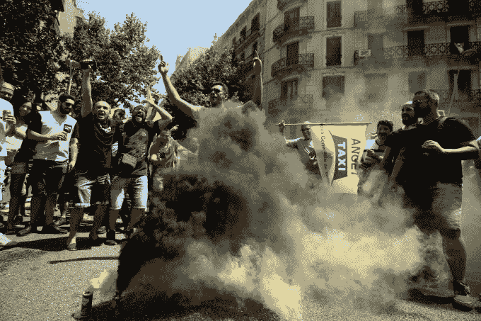
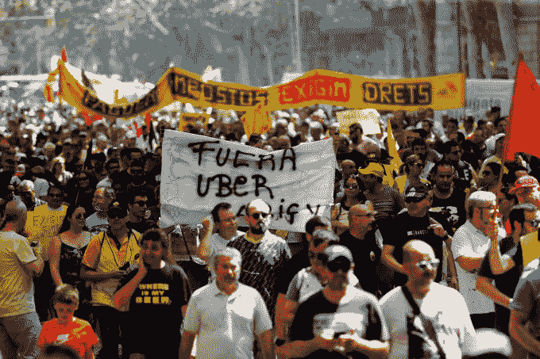

# 出租车罢工演变成暴力事件后，优步和 Cabify 暂停服务 

> 原文：<https://web.archive.org/web/https://techcrunch.com/2018/07/26/uber-and-cabify-pause-services-in-barcelona-after-taxi-strike-turns-violent/>

本周在巴塞罗那举行的为期两天的出租车司机罢工，旨在抗议街上的打车数量以及未能执行旨在限制私人出租车数量的国家法规，昨日演变为暴力事件，抗议者袭击了汽车，当地媒体也报道了对司机的袭击。

暴力事件导致该市所有出租汽车服务(VTC)暂停，因此也包括优步和 Cabify，这两家公司在该国只经营有执照的司机服务。

当地报纸《先锋报》报道称，在昨天的抗议活动中，司机甚至乘客都遭到了袭击。

一名优步发言人证实，一些司机遭到了抗议者的袭击，他告诉我们:*乘客和司机的安全是我们的首要任务。由于昨天的严重袭击，职业驾照司机的应用程序已经集体决定暂时停止在巴塞罗那的运营。”*

 *Cabify 的一名代表证实，其在巴塞罗那的服务仍然暂停。该公司还谴责其司机“仅仅因为行使工作权利就每天受到恐吓”。

“我们坚决反对昨天在巴塞罗那市出现的敌对和暴力环境。Cabify 尊重任何公司或专业团体的罢工权利，也尊重那些希望在正常条件下继续开展活动的人的权利，无论他们是出租车司机还是 VTC 司机，”它在一份声明中告诉我们。

“我们认为，巴塞罗那市的市民和游客在每年的这个时候都处于旺季，他们有权在城市中穿梭，享受优质的最低服务以及他们可能需要或希望的其他城市交通工具。”

出租车司机感到愤怒的是，每 30 辆出租车有一辆专业执照出租汽车(VTC)的假定全国比率没有得到维持。打车巨头一直在从其他运营商那里购买牌照，以扩大自己的业务。

与此同时，市政当局一直试图通过地方法规来强制执行这一比例 VTC 部门在法庭上对此提出了质疑。

代表出租汽车行业利益的当地协会 Unauto VTC 最近对市政当局试图实施自己的 VTC 法规提出了挑战，并在上周成功地让高等法院暂停了对司机和市民的潜在影响。

在昨天宣布 VTC 服务暂停并谴责暴力的声明中，Unauto VTC 表示，出租车司机抗议法院的裁决。

尽管出租车司机在该协会的推特账户上指责该机构挑选它支持的法律，忽视它不支持的法律。

西班牙全国的情况是，自 2015 年以来，VTC 许可证的比例上限为 1:30，但这一上限面临法律挑战，似乎没有得到积极执行——因此允许叫车公司通过从其他运营商购买许可证来规避这一上限。

与此同时，西班牙竞争主管机构一直在推动逐步放松对该行业的监管。而出租车协会一直在用罢工和抗议进行反击——最近的一次是在巴塞罗那街头的示威游行中，司机遭到袭击，汽车被砸，油漆被喷。

据 La Vanguardia 报道，Unauto VTC 主席 Eduardo Martin 说，他在昨天的抗议活动中看到了“两起严重袭击”的证据，受害者必须被送往医院。

“一名司机的脸上被酸液烧伤，他们用酸液来烧车辆的油漆，另一名司机被殴打，已经昏迷不醒，被送往医院，”他告诉该报。

巴塞罗那市长阿达·科劳(Ada Colau)推动了该市监管 VTC 部门以保护出租车行业的尝试，他在推特上谴责了暴力行为——他写道，虽然每个人都支持出租车部门，但没有人支持昨天在该市街头看到的暴力行为。

她的推文链接到一段视频，视频显示一群抗议者暴力袭击了一辆据说载有一个法国家庭的 Cabify 汽车。《先锋报》的[报道](https://web.archive.org/web/20221025222223/https://www.lavanguardia.com/economia/20180725/451102107757/uber-abify-suspende-actividad-barcelona-agresiones.html)包含了类似的暴力抗议图片。

在声明中，Unauto VTC 表示，鉴于其所称的“激进团体”实施的暴力程度，决定暂时停止巴塞罗那的私人出租汽车服务。

“尽管在其他场合经历过暴力事件，但今天早上巴塞罗那遭受的各种袭击的严重性迫使该行业，包括优步和 Cabify，暂停在巴塞罗那的活动，直到局势恢复正常，”它写道。

它接着表示“完全支持今天在巴塞罗那遭到袭击的所有司机和西班牙各地成千上万的司机”，并向“信任我们每天在巴塞罗那走动的成千上万的乘客”道歉，并补充说:“我们将与当局合作，以便逮捕和审判肇事者。

“我们请求机构和国家安全部队的保护，以结束这种情况，并保护职业培训局部门的数千名工人，他们不仅被剥夺了工作的权利，而且还看到他们的人身安全日益受到威胁。”

2018 年 7 月 25 日，巴塞罗那出租车司机罢工期间，出租车司机聚集在政府代表团办公室外。(图片来源:Pau 巴雷纳/法新社/盖蒂图片社)

当地出租车协会“BCN 精英出租车”昨天也通过 Twitter 发布了自己的公报——谴责暴力行为，呼吁冷静。

声明中写道，出租车司机在街上打架的画面只会伤害这个行业，并呼吁和平抗议。

“他们不会以任何方式让我们闭嘴，我们不会接受这种腐败的情况，我们不会以任何其他方式提及这种情况。我们的斗争现在和将来都将集中在法庭上，以结束这场腐败……不管要花多少钱，”它写道。“我们要求和平、平静和最大限度的尊重——尤其是对人民。”

优步直到 3 月才回到巴塞罗纳——通过支付费用从现有运营商那里获得执照，进入了 VTC 行业。该公司最初有 130 名司机，但不会透露现在在这座城市有多少司机。

今年早些时候，当打车服务在这座城市重新启动时，[当地媒体](https://web.archive.org/web/20221025222223/https://www.elperiodico.com/es/economia/20180312/uber-barcelona-6684020)报道了一位精英出租车发言人的评论，他警告说:“优步和卡比夫的司机们，欢迎来到地狱。”

优步在巴塞罗纳和马德里(它在西班牙运营 p2p 非专业司机服务的另一个城市)都没有运营这项服务。事实上，在欧洲的大部分地区也是如此，该公司表示，在这些地方，它是根据现有的运输法律运营的，即只使用有执照的司机。

原因还可以追溯到巴塞罗纳——当地出租车协会与优步的斗争由来已久。这是 2014 年在当地对该公司未经许可的 p2p 服务提出的法律挑战，一直上诉到欧洲最高法院，法官去年裁定[优步是一家运输公司，而不是一个科技平台](https://web.archive.org/web/20221025222223/https://techcrunch.com/2017/12/20/blow-to-uber-in-europe-as-top-court-rules-its-a-transport-service/)——从而宣布其早期规避出租车法律的扩张主义剧本非法。

CJEU 的决定锁定了优步近年来在欧洲面临一系列出租车行业抗议时做出的战略转变——转而专注于游说城市和国家监管机构放开和改革有利于自己的交通规则。

例如，在去年暂停运营等待改革通过后，本月[在芬兰](https://web.archive.org/web/20221025222223/https://techcrunch.com/2018/07/04/uber-relaunches-a-licensed-service-in-finland-after-taxi-law-deregulation/)重新启动了一项服务。

西班牙打车初创公司 Cabify 也在拉丁美洲开展业务，该公司辩称，“出租车不是我们的竞争对手”，称其成立宗旨是“取代私家车作为城市内的交通工具”。

“超过 50%的城市通勤是由私家车完成的，我们唯一的目标是尽可能降低这一比例，”它告诉我们。“如果我们实现了这一目标，这可能代表着对我们和出租车等替代性移动服务的需求增加，这是一个共同的目标，将使我们所有人受益。”

2018 年 7 月 25 日，出租车司机在巴塞罗纳出租车司机罢工期间，举着写着“优步出来”的牌子游行。(图片来源:Pau 巴雷纳/法新社/盖蒂图片社)

在评论巴塞罗那市提出的 VTC 法规(但被法院否决)时，它呼吁所有利益相关者共同努力，在不破坏保护的情况下实现法律现代化。

“我们认为，单边解决方案不是建设未来流动性的正确解决方案，所有参与者必须与政府合作，以找到确保市场发展和保护所有参与者的方法，”它表示。

“因此，我们认为，最终消费者作为当前和未来对该行业决策影响最大的一方，理应在所有分析中得到倾听和考虑。Cabify 在西班牙拥有超过 300 万用户，他们通过我们的应用程序
发现我们提供的服务非常有用，他们的评分为 4.77/5。”

但是 Cabify 也从优步的旧剧本中吸取了经验，通过给用户群发电子邮件来动员他们代表它在网上游说——使用标签[# haciadóndeNosMovemos](https://web.archive.org/web/20221025222223/https://twitter.com/search?q=%23HaciaD%C3%B3ndeNosMovemos&src=typd)；翻译成“这就是我们要去的地方”的短语。

没有官方消息表明 VTC 服务将于何时在该市恢复——但是一旦出租车罢工在明晚结束，行业暂停似乎将被解除，如果不是在此之前的话。*