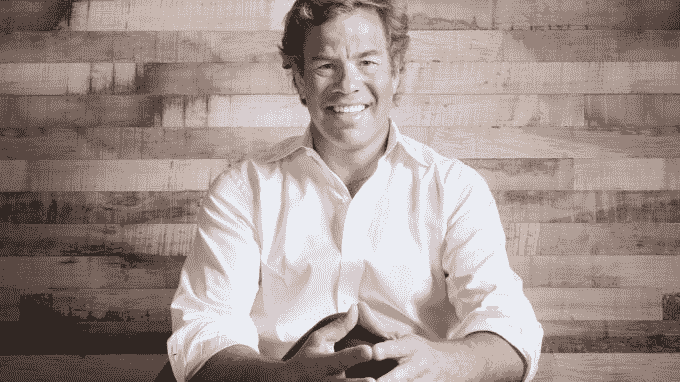

# 优步的新任亚洲主管是一位曾经攀登过珠穆朗玛峰的前高盛高管

> 原文：<https://web.archive.org/web/https://techcrunch.com/2017/08/16/uber-asia-brooks-entwistle/>

与政府监管机构的经常性摩擦，以及与资金雄厚的本土竞争对手的争斗，使亚洲成为优步面临的挑战。挑战如此之大，以至于这家美国拼车巨头聘请一位曾经登上珠穆朗玛峰顶峰的人来领导其在该地区的业务是再合适不过了。

高盛东南亚前主席 Brooks Entwistle 今天被任命为优步亚太区首席商务官。

“在亚洲工作了 20 年后，我不能拒绝影响该地区未来 20 年发展的机会，”从私募股权公司 Everstone Group 加入优步的 Entwistle 在一份声明中说。

在这个职位上，他将负责除印度和中国以外的亚洲地区的业务发展、企业发展和市场营销，印度和中国是优步不再涉足的市场。有趣的是，优步表示 Entwistle 将专注于“自动驾驶汽车联盟”虽然优步通过其奥托部门在美国的自动驾驶汽车方面取得了进展，但该公司尚未在亚洲采取行动，不像去年与麻省理工学院剥离的 Nutonomy 合作的竞争对手 Grab。

优步宣布的计划中值得注意的还有“探索新的投资机会，通过战略合作伙伴关系和投资机会扩大我们的存在”

这看起来像是优步将在亚洲各地进行投资交易，帮助它赶上 Grab 在东南亚使用的战略，以扩展其业务，而不仅仅是将乘客从 A 点运送到 b 点

Grab 正在开发一个支付平台，以帮助接触用户并培养更多的忠诚度，它特别重视该地区最大的经济体印度尼西亚。今年早些时候，Grab 宣布了一项名为“印度尼西亚 2020”的 7 亿美元计划，其中包括拨款 1 亿多美元投资初创公司和其他本地项目。

Grab 很快通过收购 Kudo 进入预算，消息人士告诉 TechCrunch，收购价格为 8000 万至 1 亿美元，但它表示有兴趣部署更多资本来帮助扩展其基础和业务。

> Brooks Entwistle，优步新任亚太区首席商务官

优步很可能希望跟随 Grab 的脚步，进行自己的投资以增加其市场份额，这些指标表明最近已经下降，因为 Grab 最近从滴滴和软银筹集了 20 亿美元的[——已经将加速器推到了地板上。](https://web.archive.org/web/20221025222321/https://beta.techcrunch.com/2017/07/23/grab-raises-2b-from-didi-chuxing-and-softbank/)

Entwistle 还将处理好与政府的关系。就在本周，[优步在菲律宾](https://web.archive.org/web/20221025222321/https://beta.techcrunch.com/2017/08/15/uber-suspends-its-service-in-the-philippines/)被禁赛一个月，[目前在澳门](https://web.archive.org/web/20221025222321/https://beta.techcrunch.com/2017/07/17/uber-halts-its-service-in-macau/)也被禁赛，[在台湾](https://web.archive.org/web/20221025222321/https://beta.techcrunch.com/2017/04/13/uber-taiwan-return/)被禁赛，在 UberX 被裁定为非法后，该公司最近恢复了有执照的出租车服务。过去一年，它还与香港、泰国和印尼等地的监管机构发生了争执。

随着一些媒体谈论优步可能退出东南亚，也有一种观点认为，恩特威斯尔可能是一位交易撮合者，他寻求的是优步去年在中国和今年在俄国再次发现的那种友好离开。

在 Grab 筹集了最近一轮资金后，这种说法越来越多，虽然看着一个关键盟友补充其战争资金是一个打击，但优步在东南亚的地位并没有落后太多，它应该需要让步。然而，如果它认为自己在美国节节败退，那么它不可能想象资源被转移到保护自己的家园。

但在东南亚，打车行业才刚刚起步，还有更多的机会。由谷歌联合撰写的 2016 年报告预测，到 2025 年，年收入可能超过 130 亿美元，高于 2015 年的 25 亿美元。