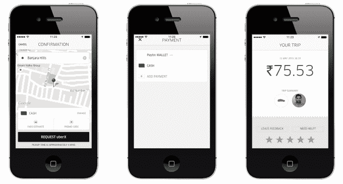
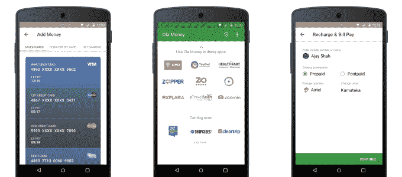

# 优步开始看到接受现金支付的回报 

> 原文：<https://web.archive.org/web/https://techcrunch.com/2016/02/08/uber-begins-to-see-the-payout-from-accepting-cash-payments/>

对于一家公司来说，如何才能摆脱对其身份至关重要的核心特征？

去年 5 月，优步打破了只接受信用卡支付的传统。这家美国公司开始了一项试点，允许拥有近 800 万人口的印度城市海德拉巴的用户使用现金支付乘车费用。

优步最大的卖点之一是其无缝支付系统。通过将卡绑定到您的帐户，当您关闭乘车门并继续一天的行程时，您的车费将被记入借方。这对大多数人来说意味着方便:找小钱付车费没有问题，如果司机没有零钱找你的大额钞票也没有问题，当你找到零钱时不需要叮当作响的硬币来填充你的口袋，没有给/不给小费的奇怪。

然而，尽管如此，现金正成为优步在世界某些地区服务的一个重要方面。

上周，最初的现金支付试验扩大到一系列新市场，覆盖了三大洲的 10 个国家，包括印度、整个东南亚(不包括新加坡和马来西亚)、非洲的肯尼亚和尼日利亚、中东的部分地区以及拉丁美洲的秘鲁。

这只是开始，现金支付选项将进一步扩展，以覆盖这些地区及更远的更多国家的优步客户。

## 接触新的人口统计数据

那么，为什么优步背离了它的一个核心原则呢？

机会。

事实是，在大多数新兴市场，信用卡的拥有率远低于人口的 10 %,而信用卡对于拥有一个优步账户来说是必不可少的。

在海得拉巴试点一年多前，优步驻亚洲高管[迈克·布朗(Mike Brown)对我说，如果公司想充分竞争，它需要在世界上的一些地方保持灵活性，特别是在支付方面。](https://web.archive.org/web/20221001215541/http://thenextweb.com/asia/2014/04/23/uber-likely-to-embrace-new-payment-methods-including-cash-to-grow-in-emerging-markets)

“我们认识到，不是每个人都使用信用卡，不同的地方有不同的支付机制。我们希望能够为每个人服务，所以从根本上说，每个人都需要适应我们的系统，或者我们需要适应其他市场的乘客如何支付，”他说。

当我在 2014 年 4 月遇到布朗时，现金支付只是一种可能，但现在它们已经成为一种战略现实。本周，在泰国曼谷和印尼雅加达举行的双重支付发布会上，优步发言人告诉 TechCrunch，现金已经成为“一项非常重要的实验，目前在全球多个市场开展，将对我们在世界各地的业务产生影响。”

正如首席执行官[特拉维斯·卡兰尼克最近在印度旅行时说的那样:“你必须对现实感同身受。你可以扭曲现实，但你不能打破它…我们在印度接受现金。我们一直希望提供优质的客户支持，这是唯一不可讨价还价的。”](https://web.archive.org/web/20221001215541/http://timesofindia.indiatimes.com/business/india-business/Ubers-India-learning-You-can-bend-reality-but-you-cant-break-it/articleshow/50618687.cms)

脸书在印度面临挑战，印度的[免费基础服务因违反网络中立原则而被禁](https://web.archive.org/web/20221001215541/https://beta.techcrunch.com/2016/02/08/india-blocks-facebook-freebasics-net-neutrality/)，与之形成对比的是，优步采取了一种更为调和的方式。

> 海得拉巴的一次现金骑行，优步在那里开始测试现金支付

## 它是如何工作的

优步的业务建立在数字支付的基础上，因此将现金投入其中会使事情变得复杂。目前，司机以数字方式获得报酬——也就是说，完成骑行的报酬、记录特定里程碑的奖金(优步在许多国家奖励司机，如果他们完成一定数量的骑行或记录特定的公平量)，以及其他额外的奖励都被电汇到司机的银行账户。这使得优步很容易扣除其收入份额，但混合现金是一个挑战，因为每个司机的一部分车费是优步的钱。

为了解决这一问题，优步在新的城市缓慢推出现金支付，因此并非所有乘客都能立即使用。这是为了稀释司机处理的现金旅行的数量。优步表示，这样一来，它就可以从司机的定期电汇支付中扣除现金支付的份额。只要司机记录更多的基于卡的支付，司机就永远不会拖欠公司，优步也永远不会要求他们返还现金。

## 追逐竞争

加速优步向现金转移的事实是，它在印度(Ola)和东南亚(Grab)面临着强大的竞争对手，而印度和东南亚早已接受现金。Grab 刚刚推出了无现金支付，而除了现金， [Ola 还提供独立的钱包服务](https://web.archive.org/web/20221001215541/https://beta.techcrunch.com/2015/11/12/ola-ubers-big-rival-in-india-gives-its-payment-service-a-standalone-app/)，可以用来支付 Ola 出租车以外的其他账单和服务。

Ola 表示，其约一半的收入来自现金支付，另一半来自 Ola 的资金，该公司采取双管齐下的方法来提供与优步目标相同的灵活性。

“印度的移动市场仍在发展，需要根据其需求定制的解决方案，”营销传播高级总监 Anand Subramanian 告诉 TechCrunch。

Subramanian 补充说:“Ola Money 自推出以来获得了巨大的认可，因为它提供了丰富的体验。”subra manian 没有给出 Ola Money 的更多具体数字。“现金仍然是 Ola 用户的重要支付方式，拥有全国最大的用户群，这将有助于我们实现为 10 亿印度人提供移动服务的使命。”

> Ola Money 应用支持公司自身服务之外的一系列服务

成立五年的 Grab——最近从 Grab taxi——[更名为 Grab taxi](https://web.archive.org/web/20221001215541/https://beta.techcrunch.com/2015/02/11/grabtaxi-cashless-payments/)——一直在新加坡测试无现金支付，新加坡是一个信用卡普及率较高的市场，现金很少用于交通出行。上个月，该公司宣布计划在未来几个月将这项服务扩展到东南亚的六个市场。

Grab 的发言人在一份声明中告诉 TechCrunch，“在新加坡以外的地区，信用卡普及率只有很低的个位数，我们一直让用户选择用现金支付。”“许多司机也更喜欢即时的现金流，而不是等待几天才能收到他们应得的收入。”

“几年前，我们投资在该地区建立了一个支持现金的运营网络，例如为司机提供的充值流程。该发言人补充说:“Grab 很自豪能够为满足当地需求设定标准，而其他行业参与者现在只是在尝试测试和效仿。”。

Grab 表示，除了为那些需要的人提供卡支付，它还在探索与合作伙伴合作的可能性，这些合作伙伴可以帮助引入“个人移动钱包”，用于无信用卡的无现金支付。一个早期合作伙伴是运营商 [Singtel](https://web.archive.org/web/20221001215541/http://www1.singtel.com/about-us/news-releases/singtel-group-and-grabtaxi-collaborate-offer-customers-southeast-asia-mobile-.html) ，但听起来 Grab 可能会尝试类似 Ola 货币的服务，可能会利用其在[优步竞争对手联盟](https://web.archive.org/web/20221001215541/https://beta.techcrunch.com/2015/12/03/lyft-didi-ola-and-grabtaxi-partner-in-global-tech-service-alliance-to-rival-uber/)的合作伙伴——Ola、Grab、Lyft 和滴滴快的——来推进其业务。

## 现金转信用卡

允许乘客不带信用卡乘车可能会使优步服务适应新的人口统计，但优步也认为它有两种工作方式。

“通过提供现金作为替代支付方式，我们正在向更多喜欢现金交易的潜在用户开放优步。通过使用优步，他们反过来也接触到了一种新的智能技术，使他们能够轻松地在他们的城市中移动，并有可能使用电子支付，这是他们以前可能不熟悉或不习惯使用的东西，”该公司发言人说。

优步表示，在接受现金支付的国家和城市，注册人数和新用户活动出现了“指数级增长”，但拒绝提供具体数字。同样，该公司表示，它已经看到“只有在我们推出现金支付后，才开始使用优步的用户大量转向电子支付方式”，尽管它没有提供数据来支持这一说法。

## 全球孵化器印度

关于现金支付特别有趣的是，它是一个主要的全球性特征，是在印度孵化的——但不是唯一的。优步的许多安全措施——包括旅途中状态更新和一个向当局求救的按钮——以及它在[短暂涉足自动人力车](https://web.archive.org/web/20221001215541/https://beta.techcrunch.com/2015/12/08/uber-suspends-its-auto-rickshaw-service-in-india/)和[“Go”掀背车服务](https://web.archive.org/web/20221001215541/https://beta.techcrunch.com/2014/11/19/uber-wants-to-replace-indias-iconic-auto-rickshaws-with-chauffeured-hatchbacks/)(扩展到邻国)也诞生于这个国家。

这很有意义，因为印度的十几亿人口与世界上许多新兴市场有很多共同点，所以适合印度文化或生活方式各种元素的解决方案可能会在亚洲、非洲和其他地区奏效，或者可以调整到奏效。

优步表示，其印度业务将很快超过美国，仅次于中国，考虑到这一点，该公司最近宣布了在印度组建首个专门研发团队的计划。如果优步要与占主导地位的本土竞争对手 Ola 展开更激烈的竞争，这是人们期待已久的举措，因此我们有理由在未来看到更多源自印度的国际市场功能和新服务。

“我们有一些令人兴奋的公告正在筹备中，请在未来几个月继续关注，以了解更多关于这些将在新兴市场推出的创新的信息，”优步调侃道。