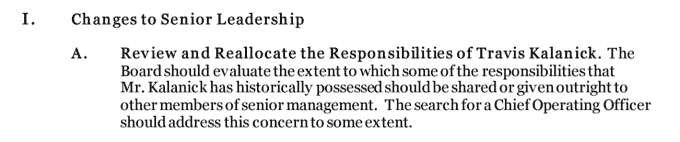

# 优步首席执行官特拉维斯·卡兰尼克休假 

> 原文：<https://web.archive.org/web/https://techcrunch.com/2017/06/13/uber-ceo-leave-of-absence/>

# 优步首席执行官特拉维斯·卡兰尼克休假

在优步的艰难时期，首席执行官特拉维斯·卡兰尼克的父母上个月遭遇了一场悲惨的划船事故，夺去了他母亲的生命。现在，为了在优步实施变革之前消除悲伤，理清思路，Travis 告诉他的团队，他将休假一段时间。你可以在下面阅读这位首席执行官给优步的信。

Kalanick 指出，“在这一过渡时期，领导团队，我的下属，将会管理公司。我将在需要时参与最具战略性的决策，但我将授权他们大胆果断，以推动公司快速向前发展。 很难给出一个时间表——可能比我们预期的要短或长。”

根据前美国司法部长埃里克·霍尔德在他的关于优步道德和领导问题的调查报告中提出的一系列建议，卡兰尼克回来后，他将扮演一个更小的角色，包括性骚扰和歧视。“卡兰尼克先生历史上拥有的一些职责应该被分享或直接交给高级管理层的其他成员，”报告概述道。

优步董事会[投票通过了报告的所有建议](https://web.archive.org/web/20221024051956/https://beta.techcrunch.com/2017/06/11/ubers-board-votes-unanimously-to-adopt-all-recommendations-of-holder-report/)，这些建议[今天将与员工和公众分享](https://web.archive.org/web/20221024051956/https://beta.techcrunch.com/2017/06/13/uber-drops-sexual-harassment-probe-recommendations/)。

影响 Kalanick 的其他建议包括:

*   通过绩效评估，让领导者对影响管理层薪酬的多样性、对员工投诉的响应、员工满意度和合规性等指标负责
*   增加独立的董事会席位、独立的董事会主席、监督委员会和强化的审计委员会，以监督卡兰尼克和优步的管理层
*   要求对卡兰尼克和其他高级管理人员进行强制性的包容性领导力培训
*   增加卡兰尼克和管理层对人力资源团队及其新价值观的公众支持

优步现在必须在没有首席执行官的情况下开始修复其文化的漫长道路。

以下是卡兰尼克发给优步员工的信:

> *团队，*
> 
> 过去八年来，我的生活一直围绕着优步。最近的事件让我认识到，人比工作更重要，我需要每天抽出一些时间来悼念我的母亲，我在周五为她下葬，反思，努力改善自己，并专注于建立一个世界级的领导团队。
> 
> 对于我们已经取得的成就以及我们如何取得今天的成就，最终的责任落在了我的肩上。当然有很多值得骄傲的地方，但也有很多需要改进的地方。对于优步 2.0 的成功来说，没有什么比花时间打造领导团队更重要的了。但如果我们要开发优步 2.0，我也需要开发 Travis 2.0，成为公司需要的领导者，也是你应得的。
> 
> 在此过渡期间，领导团队，我的下属，将管理公司。我将在需要时参与最具战略性的决策，但我将授权他们大胆果断，以推动公司快速向前发展。
> 
> 很难给出一个时间表——它可能比我们想象的更短或更长。悲惨地失去所爱的人对我来说很难，我需要恰当地说再见。来自你们所有人的令人难以置信的真诚的留言和慰问让我变得强大，但几乎所有人都以“我能帮什么忙吗？”。我的答案很简单。为我们的使命奉献一生。这让我有时间和家人在一起。以人为本，这是我妈妈的传统。让优步 2.0 成为现实，这样世界就可以看到你们所有人所做的鼓舞人心的工作，以及使优步变得伟大的鼓舞人心的人们。
> 
> *后会有期，*