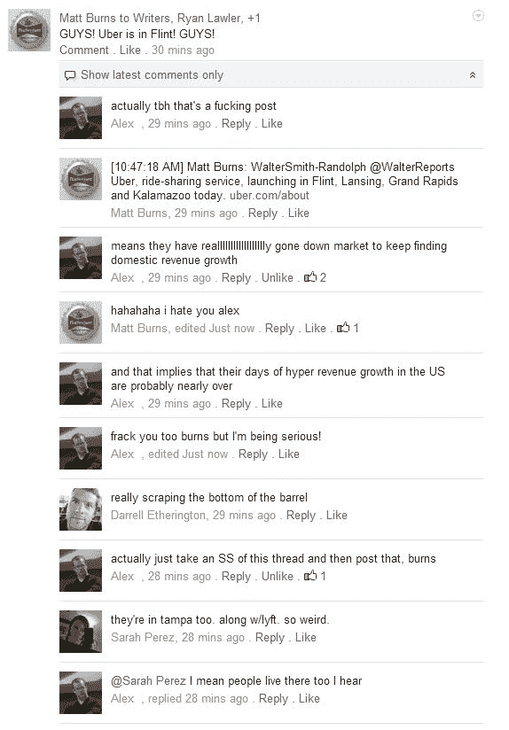

# 优步来到弗林特让我非常开心 

> 原文：<https://web.archive.org/web/https://techcrunch.com/2014/07/24/uber-comes-to-flint-and-makes-me-very-happy/>

# 优步来到弗林特，让我非常开心

我住在密歇根一个更大的死城外面的死城。我们总是最后一个拿到东西。但是优步终于来到了密歇根州的弗林特。这是最棒的一天。

事实上，[优步](https://web.archive.org/web/20221007130804/http://www.crunchbase.com/organization/uber)今天刚刚在弗林特、兰辛、大急流城和卡拉马祖推出。

其他 [TechCrunch](https://web.archive.org/web/20221007130804/http://www.crunchbase.com/organization/techcrunch) 的作者很快指出，这一举动表明优步正在“竭尽全力”开拓新市场。我同意！在这个美好的州，弗林特是我最不希望优步推出的地方。

优步已经在安娜堡和底特律了。大急流城很棒，卡拉马祖很好，兰辛是州府，为什么不呢？但是弗林特呢？谋杀之都美国？不会吧。至少现在，多亏了优步，我不用担心在新农贸市场找不到停车位。

自推出以来，首先从最大的市场开始，优步系统地将按需出租车服务推向越来越小的市场。这项服务现在已经覆盖了 150 多个城市。在这一点上，该公司显然知道如何进入 Flint 这样的无关紧要的领域并推出其服务。这对我太好了！

