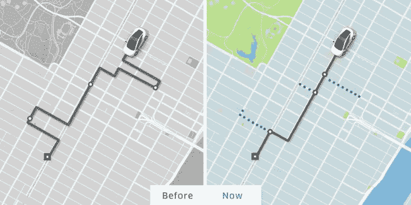

# 优步推出“更智能”的 UberPool

> 原文：<https://web.archive.org/web/http://techcrunch.com/2017/05/22/uber-debuts-a-smarter-uberpool-in-manhattan/>

优步[今天早上宣布对其在曼哈顿的拼车服务 UberPool 进行一系列的实质性改变，目的是改善其匹配算法，以及在曼哈顿的接送流程。该公司表示，这些更新是基于将司机和乘客的反馈纳入其算法，并在去年重新设计纽约的服务后进行的，在那里，它开始要求乘客走到一个特定的十字路口，以便更快地搭车。](https://web.archive.org/web/20230328004243/https://newsroom.uber.com/manhattanpool/)

通过优步的打车服务，UberPool 实际上提供了一种公共交通的替代方式，如公交车，但价格比其他按需选择更实惠。通过共享汽车，优步可以降低单个客户的价格，从而增加乘客数量(从而增加收入)。)

今天的变化更多的是完善优步已经到位的早期“走到角落”系统，并在听取了对当前流程工作方式的投诉后推出。现在，优步表示，它将更好地专注于选择正确的街道拐角供骑车人步行——这意味着，确保街道的正确一侧和方向发挥作用。

例如，优步表示，现在它正在调整交通灯前的皮卡，以减轻司机的压力，并将选择街道右侧过了交通灯的拐角。优步指出，这有助于司机搭载多名乘客，而无需变换车道。

优步还会注意公交专用道的位置，尽可能避免在那里停车。此外，它还更新了算法，以最大限度地减少转弯——这可能会减慢骑行速度，降低路线的效率。优步说，新算法减少了 20%的转弯。除此之外，该算法现在以一种旨在避免绕路的方式匹配司机和乘客，以使司机保持在更直接的路线上。

随着曼哈顿 UberPool 的更新，落榜者也得到改善。现在，当乘客要求拼车时，优步不会给他们一个下车点，而是在汽车接近目的地时，每隔几秒钟重新计算一次下车点。优步说，这也将使路线更有效率，并保持游泳池的运动。

虽然这些变化是相对较小的调整，但它们是在 UberPool 系统的一系列改进之后发生的，包括去年推出的配对和路由的[以及要求乘客走到拐角的纽约地区的调整。然而，他们认为优步在拼车领域有很大的优势——利用其丰富的乘车数据集，以及可供学习的庞大的司机和乘客群体。优步没有说类似的变化是否会推广到其他市场，但该公司很可能会做出针对特定城市的调整(如果不是完全相同的调整)，以在未来改善 UberPool 的其他地方。](https://web.archive.org/web/20230328004243/https://techcrunch.com/2016/12/12/uberpool-streamlines-matchmaking-pickups-and-driver-side-features/)