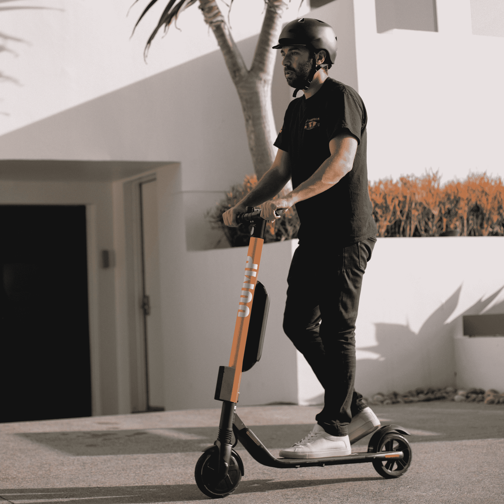

# 优步在圣莫尼卡部署跳跃滑板车和自行车

> 原文：<https://web.archive.org/web/https://techcrunch.com/2018/10/02/uber-deploys-jump-scooters-and-bikes-in-santa-monica/>

在圣莫尼卡市批准之后，优步正在通过 JUMP 部署自行车和第一批踏板车，JUMP 是它今年早些时候收购的自行车共享初创公司。虽然这些都是小米 Ninebot 滑板车，但优步表示，为了保持一致性，在谈到其个人电动汽车服务时，它会将它们命名为 JUMP。

“JUMP 是这个领域的领导者。优步滑板车产品经理 Rhea Dookeran 告诉 TechCrunch:“人们已经开始了解、喜爱和欣赏 JUMP 提供的产品质量，我们正在建立品牌资产——进一步投资，这是主要驱动因素之一。”。

作为试点计划的一部分，优步在任何时候都可以有多达 500 辆自行车和 250 辆小型摩托车在街上行驶。车手也必须确保留在圣莫尼卡服务区内，不要冒险进入更广泛的洛杉矶地区。否则，他们将被罚款。

但是优步并不是圣莫尼卡唯一的电动滑板车服务商。九月中旬， [Lyft 在圣莫尼卡推出了电动滑板车](https://web.archive.org/web/20221206082605/https://techcrunch.com/2018/09/18/lyft-deploys-electric-scooters-in-santa-monica/)，就在几周前，[公司在科罗拉多州丹佛部署了电动滑板车](https://web.archive.org/web/20221206082605/https://www.theverge.com/2018/9/6/17824040/lyft-electric-scooter-denver-dockless-public-transportation)。除了优步/JUMP 和 Lyft，伯德和莱姆都在圣莫尼卡经营电动滑板车。

到 10 月 7 日，优步的跳跃滑板车将是免费的。之后，滑板车的解锁费用为 1 美元，前五分钟后每分钟 15 美分。在你第一次骑行之前，你必须上传你的驾照照片。在每次骑行结束时，你必须拍一张你停放滑板车的照片。与其他滑板车初创公司不同，优步将依靠自己的员工在晚上收集滑板车，在晚上充电，然后在早上重新部署。

“服务的可靠性和质量是差异化的关键，也是用户在这类市场中选择你的关键，”杜克兰说。“也就是说，我们希望触及流程的每个部分，确保我们的标准和服务符合标准。”

上个月，[优步让传统骑行、滑板车和自行车之间的切换变得更加容易](https://web.archive.org/web/20221206082605/https://techcrunch.com/2018/09/06/uber-makes-it-easier-to-switch-between-rides-scooters-bikes-and-car-rentals/)——这一功能使得优步今天部署电动滑板车成为可能。此前，[优步在 7 月份参与了 Lime](https://web.archive.org/web/20221206082605/https://techcrunch.com/2018/07/10/with-lime-teaming-up-uber-can-rival-bird-go-it-alone/) 一轮 3.35 亿美元的融资，为其进军踏板车的雄心投入了一些资金。

展望未来，优步希望今年在更多的美国城市推出电动滑板车。优步还预计在今年年底前将 Lime 的电动滑板车完全整合到其产品中。

“一旦我们准备好，我们当然需要在我们的应用程序中显示他们的库存，”杜克兰说。"完整的交易将有可能通过优步应用程序."

在旧金山，我们期待在几周内看到电动滑板车再次出现在街头。然而，优步/跳跃将不会是其中之一。