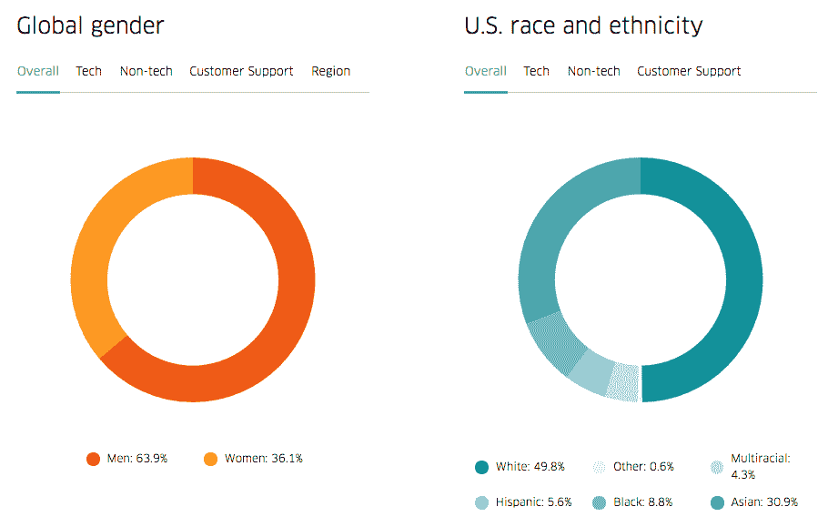

# 优步的第一份多样性报告并不是最糟糕的事情

> 原文：<https://web.archive.org/web/https://techcrunch.com/2017/03/28/uber-first-diversity-report/>

优步刚刚发布了备受期待的首份多元化报告，详述了截至本月的员工人口统计数据。TL；博士说，优步和许多其他科技公司一样，主要是白人和男性。然而，令我惊讶的是，在女性代表方面，优步的表现略好于脸书和苹果。与其他科技公司相比，优步也有相当稳固的有色人种代表。

优步首席人力资源官 Liane Hornsey 今天在优步的博客上写道:“我们晚公布这些数据已经不是什么秘密了。”。“我还要感谢我们的员工，感谢他们坚持不懈地倡导更高的透明度——因为你无法衡量的东西，你就无法改进。”

在世界范围内，优步的女性比例为 36.1%，男性比例为 63.9%。在技术岗位上，女性仅占员工总数的 15.4%。

优步的整体女性比例并不高，但也不至于像脸书(32%)和 T2(32%)苹果(32%)这样糟糕。这也不如 [Airbnb](https://web.archive.org/web/20230328062812/https://techcrunch.com/2016/10/26/airbnb-2016-diversity/) 和 [Pinterest](https://web.archive.org/web/20230328062812/https://blog.pinterest.com/en/2016-update-diversity-pinterest) 的女性比例，前者为 43%，后者为 44%。

现在谈谈种族。是的，优步是一家以白人为主的公司(49.8%)。不幸的是，这是美国科技公司的常态，但优步的亮点在于它对黑人和拉丁裔人的代表。

总体而言，优步是 8.8%的黑人，5.6%的拉丁裔和 4.3%的美国两个或两个以上种族。然而，在技术角色中，这些百分比分别下降到 1%，2.1%和 2.4%。

以下是优步与其他国家的比较:脸书(2%的黑人，4%的拉丁人，3%的两个或更多种族)，苹果(9%的黑人，12%的拉丁人，2%的多种族)，Airbnb(2.9%的黑人，6.5%的拉丁人)和 Pinterest(2%的黑人，4%的拉丁人，4%的两个或更多种族)。

在领导层，22%的优步员工是女性，2.3%是黑人，0.8%是拉丁裔，76.7%是白人。惊喜！优步的领导团队大多是一群白人。

鉴于特朗普总统对移民的攻击，优步还透露，其在美国的员工中有 15%持有工作签证，来自 71 个不同的国家，并表示无论任何人来自哪里，优步都希望你知道你在公司有一席之地。优步还表示，它将继续公开反对歧视。

“这份报告是表明多元化和包容性是优步优先考虑的第一步，”优步首席执行官特拉维斯·卡兰尼克在一份声明中说。“我知道我们公布数据的速度太慢了，而展示我们变革承诺的最佳方式是通过透明度。为了取得进步，我们必须衡量什么是重要的。”

值得注意的是，优步目前没有具体的目标。不同员工的物理表现也只是等式的一部分。营造一个包容、非敌意的工作环境，让人们不会受到性骚扰，这一点非常重要。

“虽然我们的文化有很多地方需要改变，但我相信让优步成为一个更加多元化和包容的工作场所是关键，”霍恩西写道。

优步还承诺在未来三年内拨款 300 万美元，支持关注技术领域代表性不足的少数族裔和女性的组织。优步还没有决定支持哪些组织，但是 Hornsey 说在这个决策过程中“员工将是至关重要的”。

所有这些都发生在前优步工程师苏珊·福勒·里盖蒂的性骚扰指控之后。从那时起，优步已经启动了一项关于该指控的内部调查，并表示了对多元化的承诺。这一切都发生在今年 2 月，也就是杰西·杰克森牧师呼吁优步公布数据后大约一个月。

“在闸门打开大约两年后，我们进入新的一年，我们敦促优步‘向前一步’，加入报告你们的多样性和包容性数据的科技公司行列，”杰克森在 1 月份写给卡兰尼克的一封信中写道，TechCrunch 获得了这封信。

具体来说，杰克森要求优步公开披露其 EEO-1 报告，披露 2014 年至 2016 年间新招聘的人数以及其中有色人种的比例，并报告其董事会和最高管理层领导团队的人口统计数据。杰克逊要求在 2017 年 2 月 15 日前收到这些信息。

显然，这并没有发生。直到几乎所有人都因性骚扰指控而反对优步，该公司才最终决定这么做。

霍恩西和卡兰尼克都指出，与其他科技公司相比，优步在公布其多元化数据方面一直较为缓慢。但是，信不信由你，优步并不是唯一一家高调坚持的科技公司。例如，Lyft 和 Snap 在多元化方面都非常低调。

展望未来，Hornsey 表示，优步将与外部多元化和包容性专家合作，“这些专家在这些问题上的工作时间比我们存在的时间更长，并且正在努力实现变革。”

您可以在[的新网站](https://web.archive.org/web/20230328062812/http://uber.com/diversity)了解更多关于优步多元化和包容性计划的信息。