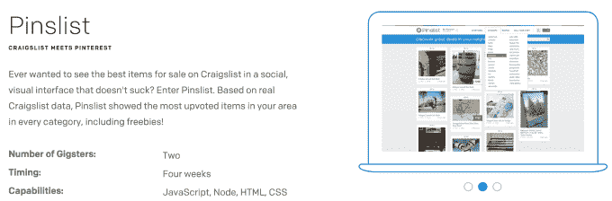
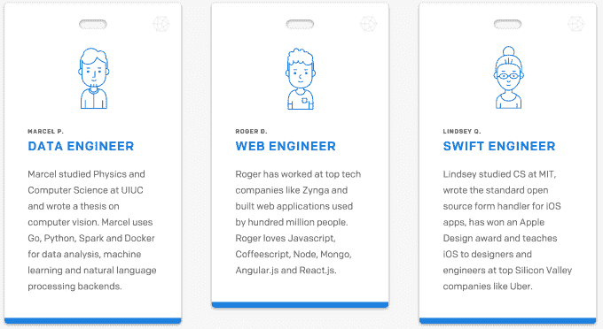

# Gigster 做开发的脏活累活，把你的想法变成应用程序

> 原文：<https://web.archive.org/web/https://techcrunch.com/2015/07/22/uber-for-developers/>

有创业想法吗？你只需要这些和一些现金就可以获得 Gigster 为你打造的全功能应用。今天推出的, [Gigster 是一个提供全面服务的开发商店](https://web.archive.org/web/20230222130708/https://www.trygigster.com/),而不是一个你必须管理你发现的人才的市场。

只需访问 Gigster 的网站，向销售工程师发送即时消息，告诉他们您想要建造什么，10 分钟后您就会得到一个保证报价，知道它的成本和需要多长时间。给予 Gigster 许可，它将管理一组精英自由程序员和设计师来构建你的产品，并每周向你提供状态报告。一旦你拿回你的项目，Gigster 甚至会维护代码，你可以付费添加升级或新功能。

技术领域人才匮乏。对于一个初出茅庐的初创公司来说，吸引优秀的工程师可能相当困难，尤其是如果他们不在旧金山这样的中心城市附近。Gigster 可以帮助企业家开发出一种最低限度可行的产品，这样他们就可以获得建立公司所需的资金和关注。

Y Combinator 初创公司得到了加速器、格雷洛克合伙公司(Greylock Partners)、彭博贝塔公司(Bernstein Beta)和菲利西斯风险投资公司(Felicis Ventures)250 万美元的支持，外加一系列顶级天使投资人，如 AngelList 的 Naval Ravikant、Facebook Messenger 的 Stan Chudnovsky 和 Twitch 的 Emmit Shear。为了开始在社区中建立信任，Gigster 将在未来几周提供大幅折扣价格，所以现在是时候将这个应用梦想变成现实了。

[2015 年 12 月 7 日更新: [Gigster 继续筹集由 Andreessen Horowitz 领导的 1000 万美元 A 轮](https://web.archive.org/web/20230222130708/https://techcrunch.com/2015/12/07/software-eats-software/)。]

## 斗争是真实的

“我从小学就开始编程了”Gigster 的联合创始人 Roger Dickey 告诉我。“我用  来学校，每隔几天在软盘上做一个不同的项目。”对快速原型制作的热爱让他和他的公司 Curiosoft 一起开发了 19 款脸书应用，然后在 2008 年将它卖给了 Zynga。在 2011 年离开开始投资之前，他在那里制作了非常成功的游戏《黑手党战争》。

去年，迪基试图提出 15 个不同的想法来寻找赢家。但是在这个过程中，他意识到外包开发是多么困难。像 oDesk 和 Elance(现在是 Upwork)这样的市场迫使买家审查大量不同的开发商和他们的出价。这项工作没有保证，质量可能会有很大差异。

建造在 Gigster 上

在测试 oDesk 的时候，迪基和他的联合创始人伯德·奥罗斯比坎为同一个项目得到了 22 到 50，000 美元不等的出价。所有这些的最大问题是，买方必须全程管理开发人员，这是出了名的困难和耗时。外包是为了减少你的工作量，对吗？[剧组](https://web.archive.org/web/20230222130708/https://crew.co/)和[剧组](https://web.archive.org/web/20230222130708/http://www.toptal.com/how)对他们的自由职业者进行预审，但是所有的管理问题依然存在。

## 推进者

Gigster 通过指派一个项目经理来处理您的开发人员的全部管理工作，并成为您的唯一联系人，从而解决了这个问题。如果项目进度落后，Gigster 会分配更多的开发人员，或者解雇表现不佳的开发人员，这样项目就能按时完成。

它只处理作物人才的精华。申请与 Gigster 合作的自由职业者只有 7.7%被接受。这些 Gigsters 来自谷歌或 Stripe 等公司，它们正在寻找一些额外的项目，来自麻省理工学院和加州理工学院等学校，它们试图在那里赚啤酒钱，或者来自初创公司创始人兼职支付账单。

他们不必处理项目投标或直接与讨厌的买家沟通。他们只是从 Gigster PM 那里得到指示，然后让它发生。一名学生用两个通宵完成了一个项目，一个周末赚了 10，000 美元。

迪基向我介绍了整个过程:

> “比方说，你想建一个送比萨饼的优步。你会遇到一个会询问细节的销售工程师。“你想如何处理交货？”你打算使用自己的车队还是车队服务？它必须显示离交货还有多长时间吗？他们算出预算和工作时间表，你用 Stripe 付钱。在后端，我们为你组建了一个包括算法和人员的团队。你有一个项目经理，一个或多个工程师，和一个 UX/UI 设计师。团队开始工作，你得到每周的更新。"

Gigster 确实有一些限制。它专门研究工程，而不是设计。它的项目配备了时尚、功能性的用户界面，但如果买家想在他们的项目上获得一些额外的美丽，他们可能不得不去别处看看，或者让 Gigster 将他们与某人联系起来。

吉斯特还必须建立信任。像 IBM 和 Infosys 这样的大公司得到了大量的外包工作，因为它们已经很成熟了。Gigster 必须让人们相信，花这笔钱来消除管理难题是值得的，即使它还没有存在太久。

建造在 Gigster 上

Pivotal Labs 可能看起来是 Gigster 的一个令人生畏的竞争对手，但它更适合企业公司和 B 轮融资后的初创公司。Pivotal 的内部工程师甚至可以被部署到客户的办公室，但这意味着其昂贵的费率补贴了没有任务的员工。

Gigster 是为较小的初创公司和产品设计的，它的按需自由职业者网络意味着你不会向不在你项目上的人付费。如果 Gigster 是开发人员的优步，Pivotal 就像是雇佣私人司机。

Dickey 认为他可以通过 Gigster 开发出 15 款应用，每款售价 1 万到 1.5 万美元，但最终他花了大约 100 万美元却没有开发出来。现在，他一心想要为其他人消除软件开发中的摩擦。“外包”不一定是一个肮脏的词。

*[Gigster 现已在](https://web.archive.org/web/20230222130708/https://www.trygigster.com/)推出，未来几周价格优惠*