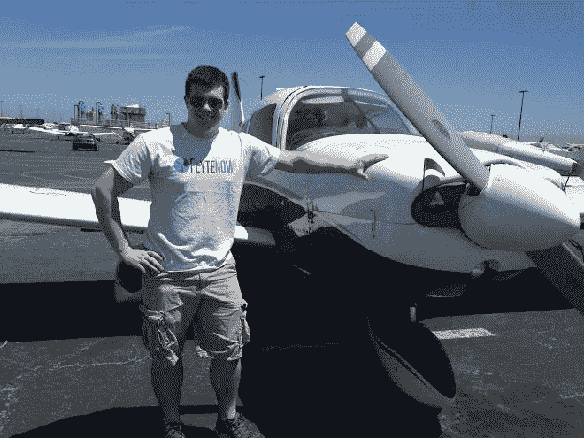
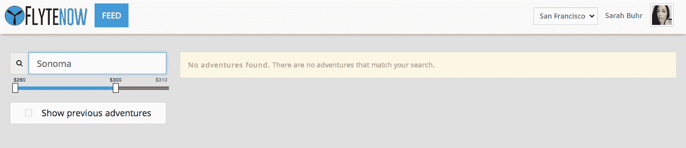

# 所以我乘坐了“微型飞机的优步”

> 原文：<https://web.archive.org/web/https://techcrunch.com/2014/06/20/uber-for-x-in-a-tiny-plane/>

我信箱里邮件的第一行写道，“这是小型飞机的 UberX。”我的收件箱里又出现了一个优步对 T2 的神秘创业公司。耶！(不尽然)。

但是避开去太浩湖的交通的想法足够吸引人去咬这个。所以四天后，我发现自己在一架 2000 英尺高的小飞机上，与 Flytenow(T4)的创始人和持证飞行员马特·沃斯卡(Matt Voska)一起，成为该公司有史以来第一个湾区客户。

那是什么感觉？我一会儿会谈到这一点。首先让我解释一下这一切是如何工作的。

假设你想和一两个朋友去葡萄酒之乡度周末。所以你可以在网站上的搜索选项中找到飞往索诺玛的人。你很幸运，一个 Flytenow 的飞行员已经发布了他正朝那个方向飞去。

不幸的是，我没有如此幸运地被赋予这样的财富:

事实上，似乎没有任何航班我可以去任何地方。也没有办法搜索某一天或更合理的价格。

谢天谢地，我有最初的电子邮件与这个“优步飞机”组织联系。沃斯卡第二天早上给我发了电子邮件，计划就定下来了。

应该发生的是，你去网站，看到一个飞行员即将到来的冒险列表。然后你，飞行“爱好者”(沃斯卡更喜欢这样称呼乘客)，预订并支付去那里的费用。

事实证明，它实际上更像是“飞机的齐姆里德”而不是“飞机的优步”

事实上，沃斯卡创办这家公司并不是出于对飞行的热爱(他确实热爱飞行)，而是因为在他当时的学生预算中，单人飞行非常昂贵。沃斯卡意识到，让其他人上车并支付汽油费是一种更简单的方式来激发他昂贵的爱好。举例来说，短途飞行的汽油价格可能在 100 美元左右。这很难用他当时的学生预算来证明。所以他暂停了大学学业，把自己从波士顿搬到了湾区。

沃斯卡 10 岁时，一位叔叔第一次带他乘坐私人飞机，沃斯卡 17 岁就获得了驾照，现在，20 岁的他打算让我们其他人享受乘坐私人飞机享受友好天空的乐趣。

回到我刚开始的飞行旅程…我有没有提到我害怕飞行？还不错，真的。每当我登上飞机时，我脑子里都会有一个小小的想法，那就是我把我的生命交到了另一个人的手中，这可能是我在地球上的最后一天，对此我无能为力。但最重要的是，这是一个很久以前就存在的想法，几乎没有人意识到——直到我发现自己在一架小飞机上。

私人飞机的致命事故比商业航班高得多(T2)。

在东湾的迪亚波罗山附近有一点气流，我正在做一些剧烈的心理助产。为了增加乐趣，沃斯卡把方向盘递给了我好一会儿。

抛开所有恐惧因素不谈，把你的生命交到一个你根本不了解的 20 岁年轻人手里，但他们说他们有执照，愿意用一辆小汽车带你去几千英里外的广阔天空……这整个操作合法吗？

Flytenow 认为[是](https://web.archive.org/web/20220813011245/https://flytenow.com/faq)。

根据目前联邦航空局的规定 [14 CFR 61.113](https://web.archive.org/web/20220813011245/http://www.faa.gov/search/?omni=MainSearch&q=Section+61.113+) 私人飞行员不能接受之前不定期航班的乘客付费。

Flytenow 解决这个问题的方法是让乘客付钱给他们，而不是飞行员。飞行员确实会收到飞行费，但这只是为了分摊飞行员本来就要乘坐的航班的油费和维修费。把它想象成和某人一起搭车，然后付一些油钱。

Flytenow 现任代理法律顾问[格雷格·温顿](https://web.archive.org/web/20220813011245/http://www.aviationlawexperts.com/attorneyprofile.html)同意该团队对法律的解释。温顿是现任航空法律专家，曾任联邦航空局和美国司法部的律师。

沃斯卡告诉我，他已经向联邦航空局提交了所有的法律文件，所以他们应该已经知道他的意图。

SurfAir 的前首席执行官，订阅航空服务的教父 Wade Eyerly 也同意 Voska 的计划可能符合法律的意图。在一个不太愿意改变的行业，他有自己的战斗要面对。

“监管总是一个挑战，每次你在一个不习惯变化的行业创造新的东西都是好的，”Eyerly 说。

沃伦·巴菲特的前飞行员迈克·弗林特曾经尝试过类似沃斯卡的东西。他的 Indiegogo 活动帮助他在 2012 年推出了愿景航空公司。这个想法是创建一个基于目的地的飞行训练计划，这将允许客户在旅行时获得飞行小时以获得飞行员执照。他甚至带着加州小姐之类的人逛硅谷。但是他的尝试，像其他几十个一样，很快就被终止了。

我们安全着陆，实际上在那几分钟的混乱之后，我平静下来了。我甚至短暂地(短暂地)有过获得执照的想法。我想，高高在上会让你有这种感觉。老实说，我可以再做一次。

沃斯卡告诉我，去蒙特利来回只需 120 美元，去太浩湖来回只需 250 美元。但是在我计划这两种情况之前，网站需要发布更多的航班，这样我就可以预订一些东西了…

**更新:** *沃斯卡通知我系统有一个小故障，现在已经修复。现在已经公布了几个定期航班。*

下面是我们空中冒险的一小段:
 [https://web.archive.org/web/20220813011245if_/https://www.youtube.com/embed/AIx3ZsTGkD0?version=3&rel=1&showsearch=0&showinfo=1&iv_load_policy=1&fs=1&hl=en-US&autohide=2&wmode=transparent](https://web.archive.org/web/20220813011245if_/https://www.youtube.com/embed/AIx3ZsTGkD0?version=3&rel=1&showsearch=0&showinfo=1&iv_load_policy=1&fs=1&hl=en-US&autohide=2&wmode=transparent)

视频