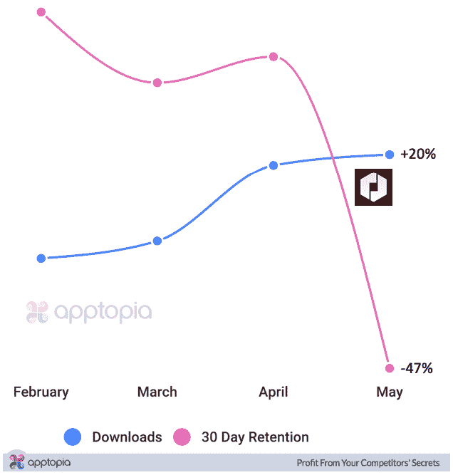

# 优步今年的新司机保持率大幅下降

> 原文：<https://web.archive.org/web/https://techcrunch.com/2017/06/23/uber-has-seen-a-sharp-drop-in-new-driver-retention-this-year-apptopia/>

根据应用分析公司 Apptopia 向 TechCrunch 提供的优步司机应用分析，优步在美国的新司机保留率大幅下降。

在对应用下载和使用情况的分析中，Apptopia 估计，从 1 月到 5 月，优步司机应用在美国的 30 天用户留存率下降了 47%。

这一衡量标准着眼于在下载第一天之后每天打开应用程序的用户比例——持续到第 30 天……其理念是有意义地衡量参与度，而不是着眼于应用程序删除(因为许多人只是停止使用应用程序，而不是主动删除它)。

Apptopia 的分析还表明，在同一时期，驱动程序的下载量增长了 20%。

因此，如果数据处理是正确的，那么看起来虽然优步成功地激发了新司机的最初兴趣，但它在维持这种兴趣方面存在严重问题。

从 4 月份开始，保留率似乎下降得尤为明显。

Apptopia 并不直接从优步获得任何使用数据，而是从拥有开发者账户的 25 万个应用网络中获取数据。然后，它使用一种算法框架来生成对单个应用程序的估计，包括通过使用应用程序商店评论等公共信号——并表示其方法会产生“主要应用程序的强劲趋势数据”

对于它在这里拉的两个百分比，它说它将谷歌 Play 商店和 iOS 应用商店的数据平均在一起——正如它所说的那样，是为了“更全面地了解”与优步司机应用的交互。

我们问优步是否对这些数据有任何评论，但在撰写本报告时，它还没有做出回应。

该公司[目前没有自己的首席执行官](https://web.archive.org/web/20230328232023/https://techcrunch.com/2017/06/20/uber-ceo-travis-kalanick-resigns/)，在联合创始人特拉维斯·卡兰尼克辞职后，投资者对其内部文化的报告施加了压力——引发这一事件的原因是一名女性前员工在博客中讲述了她在优步的一年中经历的[性骚扰和性别歧视。](https://web.archive.org/web/20230328232023/https://techcrunch.com/2017/02/24/uber-female-engineers-to-travis-theres-a-systemic-problem-with-sexism-here/)

不清楚新优步司机是否对优步的内部动荡敏感。或许更有可能的是，人们普遍不满优步拼车支付的较低费率，以及优步缺乏应用内小费功能(相比之下，Lyft 有应用内小费)——很明显，[本周](https://web.archive.org/web/20230328232023/https://techcrunch.com/2017/06/20/uber-is-implementing-tipping-but-how-well-it-works-will-be-critical/)优步终于表示，将开始允许乘客通过应用给司机小费。

当被问及对 Apptopia 的数据的看法时，拼车公司的创始人 Harry Campbell 告诉我们:“优步的车手这周大部分都很开心，因为小费的选择和 TK(特拉维斯·卡兰尼克)的离开。我们早就知道优步存在司机高流动率和低满意率的问题，许多司机认为传统知识是他们许多问题的根源。”

Apptopia 还为我们调查了骑手每月的使用情况，并在这一点上说——也许令人惊讶——优步并没有因为# delete Uber——即社交媒体运动而受到打击，该运动旨在说服优步用户放弃该应用，因为它被附加了各种道德丑闻。

#deleteuber 运动的 Apptopia 说:“它推动了卸载，但新下载保持一致，所以使用率没有下降太多。”“自 2 月份以来，美国的月使用量(针对骑手)实际上增加了约 60%。

“在美国，参与度(即平均每个人在一个月内打开应用的频率)有所下降，但实际上降幅不大。”