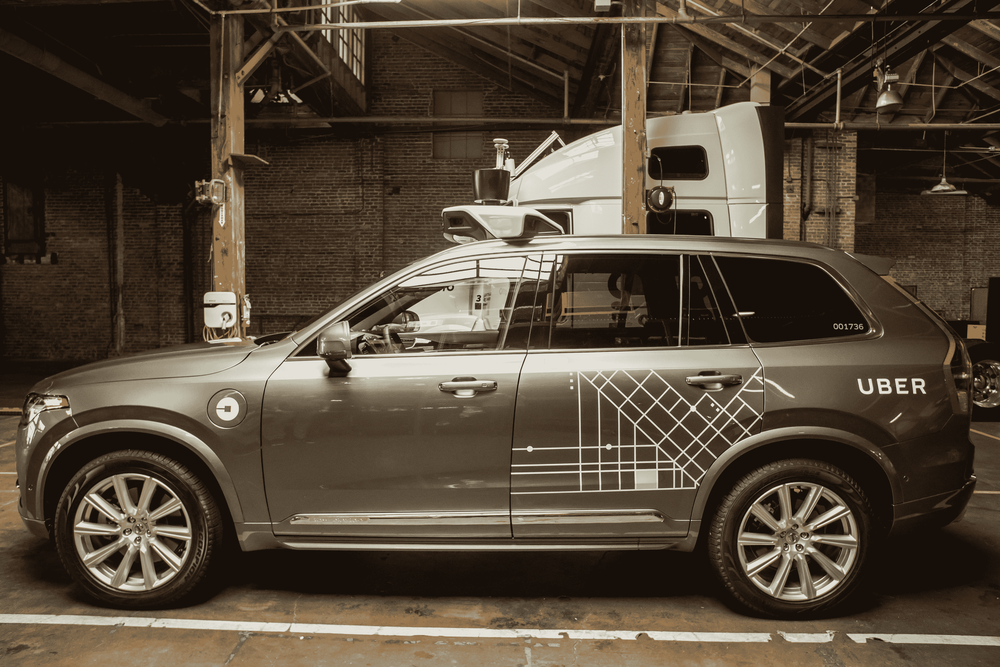

# 优步聘请前谷歌搜索主管阿密特·辛格哈尔担任工程技术博客的 SVP

> 原文：<https://web.archive.org/web/https://techcrunch.com/2017/01/20/uber-hires-former-google-search-chief-amit-singhal-as-svp-of-engineering/>

优步的最新雇员在硅谷有着传奇而辉煌的历史——前谷歌搜索高级副总裁、第 176 号员工阿密特·辛格哈尔加入这家叫车公司，成为工程界的 SVP。

辛哈尔将领导优步的地图和市场部门，同时还为首席执行官特拉维斯·卡兰尼克和优步工程副总裁以及 Otto 联合创始人安东尼·莱万多夫斯基提供咨询，帮助他们开发公司的自动驾驶技术。

上一次我们在科技新闻圈听到辛格尔的消息时，他正在告别在谷歌的 15 年职业生涯，在一封[告别信中，感觉很像是退休公告](https://web.archive.org/web/20221214192510/https://plus.google.com/+AmitSinghal/posts/4PEmsWv8WYe)。辛哈尔写道，他要离开去“看看[他]能在慈善事业上产生什么样的影响”，并“花更多的时间与[他的]家人在一起”，以努力“定义[他的]未来十五年。”现在，不到一年后，Singhal 又回到了高管的位置——这次是在一家更年轻的公司，但仍然是世界上最有影响力的技术公司之一。

那么辛哈尔是怎么从那里到这里的呢？

首先，辛格哈尔确实投身于慈善事业，专注于他和妻子希帕建立的辛格哈尔基金会，该基金会旨在为那些通常无法进入顶级学校的孩子提供高质量教育，并以印度焦特布尔市为重点。

优步新 SVP 工程学院，阿密特·辛格哈尔

辛哈尔在一次采访中解释说:“我确实离开了谷歌，把更多的时间花在了我想做的事情上，回报我的家人，以及我和妻子多年前建立的基金会，但我们无法做很多我们希望做的事情。”。“我基本上把自己投入到基金会和家庭中——每天早上开车送我儿子去学校，然后接他回家——在基金会方面，我每三个月去一次印度，以获得我们正在启动的基金会项目。”

Singhal 说，把基金会带到一个他和他的妻子对其进展感到满意的地方，就像“在另一个国家经营一家初创公司”，但最终，工作得到了回报，他们开始对他们看到的结果感到满意。

“最初的六个月对我来说非常紧张——非常紧张，”他说在那之后，我们进入了运作基金会的节奏，我们带了 50 个正在上学的孩子，明年将增加到大约 400 个，明年将增加到数千个。与此同时，我找到了一个非常非常好的合作伙伴来管理印度的基金会。"

与此同时，辛哈尔通过一个共同的朋友认识了特拉维斯·卡兰尼克，这引发了这位搜索专家和这位著名创始人之间关于优步、其目标和技术挑战的一系列对话。优步的潜在影响范围和它在实现目标过程中所面临的工程障碍程度的结合吸引了辛哈尔；毕竟，他本质上是一名真正的工程师，堆积如山的技术挑战最能吸引有技能的工程师。

> “在我 25 年的职业生涯中，这家公司还面临着一些最严峻的计算机科学挑战。”阿密特·辛格哈尔，工程系的优步·SVP

“这家公司不仅在做令人惊叹的事情，它还面临着一些我 25 年职业生涯中见过的最艰难的计算机科学挑战，”辛哈尔告诉我。“对于一个计算机科学极客来说，这些计算机科学的挑战非常有趣——你给一个极客一个难题，他们不会放弃；他们需要解决这个难题。这就是我的感受。”

Singhal 表示，与 Kalanick 的这场长期持续的对话最终让他无法抗拒某种魔咒，特别是考虑到他的慈善努力回到了正轨，在他离开谷歌后的几个月内，基金会就投入了工作。优步改变世界的潜力，加上实现这种潜力面临的巨大困难，吸引了 Singhal，就像它吸引了众多硅谷领先的投资者、顶尖学者和其他熟练的工程师一样。

“因此，在基金会一切进展顺利的情况下，我实际上深刻理解了 Travis 和优步团队正在努力做的事情，以及将需要多少深度计算、机器学习和人工智能来实际构建这家公司的梦想，这是我无法拒绝的事情。”

我问辛格哈尔，他在谷歌的经历将如何帮助他在优步的工作。在谷歌，Singhal 通过进步帮助创建了世界领先的搜索引擎，包括在查询识别中建立上下文意识，并确保返回结果的质量和顺序——这是一项大规模的任务，大多数最终用户完全认为是理所当然的。Singhal 说，理想情况下，他的工作对大多数日常优步用户来说也是不可见的。

“在优步，这个团队实际上在一个非常简单的按钮和汽车出现的界面后面隐藏了如此多的深层科学，”Singhal 解释道。“这背后的科学和我们在谷歌所做的一样复杂。我的专长是深入研究科学，构建惊人的工程来实现科学，并在此过程中建立伟大的团队，以便从用户的角度来看，复杂性被隐藏起来，他们的生活以这样或那样的方式得到改善。”

考虑一下优步最近的一些变化，以探索一些技术深度:UberPOOL 现在试图预测普通用户的即时接站情况，以优化路线，如果它确定新的骑手或刚刚上线的司机在最大化路线效率方面更有优势，它还会在接站前交换司机和骑手。一个计算机系统要做出这些决定，并有效地做出这些决定，需要考虑的因素数量是惊人的。

辛格哈尔也被优步所吸引，因为它有可能影响人们的生活方式。他说，就对人们生活的影响而言，移动性是一个具有巨大潜力的领域，而优步是一家拥有独特定位来解决这些问题的公司，它通过“向以前无法获得移动性的人提供移动性”，以及通过像 UberPOOL 这样的努力，有可能缓解城市交通拥堵。

“当我们开始基金会的项目时，我们注意到的第一件事就是，对于这些孩子来说，移动上学是一个巨大的挑战，他们生活的社区没有真正合适的交通系统，”辛哈尔说，他谈到了移动问题在他的慈善工作中是如何变得非常明显的。“即使有交通系统，城市公交路线也不会真的把他们带到他们现在要去的那所很棒的私立学校。”

为了解决这个问题，Singhal 基金会不得不启动自己的私人巴士计划，因为所有的常规交通路线都要接送有钱的孩子，把他们带到优质学校。构建能够应对移动性挑战的解决方案是优步吸引力的一个方面，它在多个方面打动了 Singhal。

他说:“挑战是非常技术性的，非常科学的，我们将不得不做以前从未做过的工程工作，结合尚未建立的科学。”“所有这些都结合了这样一个事实:我的父母已经 70 多岁，他们的行动能力正在下降——我不想让他们失去行动能力。这是真实的，它影响着真实的生活，这使得我们团结起来为世界解决这个问题变得更加重要。”

> 我们将不得不做以前从未做过的工程工作，结合尚未建立的科学。阿密特·辛格哈尔，工程系的优步·SVP

我问辛哈尔，这个问题是否不会太大而无法解决——优步自己也承认，他面临着他漫长职业生涯中见过的最艰巨的技术挑战，其中包括在谷歌构建地球上最复杂的搜索算法。该公司频繁遭遇监管挫折，本周面临[2000 万美元的联邦贸易委员会和解](https://web.archive.org/web/20221214192510/https://beta.techcrunch.com/2017/01/19/uber-settles-ftc-lawsuit-claiming-it-misled-drivers-about-pay/)，周四早些时候[因被认为与即将上任的特朗普政府关系密切而提出抗议](https://web.archive.org/web/20221214192510/https://beta.techcrunch.com/2017/01/20/anti-trump-protestors-are-outside-of-ubers-sf-headquarters/)。据报道，优步去年也花费了 30 亿美元，它的许多雄心壮志，包括自动驾驶，在未来几十年内都有回报。Singhal 提供了一个真正的工程师的答案。

“困难的问题是我们在这里要解决的，”他说。