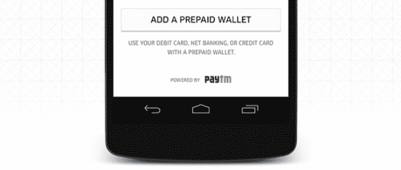

# 优步抨击印度“不必要且繁琐”的新支付法规 

> 原文：<https://web.archive.org/web/https://techcrunch.com/2014/11/30/uber-hits-out-at-indias-unnecessary-and-burdensome-new-payment-regulations/>

# 优步抨击印度“不必要且累赘”的新支付法规

优步猛烈抨击印度管理支付的新法规，称所有在线交易都必须进行双重认证是“一个过时的解决方案，对消费者来说很麻烦，对企业来说很窒息”

[美国打车应用公司上个月推出了](https://web.archive.org/web/20221006183233/https://beta.techcrunch.com/2014/11/12/uber-launches-wallet-based-payment-system-in-india-to-comply-with-new-regulations/)基于钱包的新支付解决方案，以响应[印度储备银行(RBI)](https://web.archive.org/web/20221006183233/https://beta.techcrunch.com/2014/08/25/new-restrictions-on-online-billing-in-india-may-impact-international-e-commerce-companies/) 的新措施。今天，它完全将所有支付转移到钱包上，但它表示，在其客户中采用该系统的速度“很慢”。

在推出其钱包时，优步没有提到 RBI 的规定，但今天它出来摇摆，认为用户不愿意从其基于信用卡的系统中切换出来，“表明他们对优步支付系统的信任，以及对更方便更安全的在线/移动支付的偏好。”

优步并不是唯一一家受到印度央行规则影响的公司，该规则要求任何涉及印度银行卡的在线支付都要包括双重认证过程。印度央行表示，这些规则旨在提高安全性。

有一些结果。基于钱包的支付意味着印度人现在可以使用借记卡、网上银行账户，甚至现金来充值，从而间接支付他们的优步之旅。这消除了必须拥有信用卡的障碍。优步在所有其他国家只接受基于信用卡的支付，但在印度很少有人拥有信用卡。尽管向新的受众开放，这家美国公司声称，在钱包中加载预付费信用“不太方便”。

优步表示，它已经与印度当局进行了“建设性的讨论”，但它要求 45 天的延长期，以继续允许信用卡支付，因为它说很少有客户转向新的支付方式。它认为，这实际上意味着他们将无法使用这项服务，这也将影响其司机。

这家美国公司一直在努力提高人们对这一变化的关注。上个月，它[为钱包兼容用户提供了五天免费乘车](https://web.archive.org/web/20221006183233/https://beta.techcrunch.com/2014/11/26/uber-is-literally-sucking-the-money-out-of-its-rivals-in-india/)以激发他们的兴趣，但根据今天的博客帖子，采用率似乎没有它希望的那么高。

***更新:**本文原文误将印度储备银行称为印度皇家银行。我们对造成的任何困惑表示歉意。*