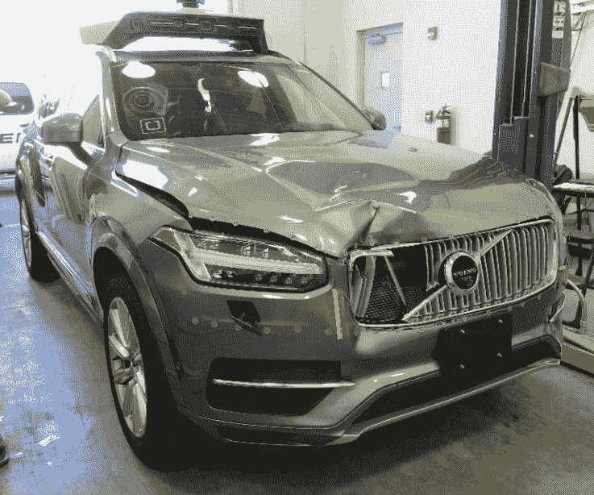

# 优步在致命车祸中探测到行人，但紧急制动被禁用 

> 原文：<https://web.archive.org/web/https://techcrunch.com/2018/05/24/uber-in-fatal-crash-detected-pedestrian-but-had-emergency-braking-disabled/>

美国国家运输安全委员会(National Transportation Safety Board)对今年 3 月发生的[致命自动驾驶优步撞车事故](https://web.archive.org/web/20221025222040/https://techcrunch.com/2018/03/19/ubers-fatal-self-driving-car-crash-prompts-ntsb-investigation/)的初步报告证实，该车早在撞车前 6 秒就检测到了行人，但没有减速或停车，因为它的紧急制动系统被故意禁用。

优步告诉 NTSB，“当车辆在计算机控制下时，紧急制动操作不会启用，以减少车辆行为不稳定的可能性，”换句话说，以确保平稳行驶。“依靠车辆操作者进行干预并采取行动。该系统不是为提醒操作员而设计的。”尚不清楚为什么紧急制动功能即使在汽车运行时被禁用也仍然存在。沃尔沃车型的内置安全系统——防撞和紧急制动等——在自动模式下也被禁用。

似乎在这种紧急情况下，这种“自动驾驶汽车”并不比路上已经行驶的许多普通汽车更好，或者更差。

很难理解这个决定的逻辑。紧急情况正是无人驾驶汽车，而不是司机，应该采取行动的情况。它的远程传感器可以从更远的地方准确地检测到问题，而它的 360 度意识和路线规划允许它做出人类无法及时完成的安全动作。人类，即使他们的全部注意力都在路上，也不是最擅长捕捉这些东西的；在需要快速反应时间和精确机动的最糟糕的情况下，只依靠他们似乎是一个不可理解和非常不负责任的决定。

[根据 NTSB 的报道](https://web.archive.org/web/20221025222040/https://www.documentcloud.org/documents/4483190-NTSBuber.html)，车辆在碰撞前六秒首次在激光雷达上记录了伊莱恩·赫尔茨贝格的信息*——以当时的速度，第一次接触距离大约 378 英尺。在接下来的几秒钟里，她首先被识别为一个未知物体，然后是一辆汽车，然后是一辆自行车(没有说明这些分类是在什么时候发生的)。*

发生碰撞后的汽车

在这 6 秒钟内，司机可以也应该被警告前方左侧有异常物体——无论是鹿、汽车还是自行车，它正在进入或可能进入道路，应该引起注意。但是系统没有警告司机，显然也没有办法。

然后，在撞击前 1.3 秒，也就是说大约 80 英尺远，优步系统决定有必要采取紧急制动程序以避免赫尔茨贝格。但它没有踩刹车，因为紧急制动系统已经失效，它也没有警告司机，因为它也不能。

只是在撞击发生前不到一秒钟，司机[碰巧从她正在做的事情上抬起头来](https://web.archive.org/web/20221025222040/https://techcrunch.com/2018/03/21/video-the-driver-of-the-autonomous-uber-was-distracted-before-fatal-crash/)看到了赫尔茨贝格，当时这辆车已经以某种方式认识了她长达五秒钟。它袭击并杀死了她。

它对优步的影响极其恶劣，它使汽车无法在紧急情况下做出反应——尽管它被授权在夜间超速行驶——并且系统没有办法在检测到重要情况时提醒司机。这不仅仅是一个安全问题，就像使用不合标准的激光雷达系统或不检查前灯就上路一样——这是优步判断失误的结果，也是一个付出生命代价的错误。

坠机发生的亚利桑那州禁止优步进行进一步的自主测试，优步昨天[结束了在该州的项目](https://web.archive.org/web/20221025222040/https://techcrunch.com/2018/05/23/uber-is-done-testing-self-driving-cars-in-arizona/)。

优步就该报告发表了以下声明:

> 在过去的两个月里，我们与 NTSB 密切合作。随着他们的调查继续进行，我们已经启动了我们自己的自动驾驶汽车项目的安全审查。我们还邀请了前 NTSB 主席 Christopher Hart 为我们的整体安全文化提供建议，我们期待在未来几周内分享更多关于我们将做出的改变。