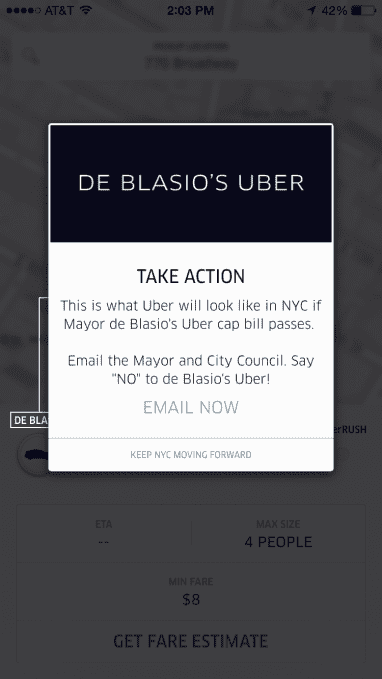

# 优步在纽约推出“白思豪的优步”功能，等待时间为 25 分钟

> 原文：<https://web.archive.org/web/https://techcrunch.com/2015/07/16/uber-launches-de-blasios-uber-feature-in-nyc-with-25-minute-wait-times/>

# 优步在纽约推出“白思豪的优步”特色，等待时间为 25 分钟

继两周前[举行集会](https://web.archive.org/web/20230404154617/https://techcrunch.com/2015/06/30/uber-stages-protest-at-nyc-city-hall-against-bill-throttling-new-driver-signups/)抗议[纽约市法案](https://web.archive.org/web/20230404154617/https://techcrunch.com/2015/06/30/uber-stages-protest-at-nyc-city-hall-against-bill-throttling-new-driver-signups/)将严重限制优步和其他拼车公司可以添加到他们平台的司机数量之后，优步又做出了一个举动，肯定会引起纽约人的注意。

该公司刚刚增加了一个“白思豪的优步”功能，现在可供 200 多万纽约用户使用，该功能要么总是显示没有车可用，要么需要等待 25 分钟。

该功能不是叫车，而是提示用户采取行动，向比尔·白思豪市长和市议会发送反对新法案的电子邮件。当然，用户仍然可以使用优步的其他功能，如 UberX 和优步黑。

优步告诉 TechCrunch，新功能将“展示如果白思豪限制优步的计划通过成为法律，纽约市骑手的生活将会是什么样子”。

提交审议的法案将要求出租车和豪华轿车委员会(TLC)严格限制新出租汽车牌照的发放。该法律将持续一年，在此期间，TLC 将完成一项关于出租汽车服务对城市影响的研究。

对于优步来说，该法案将限制他们在下一年只增加 201 名新司机。该公司表示，这个数字低于他们目前每周添加到 UberNYC 平台的数量。

“市长白思豪阻止优步的计划将损失 10，000 个工作岗位，伤害欠发达地区，并使优步汽车的等待时间飙升。优步的首席顾问大卫·普劳夫说:“有了这个观点，纽约市的乘客就可以自己看看这种对大出租车司机的政治报复会花去他们多少时间。”。

如果这项法案获得通过，对于所有在纽约运营的拼车公司来说，这将是一个重大挫折，而对于出租车行业来说，这将是一个巨大的胜利。虽然目前形式的法案在 6 月份提交给了纽约市议会，但纽约出租车行业在 3 月份首次提出了一个版本。