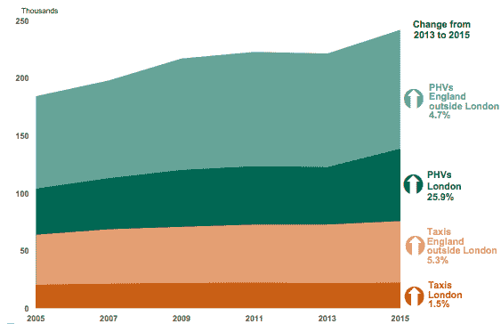

# 让我们谈谈优步、拥堵和城市空气质量 

> 原文：<https://web.archive.org/web/https://techcrunch.com/2015/08/26/uber-london-impact/>

英国政府运输部(DfT)发布了关于在英格兰运营的出租车和私人出租汽车数量的最新统计数据,该数据显示自 2013 年以来，私人出租汽车数量显著增加。

如果你想知道，按需叫车服务优步[于 2012 年夏天在伦敦试运行。巧合吗？我打赌不会。](https://web.archive.org/web/20221206020022/https://beta.techcrunch.com/2012/06/15/uber-learns-to-drive-on-the-left-soft-launches-in-london/)

这些数据中最大的飞跃是，2013 年至 2015 年间，伦敦运营的私人出租汽车数量增长了 25.9%。同期，伦敦出租车数量仅增长了 1.5%。

根据 [DfT 数据](https://web.archive.org/web/20221206020022/https://www.gov.uk/government/uploads/system/uploads/attachment_data/file/455697/taxi0104.xls)，截至今年 3 月底，伦敦共有 62，754 辆 phv，高于 2013 年的 49，854 辆——与伦敦道路上新增的 13，000 辆 phv 非常接近。而伦敦的黑色出租车数量几乎没有增加，只有 22500 辆。

TfD 的数据还显示，获得许可的 PHV 运营商数量正在萎缩，包括伦敦在内。报告指出，伦敦的运营商数量下降了 4.8%，至 3000 家。这暗示了优步式的对 PHV 竞争的影响。

优步的一位发言人告诉 TechCrunch，它现在在伦敦的账面上有超过 15，000 名“合作伙伴”(也就是通过其平台销售拼车服务的司机)。与此同时，[去年 10 月，](https://web.archive.org/web/20221206020022/http://www.ibtimes.co.uk/uber-ceo-travis-kalanick-we-will-have-42000-london-drivers-2016-1468436)首席执行官特拉维斯·卡兰尼克表示，该公司预计到 2016 年 3 月，伦敦的司机数量将增加到 42，000 人。他还声称，当时优步在首都有大约 50 万用户。

在报道他当时的评论时， [IBT](https://web.archive.org/web/20221206020022/http://www.ibtimes.co.uk/uber-ceo-travis-kalanick-we-will-have-42000-london-drivers-2016-1468436) 也报道了他说:“上个月我们有 7000 名活跃的司机在伦敦的道路上。**对于路上的每一辆车，你要从路上拿走 7 . 5 辆车**[强调我的]

这不是优步第一次对其拼车服务如何“减少交通流量”做出似是而非的声明。卡兰尼克的数学在这里尤其不诚实——假设 7.5:1 的比例(大概)假设所有优步都是满员拼车。如果 Ubers 里的人不打车，他们就会开着自己的车到处跑。

在像伦敦这样的城市——拥有全面的公共交通基础设施，在伦敦市中心有一个旨在阻止人们开车的拥堵收费区——这当然完全是胡说八道。

一份关于英国汽车牌照的 DfT 报告指出，截至 2013 年底，伦敦的人均汽车拥有率是英国最低的，每 1000 人拥有 307 辆汽车。而伦敦(TfL)交通局[2011/12 年的数据](https://web.archive.org/web/20221206020022/https://tfl.gov.uk/cdn/static/cms/documents/technical-note-12-how-many-cars-are-there-in-london.pdf)确定伦敦注册了 260 万辆汽车——而当时的城市人口在 820 万到 830 万之间。

TfL 报告指出，54%的伦敦家庭当时至少有一辆车——因此接近大多数家庭没有车。再往前追溯一点，2011 年英国人口普查记录了大伦敦无车家庭的比例上升——2001 年至 2011 年间，无车家庭从 38%上升至 42%。

所有这些都表明，越来越多的伦敦人没有车，所以他们不太可能在自己开车或让优步开车兜风之间做出选择。更有可能的是，他们在乘坐公共汽车/火车/骑自行车或乘坐优步之间做出选择。(是的，伦敦也有类似 Zipcar 的拼车计划，但是对于大多数旅行来说，乘坐公共交通工具比预定、使用和停放一辆拼车要快得多，也容易得多——而公共交通*的运作方式*通常遵循阻力最小的路线。)

因此，卡拉尼克声称优步减少了伦敦的道路交通——当 DfT 数据显示伦敦道路上的 phv 数量大幅增长时——至少可以说听起来相当空洞。

(相关信息:纽约州 T4 市正在对优步对拥堵的影响进行研究。)

鉴于同期出租车数量也有所增加(尽管幅度不大)，优步也不仅仅是取代了现有的伦敦出租车。你可以说，如果没有优步式的竞争，出租车数量可能会增长更多一点，但没有理由认为出租车数量会增长四分之一，因为坐出租车的成本高于坐优步的成本。

似乎更接近事实的是，乘坐优步的费用(T6)鼓励(一些)伦敦人远离公共交通，开上伴侣的车——一辆只有 T8 的车来搭载付费乘客。

如果没有优步，那位“优步搭档”很可能会做些别的事情，而不是花大量时间开车环游这座城市。虽然注重成本的优步用户可能会乘坐公共交通工具到达他们需要去的地方，而不是花钱搭黑色出租车。记住:伦敦的公共交通既丰富又便宜，一般来说比乘坐任何出租车都便宜。

因此，如果伦敦街道上出租的燃烧化石燃料的车辆数量正在增加 DfT 的数据似乎表明这一点(除非私人出租的全电动特斯拉大量涌入，但这一增长肯定对伦敦的空气质量产生了负面影响)。一部分污浊的空气肯定与优步有关。

当被问及其业务对伦敦等人口稠密的城市中心的空气质量的影响时，优步的一位发言人声称，其平台上的“大多数”伦敦“合伙司机”都驾驶混合动力汽车。

“这些汽车比许多其他选择更环保。此外，优步的价格点意味着许多骑手现在把私家车留在家里，使用优步。这减少了道路上的汽车数量，有助于缓解拥堵，对环境也更好，”他补充道，呼应了卡兰尼克去年的评论。

毫无疑问，伦敦在空气质量方面存在严重问题。去年，欧洲委员会开始对英国违反污染目标采取法律行动，包括在大伦敦地区——特别是与二氧化氮(汽车发动机和废气与氧气结合产生的有毒副产品)有关。

据报道，伦敦的二氧化氮水平是欧洲所有首都城市中最高的。伦敦[市政府](https://web.archive.org/web/20221206020022/https://www.london.gov.uk/priorities/environment/clearing-londons-air)网站本身指出，伦敦“大多数”空气污染是由道路交通和家庭以及商业供暖系统造成的，并建议企业鼓励员工使用公共交通、步行或骑自行车上班。

“城市居民尤其容易受到影响，因为大多数二氧化氮来自交通废气，”欧盟委员会在一份新闻稿中指出，该新闻稿详细介绍了针对英国的法律行动，并补充说:“二氧化氮是地面臭氧的主要前驱物，会造成严重的呼吸问题，并导致过早死亡。”

今年 7 月发表的一项关于二氧化氮和颗粒物污染对健康影响的[研究](https://web.archive.org/web/20221206020022/http://london.gov.uk/media/mayor-press-releases/2015/07/london-becomes-first-world-city-to-quantify-the-health-effects)，受伦敦市长委托，由伦敦大学国王学院利用 2010 年数据进行，报告了比先前估计的更高的健康影响——包括 2010 年相当于 5900 人因长期接触二氧化氮而死亡。

如果城市中心交通废气的巨大健康成本还不够糟糕的话，英国正因违反空气质量标准而面临高达 3 亿英镑的欧盟罚款。

显而易见的是，增加伦敦道路上的车辆数量不符合欧洲空气质量标准——除非这些车辆产生零排放。

在这方面，有趣的是，优步一直有兴趣在未来从电动汽车制造商特斯拉购买自动驾驶汽车。当特斯拉首席执行官埃隆·马斯克被问及(T2 拒绝回答)他的公司未来是否可能不提供拼车服务。

与此同时，正在寻找更清洁的优步替代品的伦敦人可能会有兴趣听到一家全电动特斯拉出租车初创公司去年在伦敦试运行。名为 [Gliide](https://web.archive.org/web/20221206020022/http://gliide.co/) 的零排放私人司机服务现阶段仍处于邀请阶段。