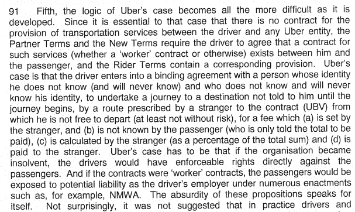

# 优步在英国就业法庭败诉 

> 原文：<https://web.archive.org/web/https://techcrunch.com/2016/10/28/uber-loses-employment-tribunal-in-the-uk/>

根据英国就业法庭的裁决，优步司机是工人，而不是个体承包商。

在所谓的零工经济中，这是工人权利的一个里程碑式的胜利，平台巨头们试图通过将运营其服务所需的大量人员归类为自营职业者来最小化成本。

法庭的裁决意味着英国的优步司机将有权享受假期工资、带薪休息和国家最低工资。尽管优步表示将会上诉。

英国优步公司的区域总经理乔·伯特伦在一份声明中说:“成千上万的伦敦人和优步一起开车，正是因为他们想自己创业，自己当老板。使用优步应用程序的绝大多数司机都希望保持自由和灵活性，能够随时随地开车。虽然这次初步听证会的决定只影响了两个人，但我们会上诉。”

这项裁决是由两名优步司机(一名现任，一名前任)提出的，也可能影响其他在英国运营的零工经济创业公司，尽管法庭只考虑了优步适用的具体条款。

但这一判决可能会鼓励其他就业分类挑战，也可能会给监管机构施加压力，要求更普遍地明确科技平台上工人的就业状况。

**《纯属虚构》**

在这种情况下，优步的律师试图辩称，该公司只是为“合作伙伴”司机提供“商业机会”，但法庭不同意，对其论点持怀疑态度，并最终持悲观态度——包括将优步的“假定司机/乘客合同”称为“纯粹的虚构，与双方之间的真实交易和关系无关”。

[法庭在陈述其结论](https://web.archive.org/web/20221005092741/https://www.judiciary.gov.uk/wp-content/uploads/2016/10/aslam-and-farrar-v-uber-reasons-20161028.pdf)时写道:

> 我们得出的结论是，任何司机，只要(a)打开了应用程序，(b)在他被授权工作的区域内，以及(c)能够并愿意接受任务，只要这些条件得到满足，就是根据“工人”合同和每个扩展定义内的合同为优步工作。

它接着表示，它对优步试图迫使人们同意其对公司的定义以及相关各方之间的法律关系的“非凡努力”感到震惊，称其“在文件中诉诸虚构、扭曲的语言甚至全新的术语”，试图推进自己的论点。

“在我们看来，否认优步是运输服务供应商是不真实的，”它补充道。"简单的常识证明情况恰恰相反。"

该法庭还认为，优步关于其在伦敦的业务是“由一个共同‘平台’连接起来的 3 万家小企业的马赛克”的说法“有点可笑”。

“在每一个案例中，这种‘生意’都是由一个有车的人通过开车来谋生组成的，”它声称，并指出司机没有资格与乘客谈判达成协议。“他们被提供并接受严格按照优步条款进行的旅行，”它补充道。

在一个密集的段落(截图如下)中，法庭列出了得出优步司机作为司机为优步工作这一结论的第五个理由，阐述了该公司采用的卡夫卡式逻辑，试图逃避作为一个非常庞大的劳动力的雇主的责任，并得出结论:“这些主张的荒谬不言自明。”

它得出结论的全部推理超过 10 点，裁决文件长达 40 页——所以有很多事情让优步的律师们忙着想下一步该怎么做。

仲裁庭要求相关各方不迟于 12 月 2 日提交书面陈述，阐明他们打算如何进行——敦促他们之间进行沟通，并试图达成“尽可能多的共同点”。

华威商学院(Warwick Business School)劳资关系教授古列尔莫·米尔迪(Guglielmo Meardi)在一份声明中对这一裁决进行了评论，他说:“优步的裁决将揭开许多关于‘零工经济’具有内在解放性的言论的神秘面纱，并激发关于机遇、限制、挑战以及解决不符合传统工作类别的新形式承包工作和活动的方式的辩论。

“由于许多权利和义务都基于这些类别——从社会保护权利(如工作时间或最低工资覆盖范围)和缴款，到税收和代表性——因此，阐明数字化活动如何与更成熟的劳动力市场模式保持一致至关重要。虽然这些被重新定义，但更安全的默认选择可能是将这些工作形式视为就业，而不是自营职业。”

裁决文件包括优步如何向司机支付报酬的细节，仲裁庭指出，这是每周一次的，其标准产品的收费是车费的 25%。(提起诉讼的投诉人开始开车前往优步时，费用已经上涨，达到 20%)。它还指出，被出示的文件“证明(优步)反对司机索要小费”。

它还指出了一个值得注意的事实，即优步的合作条款要求司机“在所有沟通中支持优步”，包括对员工提出要求，例如不得在公共场合对公司及其业务发表负面言论。

这份文件详细列出了优步对司机的各种规定——例如必须保持平均 4.4 分或以上的评分，否则将面临“质量干预”，如果他们的评分没有提高，将被清除出平台。

“近年来，自主创业有所增加，但往往伴随着非常糟糕的条件，令人担心它被用来绕过就业立法，”Meardi 补充说。

“随着像优步这样的新兴平台的出现，名义上的自由职业者更有可能受到剥削，因此需要加强保护，特别是在像英国这样的国家，那里的整体就业和交通法规更宽松，受剥削的可能性更大。”

随着科技平台迅速扩大用户群，利用技术严格管理提供应用程序所承诺的服务的人——大多数情况下不授予这些工人就业身份——成千上万所谓的“自由职业者”的就业状态推动了许多零工经济业务的增长，已经成为多个市场上越来越多的争议焦点。

在伦敦，为这一领域的另一家公司 Deliveroo 提供地面送货服务的骑手们[在今年夏天](https://web.archive.org/web/20221005092741/https://beta.techcrunch.com/2016/08/15/london-deliveroo-drivers-crowdfund-protests-over-new-pricing-model/)举行了罢工——此前该公司试图实施新的支付条款。公司[随后在部分](https://web.archive.org/web/20221005092741/https://beta.techcrunch.com/2016/08/17/deliveroo-wont-force-new-pay-per-delivery-contract-on-protesting-riders-in-london-yet/)提议的变更上做出了让步。