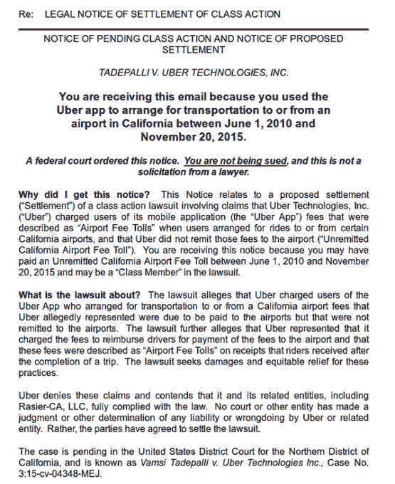

# 优步可能欠数万名加州乘客 180 万美元集体诉讼 

> 原文：<https://web.archive.org/web/https://techcrunch.com/2016/01/12/uber-might-owe-tens-of-thousands-of-california-passengers-1-8-million-in-a-class-action-lawsuit-over-airport-fees/>

加利福尼亚州的几名优步客户今天收到通知，他们被卷入了对这家拼车巨头的集体诉讼。优步同意了一项 180 万美元的诉讼条款，指控其去年年底不恰当地向客户收取“机场费”。

该诉讼于 2015 年 11 月提交，指控优步在机场要求收取“机场费”的几个月前就向客户收取了“机场费”，让司机保留这笔费用。

这场诉讼影响了大约 355，000 名客户，对于许多不知道自己卷入其中的人来说，这是一个惊喜。

加州对使用拼车服务往返机场的乘客收取单独的费用。这是因为加州公共事业委员会将优步、Lyft 和其他拼车服务归类为交通网络公司，将其与出租车服务分开，并向运输客户单独征收 3.85 美元的运输费。

发起集体诉讼的乘客 Vamsi Tadepalli 指控优步在 2015 年 11 月下旬欺诈性地向他收取了更高的 4 美元费用，并让司机保留这笔费用，而不是将其转移到 SFO，这笔费用原本打算去那里。

根据诉讼，Tadepalli 说，优步告诉他，这笔费用将用于偿还被收取 SFO 运输网络公司费用的司机。但根据诉讼，优步收取费用的时间早于机场开始要求付款的时间。优步在 2015 年 7 月向泰德帕里收取费用；SFO 直到 2015 年 11 月才开始向司机收取交通费。

该诉讼称，在 2010 年 6 月 1 日至 2015 年 11 月 20 日期间，客户被不当收取了机场运输费。诉讼称，这些费用都没有偿还给机场，而是由司机保管。

该诉讼还指控优步向乘客收取过多的费用，收取了 4 美元而不是 3.85 美元。

“尽管 SFO 宣布，未来将向优步收取 3.85 美元的接送乘客费用——优步 4.00 美元的 SFO 机场费将是过高的，并导致客户支付超过他们在这种情况下应该支付的费用，”集体诉讼称。

并非所有在这段时间内使用优步应用的人都收到了和解的电子邮件通知。然而，成千上万的乘客可能已经受到影响

根据诉讼，优步否认有任何不当行为，并坚持认为这是合法的。我们已经联系了优步进行评论，我们会尽快更新这个帖子。该案仍在审理中。