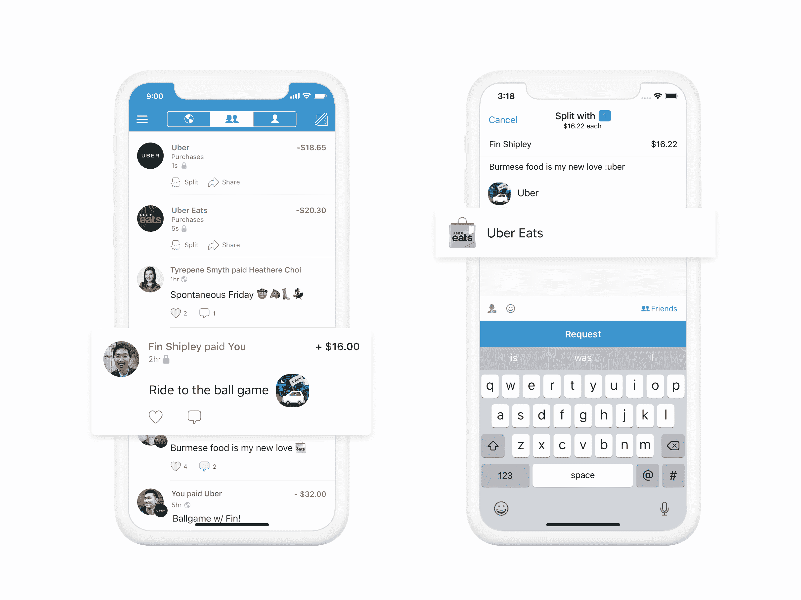

# 优步现在允许你通过 Venmo TechCrunch 支付乘车费和餐费

> 原文：<https://web.archive.org/web/https://techcrunch.com/2018/07/12/uber-now-lets-you-pay-for-rides-and-food-via-venmo/>

# 优步现在允许你通过 Venmo 支付乘车费和餐费

优步已经与贝宝旗下的 Venmo 合作，让人们通过 UberEATS 用他们 Venmo 账户中的资金支付乘车和食物的费用。据这些公司称，去年有超过 600 万笔支付提到了优步。这种整合还将使人们能够在优步应用程序内轻松分摊食品订单和朋友乘车的费用。

贝宝首席运营官比尔雷迪在一份声明中说:“在优步和优步 Eats 中增加 Venmo 作为支付方式，进一步推进了我们的使命，即提供一种无缝的方式来支付对我们的客户来说最重要的服务。”

对优步来说，这种合作关系是进一步将其与美国竞争对手 Lyft 区分开来的一种方式。不过，这不是独家合作，所以 Venmo 也可以与 Lyft 合作支付。对于 Venmo 来说，这是该服务变得更加普遍的一种方式，因为它面临着来自 Zelle 的竞争，Zelle 是一家银行支持的移动支付服务[，有望在今年某个时候在用户数量上超过 Venmo](https://web.archive.org/web/20221207171351/https://techcrunch.com/2018/06/15/venmo-is-discontinuing-web-support-for-payments-and-more/)。

在优步应用程序中，一旦您选择 Venmo 作为支付选项，您将被定向到 Venmo 应用程序。

集成将在“未来几周”正式上线