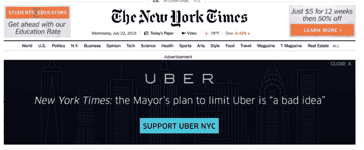

# 优步发布纽约市小时出行数据抗击网络病毒

> 原文：<https://web.archive.org/web/http://techcrunch.com/2015/07/22/uber-releases-hourly-ride-numbers-in-new-york-city-to-fight-de-blasio/>

# 优步发布纽约市小时车程数据对抗白思豪

除了一张泄露的 2013 年收入仪表板截图，优步(和大多数私营初创公司一样)在分享有关搭车统计数据方面一直是出了名的神秘。

现在，为了在市议会投票通过 T2 为网约车公司设定新的驾驶员上限之前回绝纽约市市长比尔·白思豪，优步公布了过去两个月纽约市的准确乘坐人数。

在一份 56 页的 Excel 文档中，该公司详细列出了过去两个月的皮卡数量和活跃司机数量(目前这些司机都在路上，而且优步的应用程序已经打开)，所有这些都是按小时细分的。该公司还将这些游乐项目分解为起源于纽约市中心商业区第 59 街下方的几个项目，这里的拥堵情况是纽约市最糟糕的。

虽然德·白思豪认为优步和其他拼车公司是纽约市拥堵加剧的主要原因，但《优步日报》披露的数据表明并非如此。

优步的数据显示，纽约市的 Uber 数量实际上比黄色出租车少得多。在 7 月 19 日的 24 小时内，纽约市平均有 3198 名司机在优步的站台上。另一方面，在 T4，纽约有超过 13，400 辆出租车，其中 67%到 85%的出租车都在同一条路上。

数据发布中的一些有趣内容:

6 月份，纽约市共有 3，492，389 辆优步皮卡。虽然这与纽约市黄色出租车每月 1400 多万趟相比相形见绌，但对于一家相对较新的公司来说，优步的数字仍然相当惊人。

优步在纽约市最繁忙的时候几乎总是深夜，有些日子从晚上 9 点到 12 点，每小时的交通流量接近 10，000 次(每分钟超过 150 次请求)。

为了迎接明天的投票，优步一直在对白思豪(de Blasio)和纽约市委员会(NYC City Council)发动一场侵略性的媒体战争。除了今天发布的数据，该公司还购买了一个横幅广告，目前运行在纽约时报网站的顶部。

市长白思豪一直坚定地支持该法案，尽管纽约市的其他政府官员(包括该市的审计长斯科特·斯金格(Scott Stringer))公开支持优步和其他 ride share 公司。

在纽约每日新闻撰写的一篇[专栏文章中，市长写道“[纽约市]正面临着明年街道上增加 25000 多辆汽车——大约相当于整个纽约市黄色出租车总数的两倍。”](https://web.archive.org/web/20230313190127/http://www.nydailynews.com/opinion/bill-de-blasio-fair-ride-new-yorkers-article-1.2296041)

值得注意的是，TechCrunch 获得的记录显示，纽约市出租车行业向市长白思豪的竞选活动捐赠了超过 50 万美元，是仅次于房地产行业的第二大捐赠者。此外，限制新司机注册的法案是三个月前由出租车行业首先发起的。